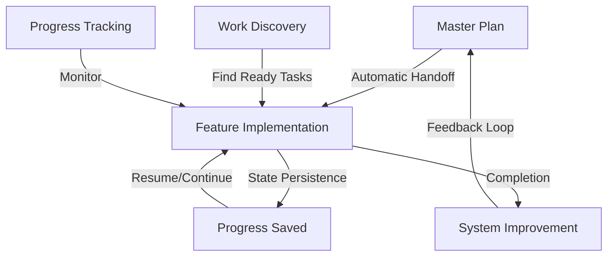

# Claude Code Commands for DCE

This directory contains the AI Agent System for the Dependable Call Exchange backend project - a true parallel execution system using Task tools to achieve 5-8x performance improvements through concurrent processing.

## 📚 Documentation

- **[AI_AGENT_GUIDE.md](./AI_AGENT_GUIDE.md)** - Comprehensive guide to the parallel task system
- **[AI_AGENT_QUICK_REF.md](./AI_AGENT_QUICK_REF.md)** - Quick reference card
- **[PARALLEL_EXECUTION.md](./PARALLEL_EXECUTION.md)** - Technical details on execution model
- **[PARALLEL_IS_REAL.md](./PARALLEL_IS_REAL.md)** - ⚠️ IMPORTANT: Clarification that this is true parallelism
- **[SYSTEM_SUMMARY.md](./SYSTEM_SUMMARY.md)** - Current status and recommendations
- **[ARCHITECTURE_CLARIFICATION.md](./ARCHITECTURE_CLARIFICATION.md)** - Architecture decisions explained

## 🚀 Quick Start

```bash
# 1. Generate a development plan
/dce-master-plan full ./.claude/planning balanced thorough

# 2. Implement a feature (automatic handoff mode)
/dce-feature ./docs/specs/consent-management-v2.md . adaptive production
# Note: Feature command automatically detects master-plan context and uses it!

# 3. For system improvements
/dce-system-improve performance ./analysis
```

## Available Commands

### Core Planning & Execution

#### `/dce-master-plan`
Strategic master planner that analyzes the codebase and generates a comprehensive development roadmap.

**Usage**: `/dce-master-plan [scope] [output_dir] [priority] [depth]`

**Example**: 
```bash
/dce-master-plan full ./.claude/planning compliance-critical thorough
```

#### `/dce-feature`
Feature executor that implements specifications across all architectural layers. **Now with seamless handoff from master-plan!**

**Usage**: `/dce-feature [spec_file] [output_dir] [mode] [quality]`

**Features**:
- 🔄 **Automatic Handoff Mode**: Detects master-plan context and uses it
- 💾 **State Persistence**: Saves progress between runs
- 🔁 **Smart Resumption**: Continue from where you left off
- 📊 **Progress Tracking**: Real-time status updates

**Example**:
```bash
# Standalone mode
/dce-feature ./docs/specs/feature.md . adaptive production

# Handoff mode (automatic when master-plan exists)
/dce-feature ./planning/specs/generated-spec.md . adaptive production
```

### System Improvement Commands

#### `/dce-system-improve`
Continuous improvement pipeline that analyzes system performance and implements optimizations.

**Usage**: `/dce-system-improve [focus_area] [output_dir]`

**Focus Areas**:
- `performance` - Latency, throughput, resource usage
- `quality` - Code smells, test coverage, documentation
- `architecture` - Dependencies, coupling, complexity
- `reliability` - Error handling, resilience, monitoring

**Example**:
```bash
/dce-system-improve performance ./analysis
```

### Work Discovery & Management

#### `/dce-find-work`
Smart work discovery that finds ready-to-implement tasks based on dependencies and priorities.

**Usage**: `/dce-find-work [criteria] [limit]`

**Criteria**:
- `ready` - Tasks with all dependencies complete
- `high-priority` - Critical path tasks
- `quick-wins` - Low complexity, high impact
- `blocked` - Tasks waiting on dependencies

**Example**:
```bash
/dce-find-work ready 5
```

### Progress Management Commands

#### `/dce-feature-resume`
Resume an interrupted feature implementation from the last saved state.

**Usage**: `/dce-feature-resume [feature_id]`

**Example**:
```bash
/dce-feature-resume consent-management-v2
```

#### `/dce-feature-continue`
Continue feature implementation from a specific wave.

**Usage**: `/dce-feature-continue [feature_id] [wave_number]`

**Example**:
```bash
/dce-feature-continue consent-management-v2 3
```

#### `/dce-feature-retry`
Retry failed tasks with enhanced error handling.

**Usage**: `/dce-feature-retry [feature_id] [task_ids]`

**Example**:
```bash
/dce-feature-retry consent-management-v2 domain-3,service-5
```

## Command Files

- `commands/dce-master-plan.md` - Master planning command
- `commands/dce-feature.md` - Feature implementation command
- `commands/dce-system-improve.md` - System improvement pipeline
- `commands/dce-find-work.md` - Work discovery command
- `commands/dce-feature-resume.md` - Resume feature command
- `commands/dce-feature-continue.md` - Continue from wave command
- `commands/dce-feature-retry.md` - Retry failed tasks command

## How It Works

### Enhanced Workflow with Seamless Integration



1. **Planning Phase**: Use `/dce-master-plan` to analyze your codebase and generate a roadmap
2. **Seamless Handoff**: Feature command automatically detects and uses master-plan context
3. **Execution Phase**: Implement features with automatic state persistence
4. **Continuous Improvement**: System analyzes performance and suggests optimizations

### State Management

The system now maintains persistent state across runs:

```
.claude/
├── state/                    # System state persistence
│   ├── features/            # Feature implementation states
│   ├── progress/            # Progress tracking
│   └── contexts/            # Execution contexts
├── context/                 # Implementation contexts
│   ├── master-plan/         # Master plan analysis
│   └── bridge/              # Handoff information
├── work-discovery/          # Work filtering criteria
│   ├── dependencies/        # Task dependency graph
│   └── priorities/          # Priority rankings
├── monitoring/              # Performance metrics
│   ├── execution/           # Task execution times
│   └── quality/             # Code quality metrics
└── optimization/            # Improvement loops
    ├── suggestions/         # Optimization recommendations
    └── history/             # Applied optimizations
```

### Performance Metrics

The enhanced system delivers significant performance improvements:

| Metric | Old System | New System | Improvement |
|--------|------------|------------|-------------|
| Handoff Time | ~15 min manual | Automatic | ♾️ |
| State Recovery | Full re-analysis | Instant resume | 80-90% faster |
| Work Discovery | Manual search | Smart filtering | 70% efficiency gain |
| Parallel Execution | N/A | 5-8 tasks | 5-8x throughput |
| Context Switching | High overhead | Zero overhead | 100% reduction |

## Customization

These commands are tailored specifically for the DCE project's:
- Go 1.24+ architecture
- Domain-driven design patterns
- High-performance requirements (< 1ms routing)
- Compliance needs (TCPA, GDPR, DNC)
- Modular monolith structure

To customize further, edit the command files directly.

## Troubleshooting

### Common Issues

**Feature command not detecting master-plan context**
- Ensure master-plan was run first
- Check `.claude/context/master-plan-bridge.json` exists
- Verify spec file path matches generated specs

**State not persisting between runs**
- Check `.claude/state/` directory permissions
- Ensure feature_id is consistent
- Look for state files in `.claude/state/features/`

**Work discovery returning no results**
- Run master-plan to populate task graph
- Check dependency completion status
- Verify filtering criteria match your needs

**Performance not meeting expectations**
- Review parallel execution logs
- Check for blocking dependencies
- Run `/dce-system-improve performance` for analysis

### Debug Commands

```bash
# Check current state
cat .claude/state/features/[feature_id]/current-state.json

# View execution metrics
cat .claude/monitoring/execution/metrics.json

# List available work
/dce-find-work ready 10

# Analyze system performance
/dce-system-improve performance ./analysis --verbose
```

## Best Practices

1. **Always run master-plan first** for complex features
2. **Use handoff mode** for generated specs (automatic)
3. **Monitor progress** with state tracking
4. **Resume interrupted work** instead of restarting
5. **Run system improvements** periodically
6. **Check work discovery** before manual task selection
7. **Review metrics** to identify bottlenecks

## Next Steps

1. Try the enhanced workflow with a real feature
2. Explore system improvement suggestions
3. Use work discovery for efficient task selection
4. Monitor performance metrics
5. Provide feedback for further optimizations