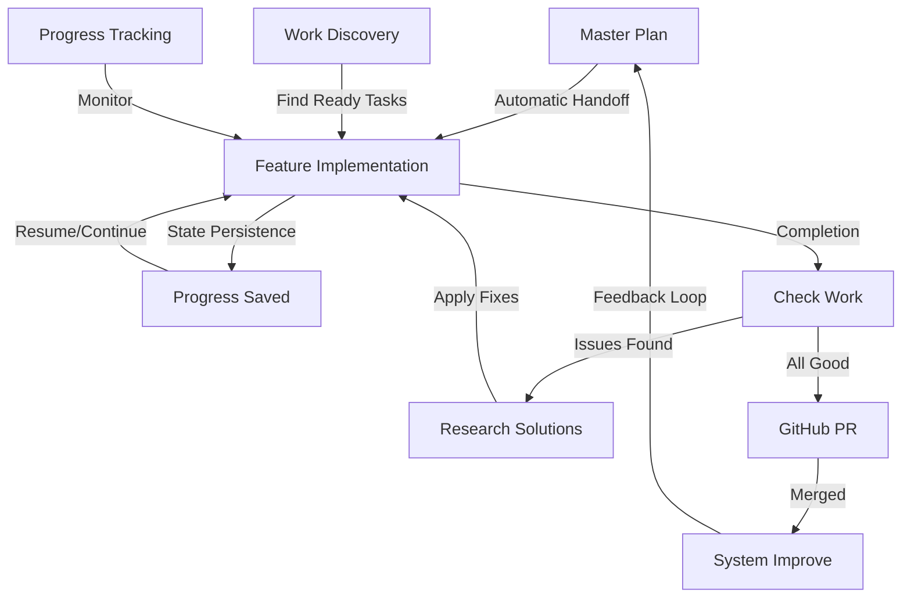

# Claude Code Commands for DCE

This directory contains the AI Agent System for the Dependable Call Exchange backend project - a true parallel execution system using Task tools to achieve 5-8x performance improvements through concurrent processing.

## 📚 Documentation Hub

### Navigation Guide

| Document | Purpose | When to Use |
|----------|---------|-------------|
| **[INDEX.md](./INDEX.md)** | Master navigation and documentation map | Start here to find any document |
| **[QUICKSTART.md](./QUICKSTART.md)** | 5-minute introduction to the system | New users or quick refresher |
| **[COMMAND_REFERENCE.md](./COMMAND_REFERENCE.md)** | Complete command documentation | Looking up command syntax/options |
| **[docs/ARCHITECTURE.md](./docs/ARCHITECTURE.md)** | Technical architecture deep dive | Understanding system internals |
| **[docs/TROUBLESHOOTING.md](./docs/TROUBLESHOOTING.md)** | Problem diagnosis and solutions | When things go wrong |
| **[docs/WORKFLOWS.md](./docs/WORKFLOWS.md)** | End-to-end workflow examples | Learning common usage patterns |

### System Documentation

- **[AI_AGENT_GUIDE.md](./docs/AI_AGENT_GUIDE.md)** - Comprehensive guide to the parallel task system
- **[AI_AGENT_QUICK_REF.md](./docs/AI_AGENT_QUICK_REF.md)** - Quick reference card
- **[PARALLEL_EXECUTION.md](./docs/PARALLEL_EXECUTION.md)** - Technical details on execution model
- **[PARALLEL_IS_REAL.md](./docs/PARALLEL_IS_REAL.md)** - ⚠️ IMPORTANT: Clarification that this is true parallelism
- **[SYSTEM_SUMMARY.md](./docs/SYSTEM_SUMMARY.md)** - Current status and recommendations
- **[ARCHITECTURE_CLARIFICATION.md](./docs/ARCHITECTURE_CLARIFICATION.md)** - Architecture decisions explained

## 🚀 Getting Started

**New to the system?** Start with **[QUICKSTART.md](./QUICKSTART.md)** for a 5-minute introduction.

### Quick Start Commands

```bash
# 1. Generate a development plan
/dce-master-plan full ./.claude/planning balanced thorough

# 2. Implement a feature (automatic handoff mode)
/dce-feature ./docs/specs/consent-management-v2.md . adaptive production
# Note: Feature command automatically detects master-plan context and uses it!

# 3. Check your work for gaps
/dce-check-work

# 4. For system improvements
/dce-system-improve performance ./analysis
```

## Available Commands

For complete command documentation with all options and examples, see **[COMMAND_REFERENCE.md](./COMMAND_REFERENCE.md)**.

### Core Planning & Execution

#### `/dce-master-plan`
Strategic master planner that analyzes the codebase and generates a comprehensive development roadmap.

**Usage**: `/dce-master-plan [scope] [output_dir] [priority] [depth]`

**Example**: 
```bash
/dce-master-plan full ./.claude/planning compliance-critical thorough
```

#### `/dce-feature`
Feature executor that implements specifications across all architectural layers. **Now with seamless handoff from master-plan!**

**Usage**: `/dce-feature [spec_file] [output_dir] [mode] [quality]`

**Features**:
- 🔄 **Automatic Handoff Mode**: Detects master-plan context and uses it
- 💾 **State Persistence**: Saves progress between runs
- 🔁 **Smart Resumption**: Continue from where you left off
- 📊 **Progress Tracking**: Real-time status updates

**Example**:
```bash
# Standalone mode
/dce-feature ./docs/specs/feature.md . adaptive production

# Handoff mode (automatic when master-plan exists)
/dce-feature ./planning/specs/generated-spec.md . adaptive production
```

### Quality & Review Commands

#### `/dce-check-work`
Comprehensive self-review that identifies overlooked requirements, edge cases, security vulnerabilities, and implementation gaps.

**Usage**: `/dce-check-work`

**Analysis Areas**:
- Implementation completeness
- Architecture & design adherence
- Performance & quality metrics
- Security & compliance gaps
- Testing & documentation coverage

**Example**:
```bash
/dce-check-work
# Performs critical analysis across all quality dimensions
# Outputs detailed findings with severity levels and remediation steps
```

#### `/dce-research`
Web research tool for addressing errors, discovering solutions, and finding best practices for implementation challenges.

**Usage**: `/dce-research [topic]`

**Research Focus**:
- Go 1.24 specific features and patterns
- High-performance telephony architecture
- Compliance implementation strategies
- Performance optimization techniques
- Security best practices

**Example**:
```bash
/dce-research "Go 1.24 synctest patterns for concurrent testing"
/dce-research "sub-millisecond latency optimization techniques"
/dce-research "TCPA compliance implementation in telephony systems"
```

### System Improvement Commands

#### `/dce-system-improve`
End-to-end improvement pipeline that implements recommendations from the System Improvement Guide.

**Usage**: `/dce-system-improve --phase=[phases] --depth=[level] --output=[path]`

**Phases**:
- `0` - Critical handoff fix
- `1` - Foundation upgrades (state engine, work discovery)
- `2` - Progress tracking & resumption
- `3` - Inter-wave coordination
- `3.5` - Implementation detail generation
- `4` - Enhanced coordination
- `5` - Self-review & continuous improvement
- `all` - Complete pipeline (default)

**Example**:
```bash
/dce-system-improve --phase=all --depth=thorough --output=./.claude/improve
/dce-system-improve --phase=0-2 --depth=exhaustive --incremental=true
```

### Work Discovery & Management

#### `/dce-find-work`
Smart work discovery that finds ready-to-implement tasks based on dependencies and priorities.

**Usage**: `/dce-find-work [options]`

**Options**:
- `--ready` - Tasks with all dependencies complete
- `--no-blockers` - Same as --ready
- `--criteria="<query>"` - Complex queries (e.g., "revenue-critical AND effort:low")
- `--technical="<filter>"` - Technical criteria (e.g., "missing-tests")
- `--team="<team>"` - Filter by team assignment
- `--capacity="<hours>"` - Find work fitting team capacity

**Example**:
```bash
/dce-find-work --ready
/dce-find-work --criteria="compliance-required AND ready"
/dce-find-work --technical="performance-issues" --team=backend
```

### Progress Management Commands

#### `/dce-feature-resume`
Resume an interrupted feature implementation from the last saved state.

**Usage**: `/dce-feature-resume [feature_id] [options]`

**Options**:
- `--from-wave=<wave>` - Resume from specific wave
- `--force` - Force resume even if feature appears complete
- `--status` - Check status without resuming

**Example**:
```bash
/dce-feature-resume consent-management-v2
/dce-feature-resume consent-management --status
/dce-feature-resume consent-management --from-wave=3
```

#### `/dce-feature-continue`
Continue feature implementation from a specific wave, useful for skipping completed waves.

**Usage**: `/dce-feature-continue [feature_id] --from-wave=[wave] [options]`

**Options**:
- `--from-wave=<wave>` - Wave number to continue from (1-5) (required)
- `--skip-validation` - Skip validation of previous waves
- `--with-context=<file>` - Load additional context

**Example**:
```bash
/dce-feature-continue consent-management --from-wave=3
/dce-feature-continue consent-management --from-wave=4 --with-context=api-design.yaml
```

#### `/dce-feature-retry`
Retry failed waves with improvements, incorporating lessons learned from failures.

**Usage**: `/dce-feature-retry [feature_id] --wave=[wave] [options]`

**Options**:
- `--wave=<wave>` - Wave number to retry (1-5) (required)
- `--with-context=<message>` - Additional context about fixes
- `--clean-artifacts` - Remove failed artifacts before retry
- `--alternative-approach` - Use alternative implementation

**Example**:
```bash
/dce-feature-retry consent-management --wave=2 --with-context="Add database indexes"
/dce-feature-retry consent-management --wave=3 --alternative-approach
```

### Version Control Integration

#### `/github`
GitHub integration for creating logical commits and pull requests with automated organization.

**Usage**: `/github [branch_name]`

**Features**:
- Automatic branch creation/management
- Logical commit grouping by type
- Pull request creation/updates
- CI/CD integration
- Post-merge cleanup

**Example**:
```bash
/github feature/consent-management
# Creates/uses branch, groups commits logically, creates PR

/github
# Auto-generates branch name if on main
```

## Command Files

- `commands/dce-master-plan.md` - Master planning command
- `commands/dce-feature.md` - Feature implementation command
- `commands/dce-check-work.md` - Self-review and gap analysis
- `commands/dce-research.md` - Web research for solutions
- `commands/dce-system-improve.md` - System improvement pipeline
- `commands/dce-find-work.md` - Work discovery command
- `commands/dce-feature-resume.md` - Resume feature command
- `commands/dce-feature-continue.md` - Continue from wave command
- `commands/dce-feature-retry.md` - Retry failed tasks command
- `commands/github.md` - GitHub integration command

## How It Works

For detailed technical architecture, see **[docs/ARCHITECTURE.md](./docs/ARCHITECTURE.md)**.

### Enhanced Workflow with Seamless Integration



1. **Planning Phase**: Use `/dce-master-plan` to analyze your codebase and generate a roadmap
2. **Seamless Handoff**: Feature command automatically detects and uses master-plan context
3. **Execution Phase**: Implement features with automatic state persistence
4. **Quality Check**: Use `/dce-check-work` to identify gaps
5. **Research Solutions**: Use `/dce-research` for technical challenges
6. **Version Control**: Use `/github` for organized commits and PRs
7. **Continuous Improvement**: System analyzes performance and suggests optimizations

### State Management

The system maintains persistent state across runs:

```
.claude/
├── state/                    # System state persistence
│   ├── system-snapshot.yaml # System health and status
│   ├── analysis-history.yaml # Previous analysis cache
│   ├── feature-progress.yaml # Detailed progress tracking
│   ├── dependency-graph.yaml # Inter-feature relationships
│   └── performance-metrics.yaml # Execution metrics
├── context/                 # Implementation contexts
│   ├── feature-context.yaml # Current feature context
│   ├── implementation-plan.md # Execution plan
│   └── wave-coordination.yaml # Inter-wave communication
├── work-discovery/          # Work filtering criteria
│   ├── criteria.yaml        # Discovery filters
│   └── execution-queue.yaml # Prioritized work queue
├── monitoring/              # Performance metrics
│   ├── metrics.db          # Historical metrics
│   └── dashboard.md        # Performance dashboard
└── optimization/            # Improvement loops
    ├── improvement-loop.yaml # Optimization strategies
    └── applied-fixes.log    # Applied optimizations
```

### Performance Metrics

The enhanced system delivers significant performance improvements:

| Metric | Old System | New System | Improvement |
|--------|------------|------------|-------------|
| Handoff Time | ~15 min manual | Automatic | ♾️ |
| State Recovery | Full re-analysis | Instant resume | 80-90% faster |
| Work Discovery | Manual search | Smart filtering | 70% efficiency gain |
| Parallel Execution | N/A | 5-8 tasks | 5-8x throughput |
| Context Switching | High overhead | Zero overhead | 100% reduction |

## Customization

These commands are tailored specifically for the DCE project's:
- Go 1.24+ architecture
- Domain-driven design patterns
- High-performance requirements (< 1ms routing)
- Compliance needs (TCPA, GDPR, DNC)
- Modular monolith structure

To customize further, edit the command files directly.

## Troubleshooting

For comprehensive troubleshooting guide, see **[docs/TROUBLESHOOTING.md](./docs/TROUBLESHOOTING.md)**.

### Common Issues

**Feature command not detecting master-plan context**
- Ensure master-plan was run first
- Check `.claude/context/feature-context.yaml` exists
- Verify spec file path matches generated specs

**State not persisting between runs**
- Check `.claude/state/` directory permissions
- Ensure feature_id is consistent
- Look for state files in `.claude/state/`

**Work discovery returning no results**
- Run master-plan to populate task graph
- Check dependency completion status
- Verify filtering criteria match your needs

**Performance not meeting expectations**
- Review parallel execution logs
- Check for blocking dependencies
- Run `/dce-system-improve performance` for analysis

### Debug Commands

```bash
# Check current state
cat .claude/state/feature-progress.yaml

# View execution metrics
cat .claude/state/performance-metrics.yaml

# List available work
/dce-find-work --ready

# Analyze system performance
/dce-system-improve --phase=5 --output=./analysis

# Check for implementation gaps
/dce-check-work
```

## Best Practices

For complete workflow examples, see **[docs/WORKFLOWS.md](./docs/WORKFLOWS.md)**.

1. **Always run master-plan first** for complex features
2. **Use handoff mode** for generated specs (automatic)
3. **Check your work** with `/dce-check-work` before PRs
4. **Research solutions** with `/dce-research` for technical challenges
5. **Monitor progress** with state tracking
6. **Resume interrupted work** instead of restarting
7. **Run system improvements** periodically
8. **Use work discovery** before manual task selection
9. **Create logical commits** with `/github` integration

## Next Steps

1. **New Users**: Start with **[QUICKSTART.md](./QUICKSTART.md)**
2. **Learn Workflows**: Read **[docs/WORKFLOWS.md](./docs/WORKFLOWS.md)** for end-to-end examples
3. **Explore Commands**: Browse **[COMMAND_REFERENCE.md](./COMMAND_REFERENCE.md)** for all options
4. **Understand Architecture**: Study **[docs/ARCHITECTURE.md](./docs/ARCHITECTURE.md)** for system internals
5. **Get Help**: Check **[docs/TROUBLESHOOTING.md](./docs/TROUBLESHOOTING.md)** when issues arise

### Quick Links

- 🚀 **[Quick Start Guide](./QUICKSTART.md)** - Get running in 5 minutes
- 📖 **[Full Documentation Index](./INDEX.md)** - Complete documentation map
- 🛠️ **[Command Reference](./COMMAND_REFERENCE.md)** - All commands and options
- 🏗️ **[Architecture Guide](./docs/ARCHITECTURE.md)** - Technical deep dive
- 🔧 **[Troubleshooting](./docs/TROUBLESHOOTING.md)** - Problem solving guide
- 📋 **[Workflow Examples](./docs/WORKFLOWS.md)** - Common usage patterns