# Agent Collaboration Patterns

> Visual guide to how parallel AI agents coordinate and collaborate in the DCE infinite loop system

## 1. Agent Spawning Architecture

### Task Tool Invocation Flow
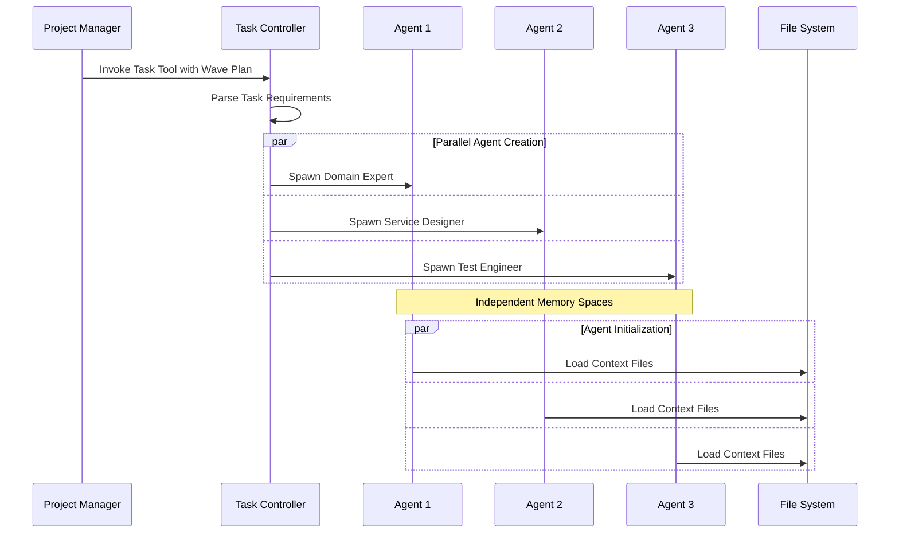
```mermaid
sequenceDiagram
    participant PM as Project Manager
    participant TC as Task Controller
    participant A1 as Agent 1
    participant A2 as Agent 2
    participant A3 as Agent 3
    participant FS as File System

    PM->>TC: Invoke Task Tool with Wave Plan
    TC->>TC: Parse Task Requirements
    
    par Parallel Agent Creation
        TC->>A1: Spawn Domain Expert
        and
        TC->>A2: Spawn Service Designer
        and
        TC->>A3: Spawn Test Engineer
    end

    Note over A1,A3: Independent Memory Spaces
    
    par Agent Initialization
        A1->>FS: Load Context Files
        and
        A2->>FS: Load Context Files
        and
        A3->>FS: Load Context Files
    end
```

### Agent Lifecycle Management
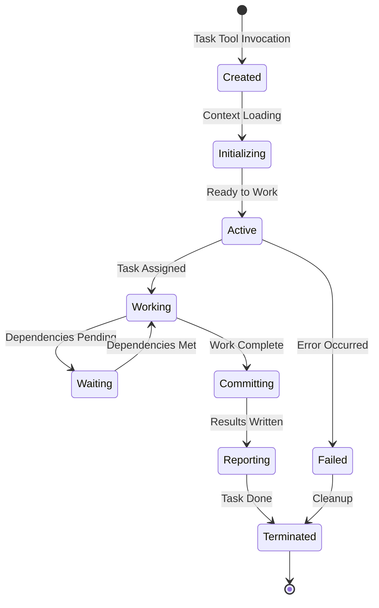
```mermaid
stateDiagram-v2
    [*] --> Created: Task Tool Invocation
    Created --> Initializing: Context Loading
    Initializing --> Active: Ready to Work
    
    Active --> Working: Task Assigned
    Working --> Waiting: Dependencies Pending
    Waiting --> Working: Dependencies Met
    
    Working --> Committing: Work Complete
    Committing --> Reporting: Results Written
    Reporting --> Terminated: Task Done
    
    Terminated --> [*]
    
    Active --> Failed: Error Occurred
    Failed --> Terminated: Cleanup
```

### Memory Isolation Architecture
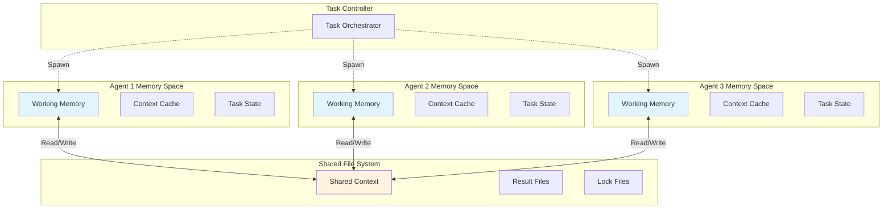
```mermaid
graph TB
    subgraph "Task Controller"
        TC[Task Orchestrator]
    end
    
    subgraph "Agent 1 Memory Space"
        M1[Working Memory]
        C1[Context Cache]
        T1[Task State]
    end
    
    subgraph "Agent 2 Memory Space"
        M2[Working Memory]
        C2[Context Cache]
        T2[Task State]
    end
    
    subgraph "Agent 3 Memory Space"
        M3[Working Memory]
        C3[Context Cache]
        T3[Task State]
    end
    
    subgraph "Shared File System"
        SF[Shared Context]
        RF[Result Files]
        LF[Lock Files]
    end
    
    TC -.->|Spawn| M1
    TC -.->|Spawn| M2
    TC -.->|Spawn| M3
    
    M1 <-->|Read/Write| SF
    M2 <-->|Read/Write| SF
    M3 <-->|Read/Write| SF
    
    style M1 fill:#e1f5fe
    style M2 fill:#e1f5fe
    style M3 fill:#e1f5fe
    style SF fill:#fff3e0
```

## 2. Collaboration Patterns

### Producer-Consumer Pattern
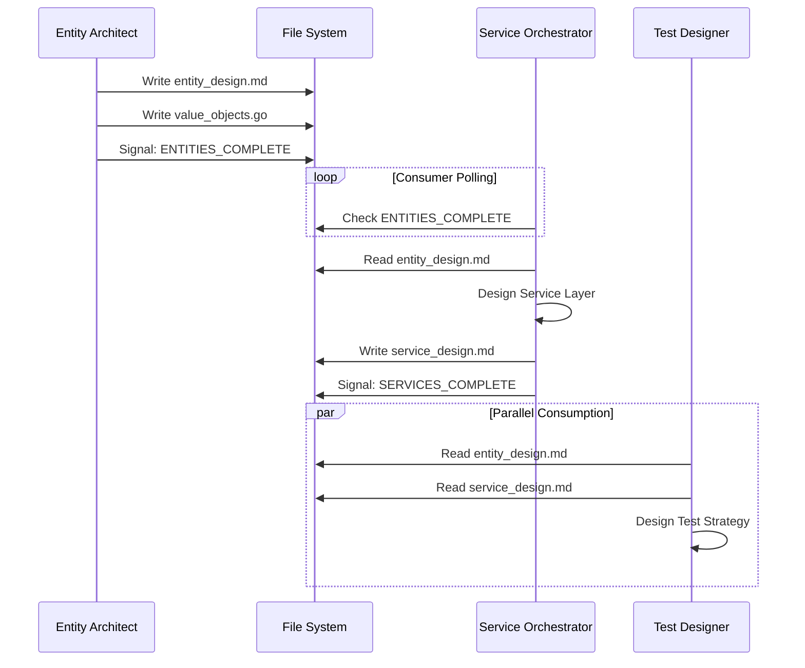
```mermaid
sequenceDiagram
    participant EA as Entity Architect
    participant FS as File System
    participant SO as Service Orchestrator
    participant TD as Test Designer
    
    EA->>FS: Write entity_design.md
    EA->>FS: Write value_objects.go
    EA->>FS: Signal: ENTITIES_COMPLETE
    
    loop Consumer Polling
        SO->>FS: Check ENTITIES_COMPLETE
    end
    
    SO->>FS: Read entity_design.md
    SO->>SO: Design Service Layer
    SO->>FS: Write service_design.md
    SO->>FS: Signal: SERVICES_COMPLETE
    
    par Parallel Consumption
        TD->>FS: Read entity_design.md
        TD->>FS: Read service_design.md
        TD->>TD: Design Test Strategy
    end
```

### Pipeline Processing Chain
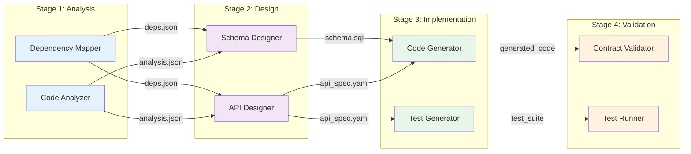
```mermaid
graph LR
    subgraph "Stage 1: Analysis"
        A1[Code Analyzer]
        A2[Dependency Mapper]
    end
    
    subgraph "Stage 2: Design"
        D1[API Designer]
        D2[Schema Designer]
    end
    
    subgraph "Stage 3: Implementation"
        I1[Code Generator]
        I2[Test Generator]
    end
    
    subgraph "Stage 4: Validation"
        V1[Contract Validator]
        V2[Test Runner]
    end
    
    A1 -->|analysis.json| D1
    A2 -->|deps.json| D1
    A1 -->|analysis.json| D2
    A2 -->|deps.json| D2
    
    D1 -->|api_spec.yaml| I1
    D2 -->|schema.sql| I1
    D1 -->|api_spec.yaml| I2
    
    I1 -->|generated_code| V1
    I2 -->|test_suite| V2
    
    style A1 fill:#e3f2fd
    style A2 fill:#e3f2fd
    style D1 fill:#f3e5f5
    style D2 fill:#f3e5f5
    style I1 fill:#e8f5e9
    style I2 fill:#e8f5e9
    style V1 fill:#fff3e0
    style V2 fill:#fff3e0
```

### Fan-Out/Fan-In Orchestration
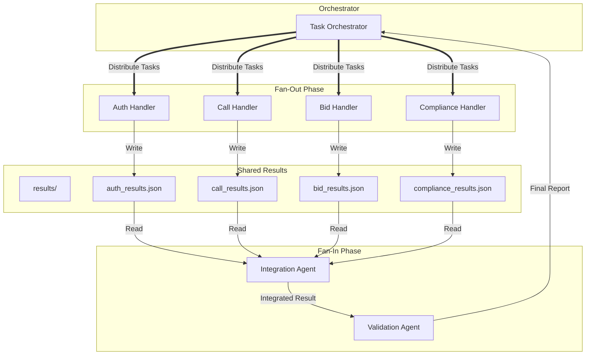
```mermaid
graph TB
    subgraph "Orchestrator"
        O[Task Orchestrator]
    end
    
    subgraph "Fan-Out Phase"
        A1[Auth Handler]
        A2[Call Handler]
        A3[Bid Handler]
        A4[Compliance Handler]
    end
    
    subgraph "Shared Results"
        R[results/]
        R1[auth_results.json]
        R2[call_results.json]
        R3[bid_results.json]
        R4[compliance_results.json]
    end
    
    subgraph "Fan-In Phase"
        I[Integration Agent]
        V[Validation Agent]
    end
    
    O ==>|Distribute Tasks| A1
    O ==>|Distribute Tasks| A2
    O ==>|Distribute Tasks| A3
    O ==>|Distribute Tasks| A4
    
    A1 -->|Write| R1
    A2 -->|Write| R2
    A3 -->|Write| R3
    A4 -->|Write| R4
    
    R1 -->|Read| I
    R2 -->|Read| I
    R3 -->|Read| I
    R4 -->|Read| I
    
    I -->|Integrated Result| V
    V -->|Final Report| O
```

### Dependency-Driven Coordination
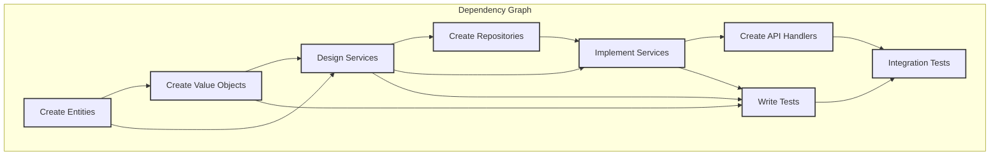
```mermaid
graph TD
    subgraph "Dependency Graph"
        T1[Create Entities]
        T2[Create Value Objects]
        T3[Design Services]
        T4[Create Repositories]
        T5[Implement Services]
        T6[Create API Handlers]
        T7[Write Tests]
        T8[Integration Tests]
    end
    
    T1 --> T2
    T1 --> T3
    T2 --> T3
    T3 --> T4
    T3 --> T5
    T4 --> T5
    T5 --> T6
    T2 --> T7
    T3 --> T7
    T5 --> T7
    T6 --> T8
    T7 --> T8
    
    style T1 fill:#completed,stroke:#333,stroke-width:2px
    style T2 fill:#completed,stroke:#333,stroke-width:2px
    style T3 fill:#in-progress,stroke:#333,stroke-width:2px
    style T4 fill:#in-progress,stroke:#333,stroke-width:2px
    style T5 fill:#waiting,stroke:#333,stroke-width:2px
    style T6 fill:#waiting,stroke:#333,stroke-width:2px
    style T7 fill:#in-progress,stroke:#333,stroke-width:2px
    style T8 fill:#waiting,stroke:#333,stroke-width:2px
    
    classDef completed fill:#c8e6c9
    classDef in-progress fill:#fff9c4
    classDef waiting fill:#ffccbc
```

## 3. Specialist Agent Interactions

### Entity Architect → Service Orchestrator Handoff
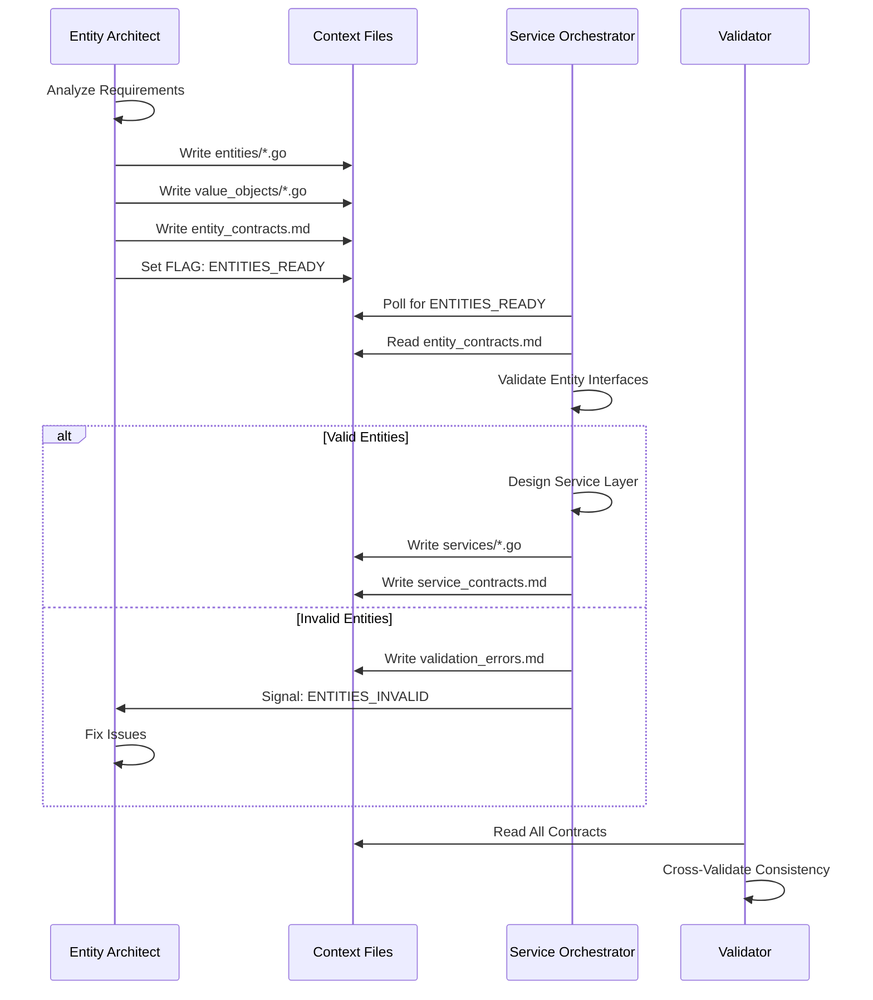
```mermaid
sequenceDiagram
    participant EA as Entity Architect
    participant CTX as Context Files
    participant SO as Service Orchestrator
    participant VAL as Validator
    
    EA->>EA: Analyze Requirements
    EA->>CTX: Write entities/*.go
    EA->>CTX: Write value_objects/*.go
    EA->>CTX: Write entity_contracts.md
    EA->>CTX: Set FLAG: ENTITIES_READY
    
    SO->>CTX: Poll for ENTITIES_READY
    SO->>CTX: Read entity_contracts.md
    SO->>SO: Validate Entity Interfaces
    
    alt Valid Entities
        SO->>SO: Design Service Layer
        SO->>CTX: Write services/*.go
        SO->>CTX: Write service_contracts.md
    else Invalid Entities
        SO->>CTX: Write validation_errors.md
        SO->>EA: Signal: ENTITIES_INVALID
        EA->>EA: Fix Issues
    end
    
    VAL->>CTX: Read All Contracts
    VAL->>VAL: Cross-Validate Consistency
```

### API Designer ↔ Test Engineer Coordination
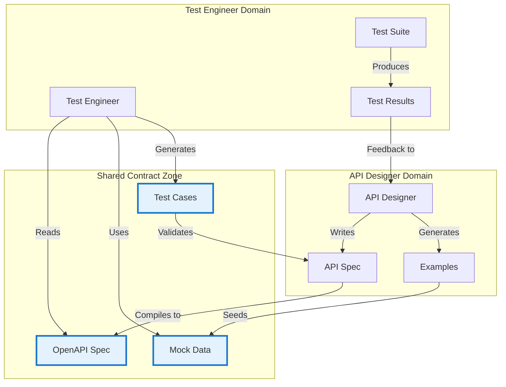
```mermaid
graph TB
    subgraph "API Designer Domain"
        AD[API Designer]
        AS[API Spec]
        AE[Examples]
    end
    
    subgraph "Shared Contract Zone"
        OA[OpenAPI Spec]
        TC[Test Cases]
        MD[Mock Data]
    end
    
    subgraph "Test Engineer Domain"
        TE[Test Engineer]
        TS[Test Suite]
        TR[Test Results]
    end
    
    AD -->|Writes| AS
    AD -->|Generates| AE
    AS -->|Compiles to| OA
    AE -->|Seeds| MD
    
    TE -->|Reads| OA
    TE -->|Uses| MD
    TE -->|Generates| TC
    TC -->|Validates| AS
    
    TS -->|Produces| TR
    TR -->|Feedback to| AD
    
    style OA fill:#e3f2fd,stroke:#1976d2,stroke-width:3px
    style TC fill:#e3f2fd,stroke:#1976d2,stroke-width:3px
    style MD fill:#e3f2fd,stroke:#1976d2,stroke-width:3px
```

### Cross-Cutting Concern Handling
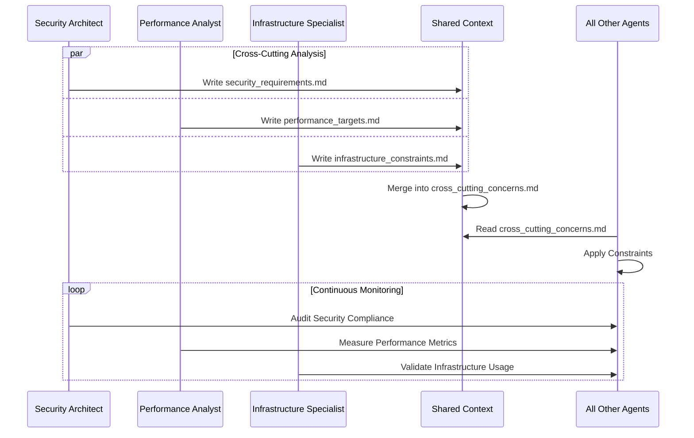
```mermaid
sequenceDiagram
    participant SA as Security Architect
    participant PA as Performance Analyst
    participant IA as Infrastructure Specialist
    participant CTX as Shared Context
    participant ALL as All Other Agents
    
    par Cross-Cutting Analysis
        SA->>CTX: Write security_requirements.md
        and
        PA->>CTX: Write performance_targets.md
        and
        IA->>CTX: Write infrastructure_constraints.md
    end
    
    CTX->>CTX: Merge into cross_cutting_concerns.md
    
    ALL->>CTX: Read cross_cutting_concerns.md
    ALL->>ALL: Apply Constraints
    
    loop Continuous Monitoring
        SA->>ALL: Audit Security Compliance
        PA->>ALL: Measure Performance Metrics
        IA->>ALL: Validate Infrastructure Usage
    end
```

## 4. File-Based Communication

### Shared Context Architecture
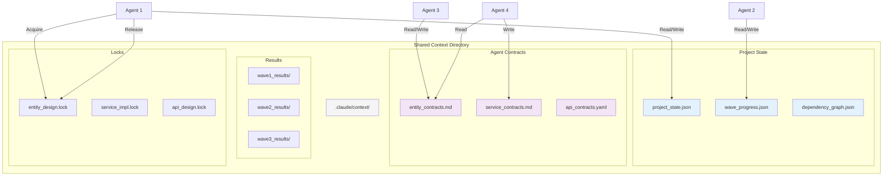
```mermaid
graph TB
    subgraph "Shared Context Directory"
        SC[.claude/context/]
        
        subgraph "Project State"
            PS1[project_state.json]
            PS2[wave_progress.json]
            PS3[dependency_graph.json]
        end
        
        subgraph "Agent Contracts"
            AC1[entity_contracts.md]
            AC2[service_contracts.md]
            AC3[api_contracts.yaml]
        end
        
        subgraph "Results"
            R1[wave1_results/]
            R2[wave2_results/]
            R3[wave3_results/]
        end
        
        subgraph "Locks"
            L1[entity_design.lock]
            L2[service_impl.lock]
            L3[api_design.lock]
        end
    end
    
    A1[Agent 1] -->|Read/Write| PS1
    A2[Agent 2] -->|Read/Write| PS2
    A3[Agent 3] -->|Read/Write| AC1
    A4[Agent 4] -->|Read| AC1
    A4 -->|Write| AC2
    
    A1 -->|Acquire| L1
    A1 -->|Release| L1
    
    style SC fill:#f5f5f5
    style PS1 fill:#e3f2fd
    style PS2 fill:#e3f2fd
    style PS3 fill:#e3f2fd
    style AC1 fill:#f3e5f5
    style AC2 fill:#f3e5f5
    style AC3 fill:#f3e5f5
```

### Result Aggregation Mechanism
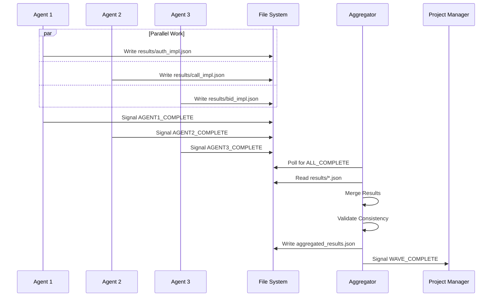
```mermaid
sequenceDiagram
    participant A1 as Agent 1
    participant A2 as Agent 2
    participant A3 as Agent 3
    participant FS as File System
    participant AGG as Aggregator
    participant PM as Project Manager
    
    par Parallel Work
        A1->>FS: Write results/auth_impl.json
        and
        A2->>FS: Write results/call_impl.json
        and
        A3->>FS: Write results/bid_impl.json
    end
    
    A1->>FS: Signal AGENT1_COMPLETE
    A2->>FS: Signal AGENT2_COMPLETE
    A3->>FS: Signal AGENT3_COMPLETE
    
    AGG->>FS: Poll for ALL_COMPLETE
    AGG->>FS: Read results/*.json
    AGG->>AGG: Merge Results
    AGG->>AGG: Validate Consistency
    AGG->>FS: Write aggregated_results.json
    AGG->>PM: Signal WAVE_COMPLETE
```

### State Synchronization Pattern
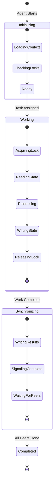
```mermaid
stateDiagram-v2
    [*] --> Initializing: Agent Starts
    
    state Initializing {
        [*] --> LoadingContext
        LoadingContext --> CheckingLocks
        CheckingLocks --> Ready
    }
    
    Ready --> Working: Task Assigned
    
    state Working {
        [*] --> AcquiringLock
        AcquiringLock --> ReadingState
        ReadingState --> Processing
        Processing --> WritingState
        WritingState --> ReleasingLock
        ReleasingLock --> [*]
    }
    
    Working --> Synchronizing: Work Complete
    
    state Synchronizing {
        [*] --> WritingResults
        WritingResults --> SignalingComplete
        SignalingComplete --> WaitingForPeers
        WaitingForPeers --> [*]
    }
    
    Synchronizing --> Completed: All Peers Done
    Completed --> [*]
```

### Conflict Resolution Strategy
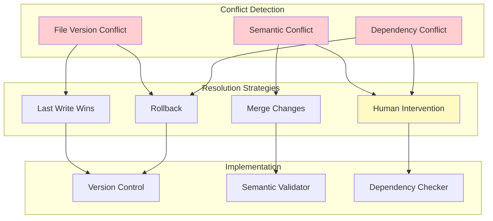
```mermaid
graph TD
    subgraph "Conflict Detection"
        C1[File Version Conflict]
        C2[Semantic Conflict]
        C3[Dependency Conflict]
    end
    
    subgraph "Resolution Strategies"
        R1[Last Write Wins]
        R2[Merge Changes]
        R3[Human Intervention]
        R4[Rollback]
    end
    
    subgraph "Implementation"
        I1[Version Control]
        I2[Semantic Validator]
        I3[Dependency Checker]
    end
    
    C1 --> R1
    C1 --> R4
    C2 --> R2
    C2 --> R3
    C3 --> R3
    C3 --> R4
    
    R1 --> I1
    R2 --> I2
    R3 --> I3
    R4 --> I1
    
    style C1 fill:#ffcdd2
    style C2 fill:#ffcdd2
    style C3 fill:#ffcdd2
    style R3 fill:#fff9c4
```

## 5. Wave Coordination Mechanics

### Inter-Wave Dependency Management
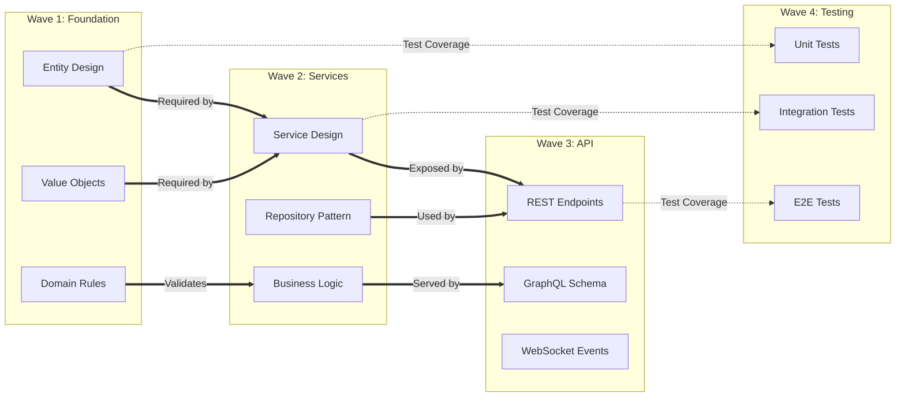
```mermaid
graph LR
    subgraph "Wave 1: Foundation"
        W1A[Entity Design]
        W1B[Value Objects]
        W1C[Domain Rules]
    end
    
    subgraph "Wave 2: Services"
        W2A[Service Design]
        W2B[Repository Pattern]
        W2C[Business Logic]
    end
    
    subgraph "Wave 3: API"
        W3A[REST Endpoints]
        W3B[GraphQL Schema]
        W3C[WebSocket Events]
    end
    
    subgraph "Wave 4: Testing"
        W4A[Unit Tests]
        W4B[Integration Tests]
        W4C[E2E Tests]
    end
    
    W1A ==>|Required by| W2A
    W1B ==>|Required by| W2A
    W1C ==>|Validates| W2C
    
    W2A ==>|Exposed by| W3A
    W2B ==>|Used by| W3A
    W2C ==>|Served by| W3B
    
    W1A -.->|Test Coverage| W4A
    W2A -.->|Test Coverage| W4B
    W3A -.->|Test Coverage| W4C
    
    style W1A fill:#completed
    style W1B fill:#completed
    style W1C fill:#completed
    style W2A fill:#in-progress
    style W2B fill:#in-progress
    style W2C fill:#waiting
    style W3A fill:#waiting
    style W3B fill:#waiting
    style W3C fill:#waiting
    
    classDef completed fill:#c8e6c9
    classDef in-progress fill:#fff9c4
    classDef waiting fill:#ffccbc
```

### Quality Gate Enforcement
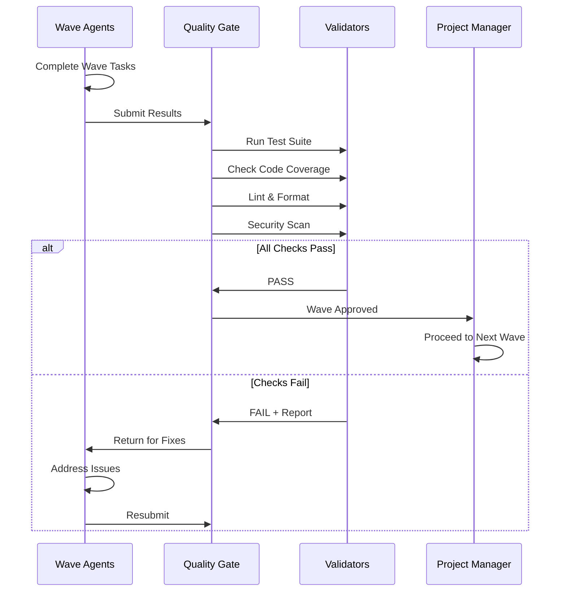
```mermaid
sequenceDiagram
    participant W as Wave Agents
    participant QG as Quality Gate
    participant V as Validators
    participant PM as Project Manager
    
    W->>W: Complete Wave Tasks
    W->>QG: Submit Results
    
    QG->>V: Run Test Suite
    QG->>V: Check Code Coverage
    QG->>V: Lint & Format
    QG->>V: Security Scan
    
    alt All Checks Pass
        V->>QG: PASS
        QG->>PM: Wave Approved
        PM->>PM: Proceed to Next Wave
    else Checks Fail
        V->>QG: FAIL + Report
        QG->>W: Return for Fixes
        W->>W: Address Issues
        W->>QG: Resubmit
    end
```

### Progress Tracking System
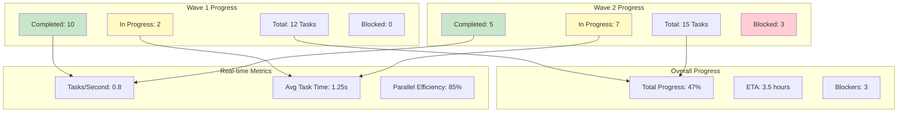
```mermaid
graph TB
    subgraph "Wave 1 Progress"
        W1T[Total: 12 Tasks]
        W1C[Completed: 10]
        W1P[In Progress: 2]
        W1B[Blocked: 0]
    end
    
    subgraph "Wave 2 Progress"
        W2T[Total: 15 Tasks]
        W2C[Completed: 5]
        W2P[In Progress: 7]
        W2B[Blocked: 3]
    end
    
    subgraph "Overall Progress"
        OP[Total Progress: 47%]
        ETA[ETA: 3.5 hours]
        BL[Blockers: 3]
    end
    
    subgraph "Real-time Metrics"
        TPS[Tasks/Second: 0.8]
        APT[Avg Task Time: 1.25s]
        PAE[Parallel Efficiency: 85%]
    end
    
    W1T --> OP
    W2T --> OP
    W1C --> TPS
    W2C --> TPS
    W1P --> APT
    W2P --> APT
    
    style W1C fill:#c8e6c9
    style W1P fill:#fff9c4
    style W2C fill:#c8e6c9
    style W2P fill:#fff9c4
    style W2B fill:#ffcdd2
```

### Error Propagation Flow
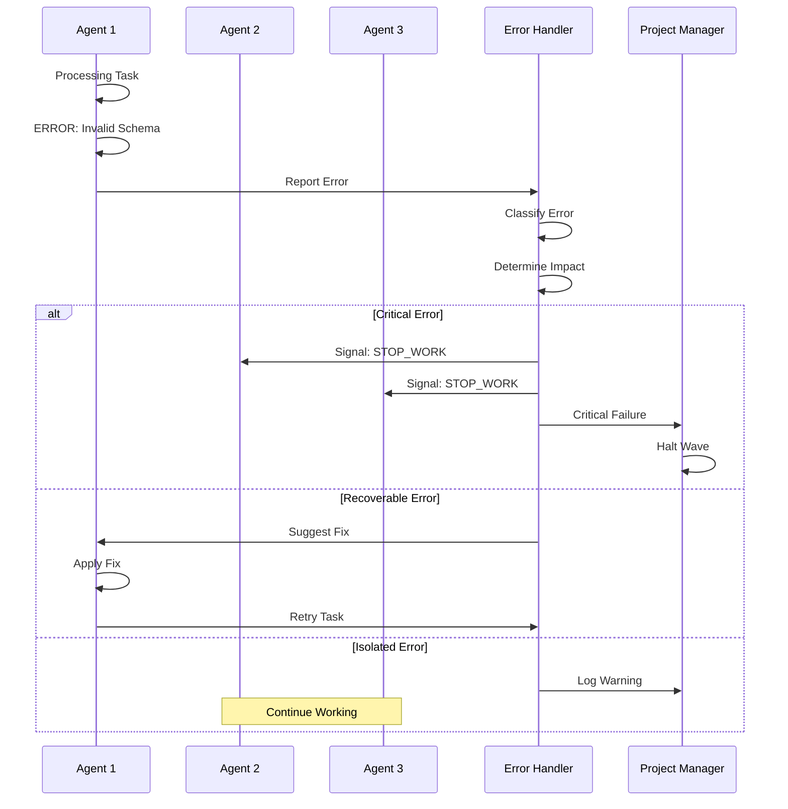
```mermaid
sequenceDiagram
    participant A1 as Agent 1
    participant A2 as Agent 2
    participant A3 as Agent 3
    participant EH as Error Handler
    participant PM as Project Manager
    
    A1->>A1: Processing Task
    A1->>A1: ERROR: Invalid Schema
    A1->>EH: Report Error
    
    EH->>EH: Classify Error
    EH->>EH: Determine Impact
    
    alt Critical Error
        EH->>A2: Signal: STOP_WORK
        EH->>A3: Signal: STOP_WORK
        EH->>PM: Critical Failure
        PM->>PM: Halt Wave
    else Recoverable Error
        EH->>A1: Suggest Fix
        A1->>A1: Apply Fix
        A1->>EH: Retry Task
    else Isolated Error
        EH->>PM: Log Warning
        Note over A2,A3: Continue Working
    end
```

## 6. Performance Patterns

### Load Balancing Strategy
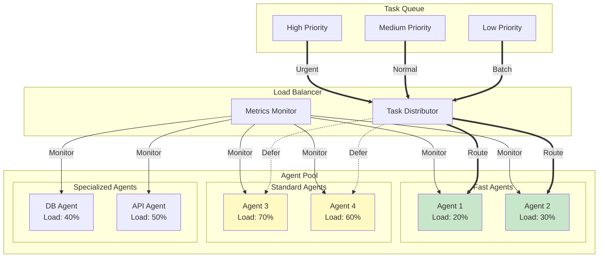
```mermaid
graph TB
    subgraph "Task Queue"
        Q1[High Priority]
        Q2[Medium Priority]
        Q3[Low Priority]
    end
    
    subgraph "Load Balancer"
        LB[Task Distributor]
        M[Metrics Monitor]
    end
    
    subgraph "Agent Pool"
        subgraph "Fast Agents"
            A1[Agent 1<br/>Load: 20%]
            A2[Agent 2<br/>Load: 30%]
        end
        
        subgraph "Standard Agents"
            A3[Agent 3<br/>Load: 70%]
            A4[Agent 4<br/>Load: 60%]
        end
        
        subgraph "Specialized Agents"
            A5[DB Agent<br/>Load: 40%]
            A6[API Agent<br/>Load: 50%]
        end
    end
    
    Q1 ==>|Urgent| LB
    Q2 ==>|Normal| LB
    Q3 ==>|Batch| LB
    
    M -->|Monitor| A1
    M -->|Monitor| A2
    M -->|Monitor| A3
    M -->|Monitor| A4
    M -->|Monitor| A5
    M -->|Monitor| A6
    
    LB ==>|Route| A1
    LB ==>|Route| A2
    LB -.->|Defer| A3
    LB -.->|Defer| A4
    
    style A1 fill:#c8e6c9
    style A2 fill:#c8e6c9
    style A3 fill:#fff9c4
    style A4 fill:#fff9c4
```

### Resource Contention Avoidance
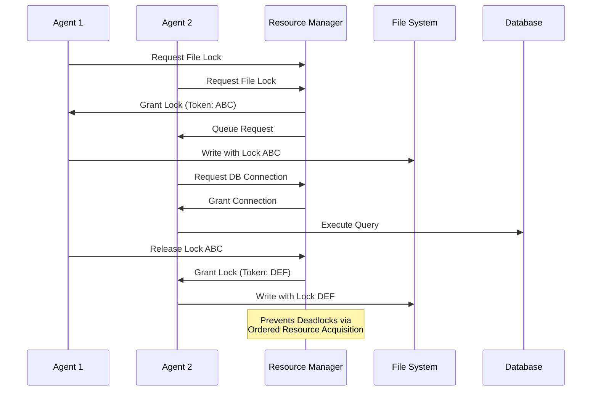
```mermaid
sequenceDiagram
    participant A1 as Agent 1
    participant A2 as Agent 2
    participant RM as Resource Manager
    participant FS as File System
    participant DB as Database
    
    A1->>RM: Request File Lock
    A2->>RM: Request File Lock
    
    RM->>A1: Grant Lock (Token: ABC)
    RM->>A2: Queue Request
    
    A1->>FS: Write with Lock ABC
    
    A2->>RM: Request DB Connection
    RM->>A2: Grant Connection
    A2->>DB: Execute Query
    
    A1->>RM: Release Lock ABC
    RM->>A2: Grant Lock (Token: DEF)
    A2->>FS: Write with Lock DEF
    
    Note over RM: Prevents Deadlocks via<br/>Ordered Resource Acquisition
```

### Efficient Result Collection
```mermaid
graph LR
    subgraph "Streaming Collection"
        A1[Agent 1] -->|Stream| B1[Buffer 1]
        A2[Agent 2] -->|Stream| B2[Buffer 2]
        A3[Agent 3] -->|Stream| B3[Buffer 3]
        
        B1 -->|Batch| C[Collector]
        B2 -->|Batch| C
        B3 -->|Batch| C
        
        C -->|Aggregate| R[Results]
    end
    
    subgraph "Metrics"
        R -->|Monitor| M1[Throughput]
        R -->|Monitor| M2[Latency]
        R -->|Monitor| M3[Memory]
    end
    
    style B1 fill:#e3f2fd
    style B2 fill:#e3f2fd
    style B3 fill:#e3f2fd
    style C fill:#fff9c4
```

### Scalability Architecture
```mermaid
graph TB
    subgraph "Control Plane"
        PM[Project Manager]
        TS[Task Scheduler]
        MM[Metrics Monitor]
    end
    
    subgraph "Agent Plane - Node 1"
        A1[Agent 1]
        A2[Agent 2]
        A3[Agent 3]
    end
    
    subgraph "Agent Plane - Node 2"
        A4[Agent 4]
        A5[Agent 5]
        A6[Agent 6]
    end
    
    subgraph "Agent Plane - Node 3"
        A7[Agent 7]
        A8[Agent 8]
        A9[Agent 9]
    end
    
    subgraph "Shared Storage"
        S1[(Primary Store)]
        S2[(Replica 1)]
        S3[(Replica 2)]
    end
    
    PM ==>|Orchestrate| TS
    TS ==>|Distribute| A1
    TS ==>|Distribute| A4
    TS ==>|Distribute| A7
    
    MM -.->|Monitor| A1
    MM -.->|Monitor| A4
    MM -.->|Monitor| A7
    
    A1 <-->|Read/Write| S1
    A4 <-->|Read/Write| S1
    A7 <-->|Read/Write| S1
    
    S1 -.->|Replicate| S2
    S1 -.->|Replicate| S3
    
    style PM fill:#e3f2fd
    style TS fill:#e3f2fd
    style MM fill:#e3f2fd
```

## Summary

These collaboration patterns demonstrate how the DCE parallel execution system achieves:

1. **True Parallelism** - Independent agents with isolated memory spaces
2. **Efficient Coordination** - File-based communication with minimal contention
3. **Robust Error Handling** - Graceful degradation and recovery
4. **Scalable Architecture** - Horizontal scaling with maintained efficiency
5. **Quality Assurance** - Built-in gates and validation at every step

The visual patterns shown here form the foundation for understanding how AI agents can work together to deliver complex software features with the efficiency and coordination of a well-orchestrated development team.