# DCE Command Execution Flows

> Visual documentation of command processing pipelines, execution flows, and system optimization strategies

## Table of Contents

1. [Command Processing Pipeline](#command-processing-pipeline)
2. [Individual Command Flows](#individual-command-flows)
3. [Mode Detection Decision Trees](#mode-detection-decision-trees)
4. [Error Handling and Recovery](#error-handling-and-recovery)
5. [Performance Optimization Flows](#performance-optimization-flows)

---

## Command Processing Pipeline

### Complete Command Execution Flow

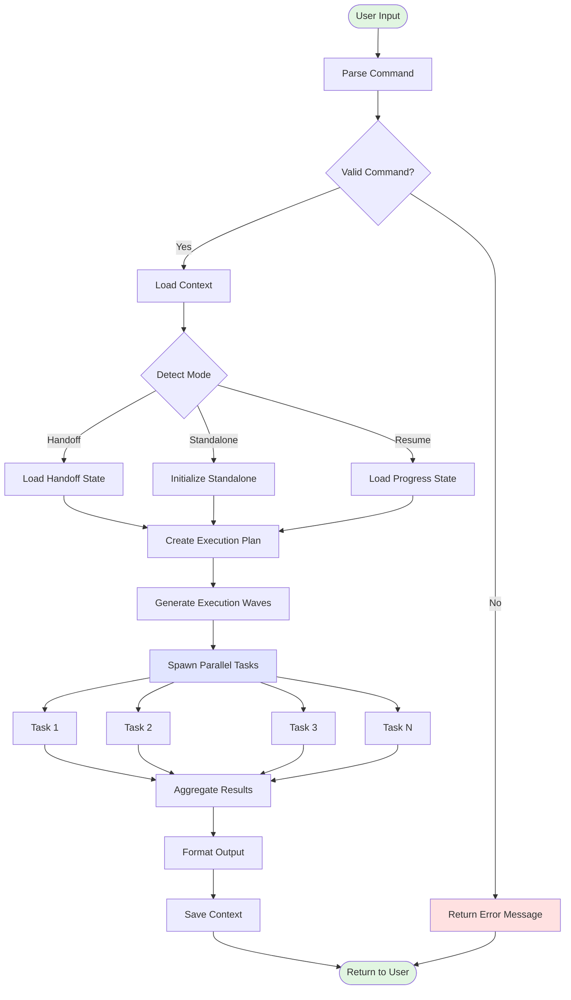

### Command Parser State Machine

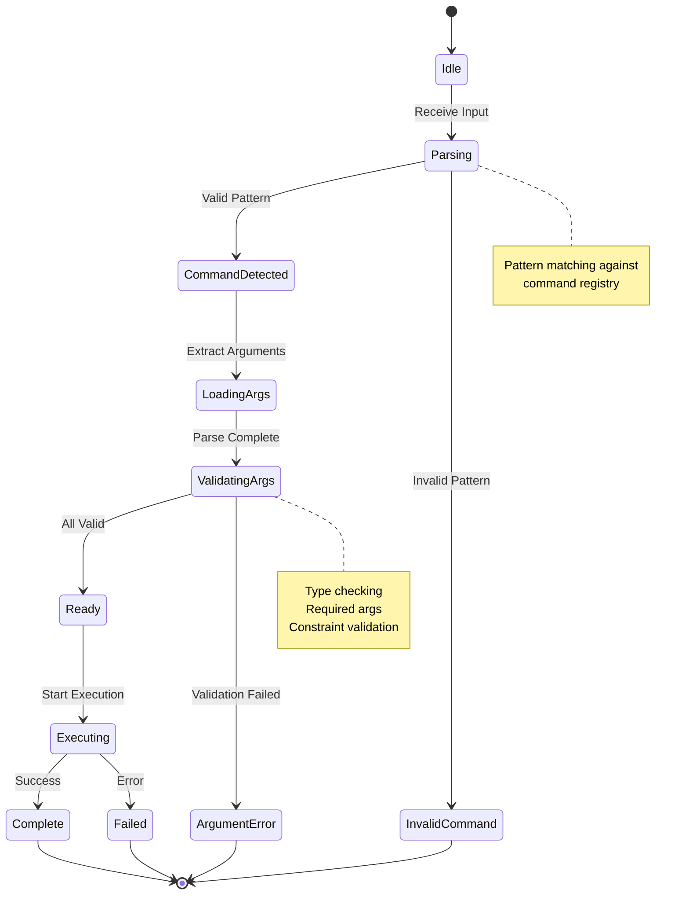

---

## Individual Command Flows

### `/dce-master-plan` Execution Pipeline

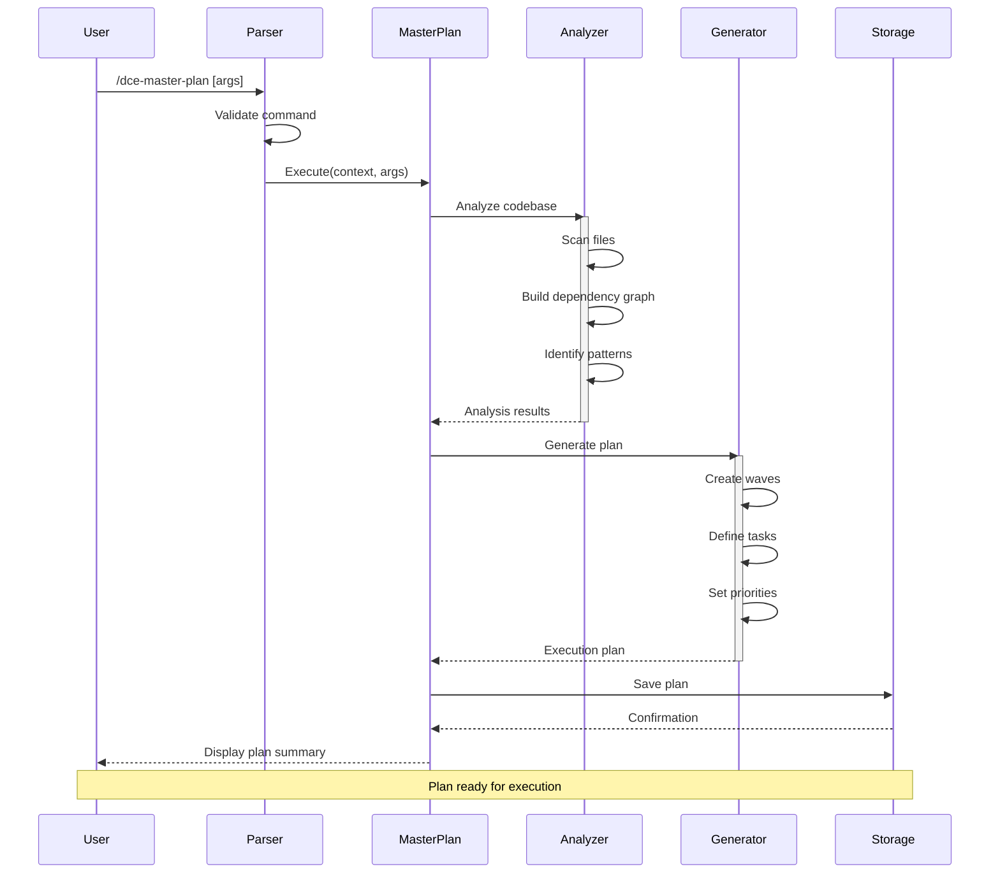

### `/dce-feature` with Handoff Mode Detection

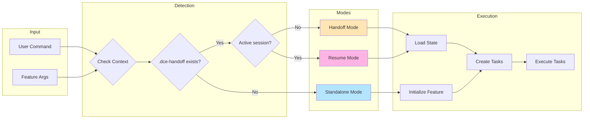

### `/dce-check-work` Analysis Workflow

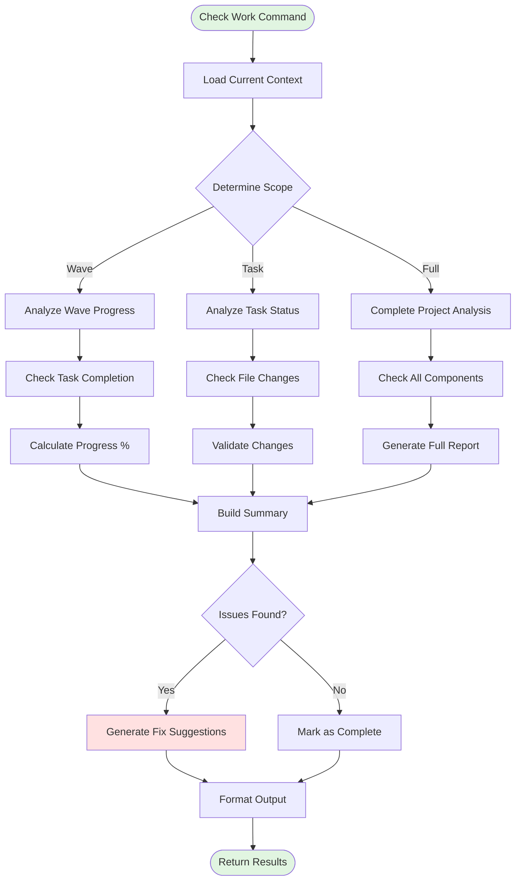

### `/dce-system-improve` Enhancement Pipeline

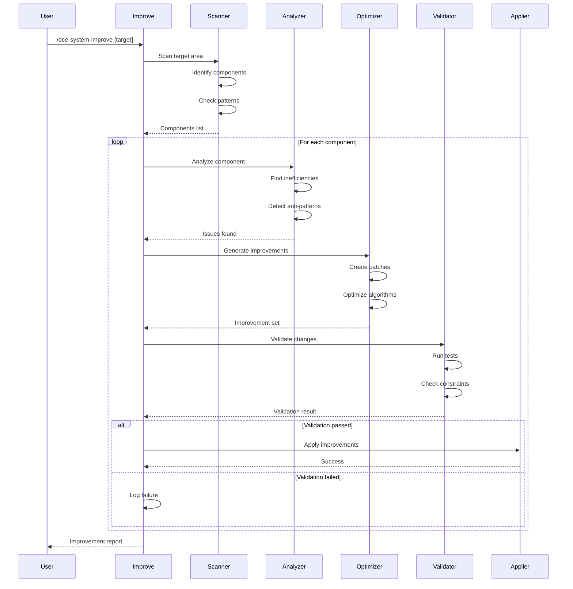

---

## Mode Detection Decision Trees

### Execution Mode Decision Logic

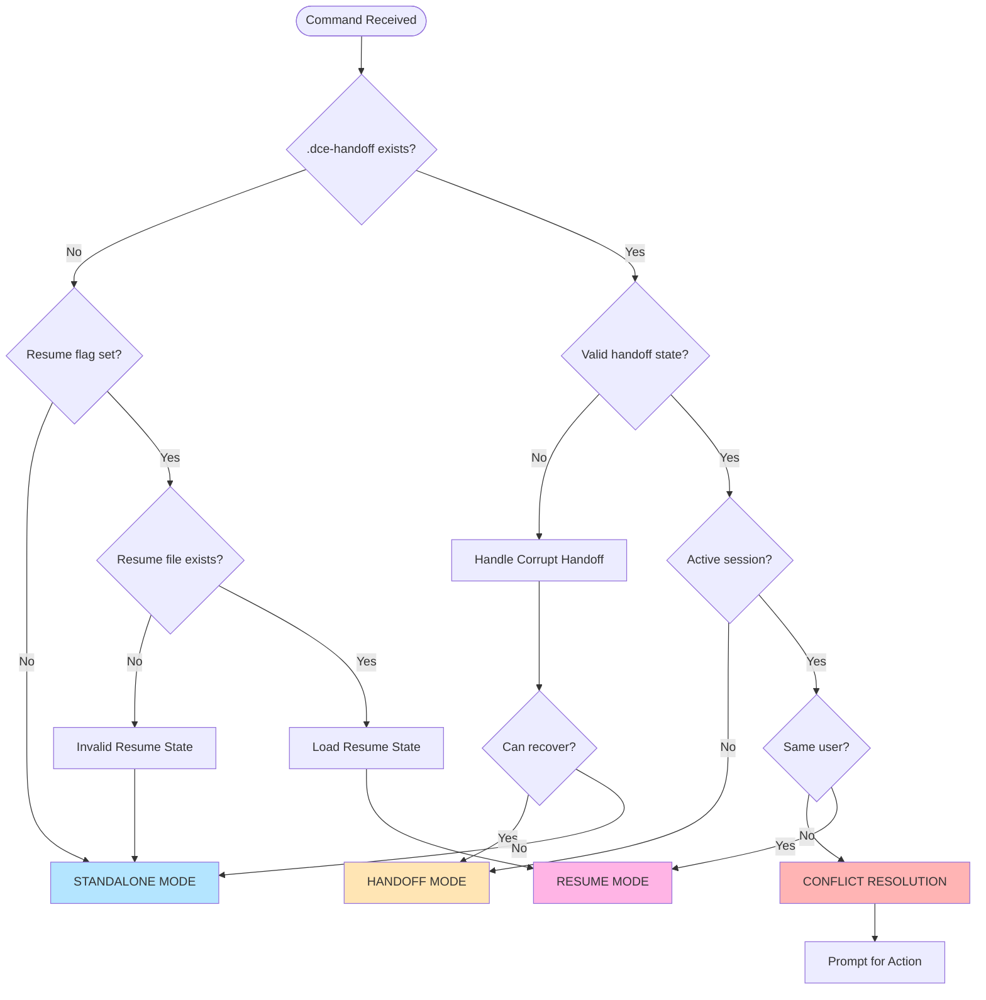

### Context Validation Flow

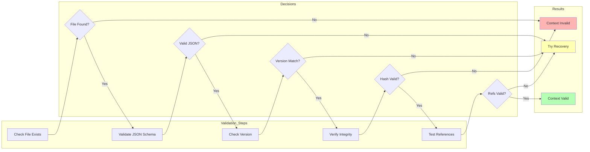

---

## Error Handling and Recovery

### Command Error Recovery Flow

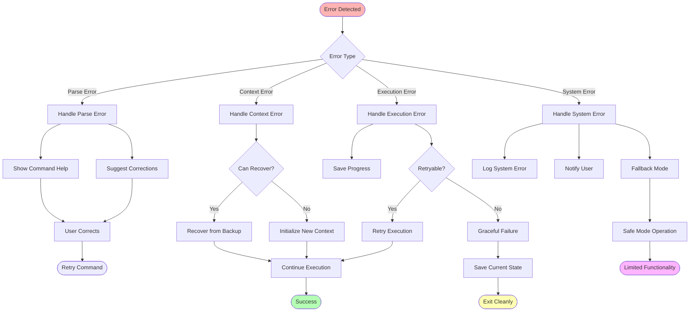

### Partial Completion Recovery

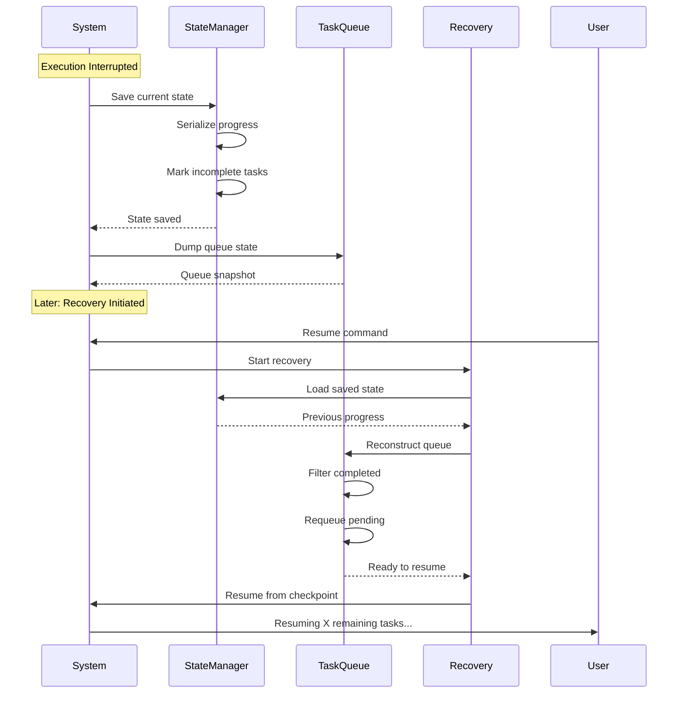

---

## Performance Optimization Flows

### Cache Hit/Miss Decision Flow

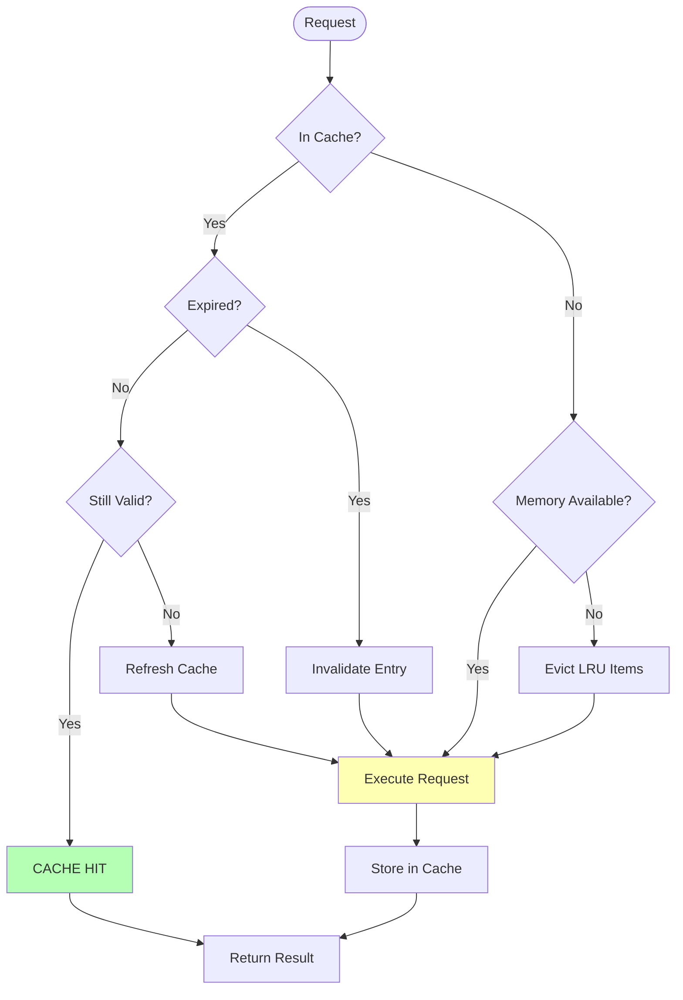

### Parallel Execution Routing

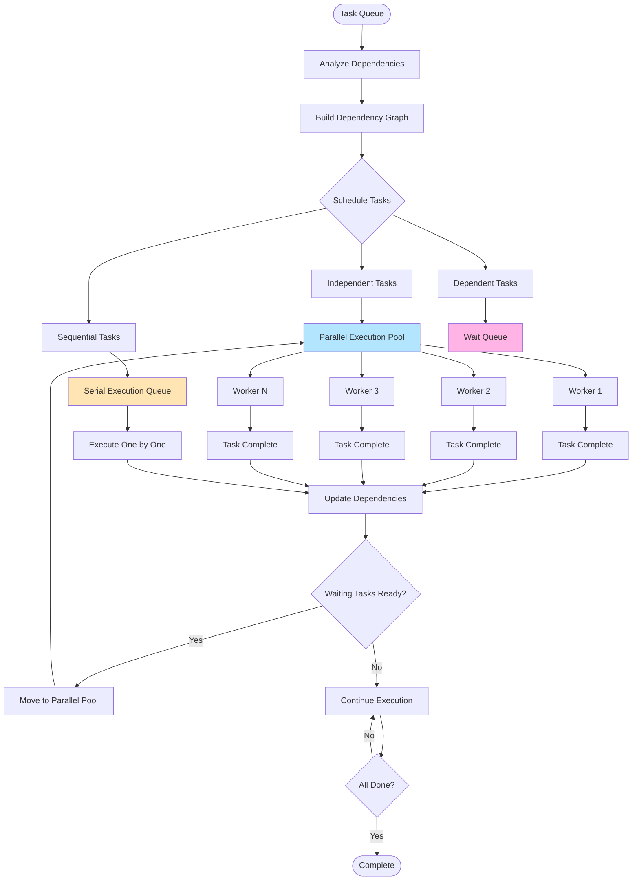

### Resource Allocation Strategy

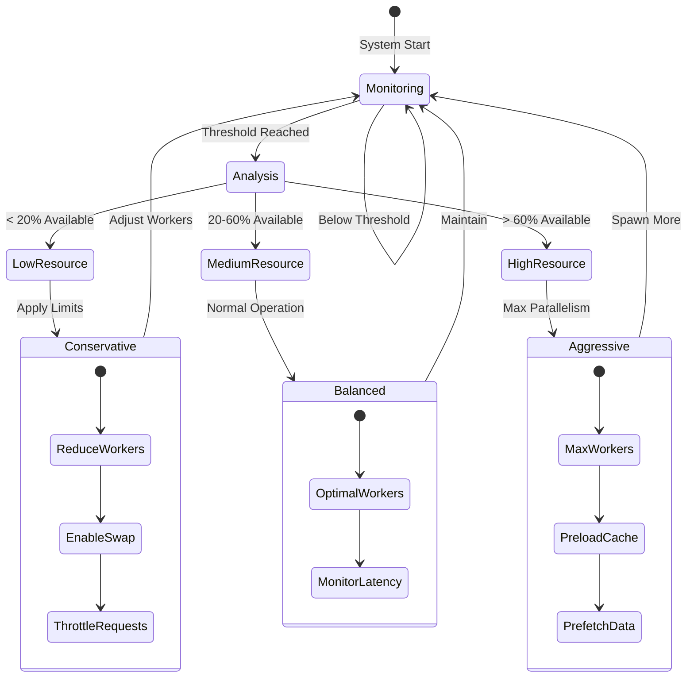

### Bottleneck Detection and Mitigation

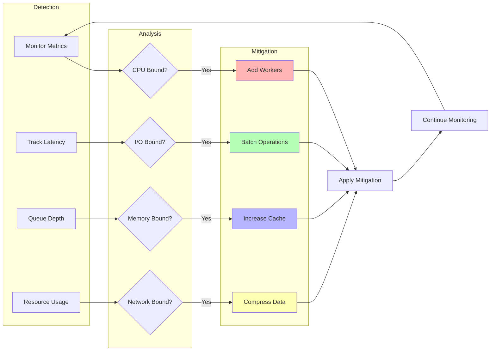

---

## Implementation Notes

### Key Performance Metrics

- **Command Parse Time**: < 10ms
- **Context Load Time**: < 50ms
- **Task Spawn Overhead**: < 5ms per task
- **Result Aggregation**: < 100ms for 100 tasks
- **Cache Hit Rate**: > 80% for repeated operations

### Optimization Strategies

1. **Lazy Loading**: Context components loaded on-demand
2. **Parallel by Default**: All independent operations run concurrently
3. **Smart Caching**: LRU with predictive preloading
4. **Resource Pooling**: Reuse connections and workers
5. **Progressive Enhancement**: Graceful degradation under load

### Error Recovery Priorities

1. **Data Integrity**: Never lose user work
2. **Graceful Degradation**: Partial functionality > complete failure
3. **Clear Communication**: Always inform user of issues
4. **Automatic Recovery**: Attempt self-healing when possible
5. **State Preservation**: Save progress frequently

---

*These diagrams represent the current implementation of the DCE command execution system, focusing on performance, reliability, and user experience.*