# Context Bridge System - Visual Documentation

## Overview
The Context Bridge System enables seamless handoff from planning to implementation phases, transforming the traditional manual context transfer into an automatic, intelligent process. This system is the cornerstone of the "infinite handoff time" improvement.

## 1. Context Bridge Architecture

### System Overview
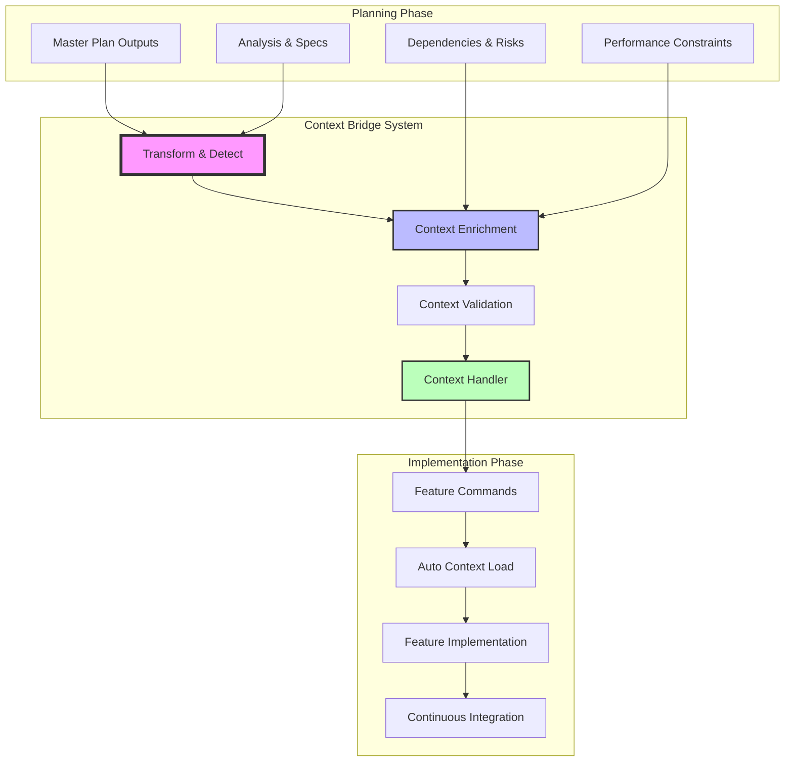

### Information Flow Architecture
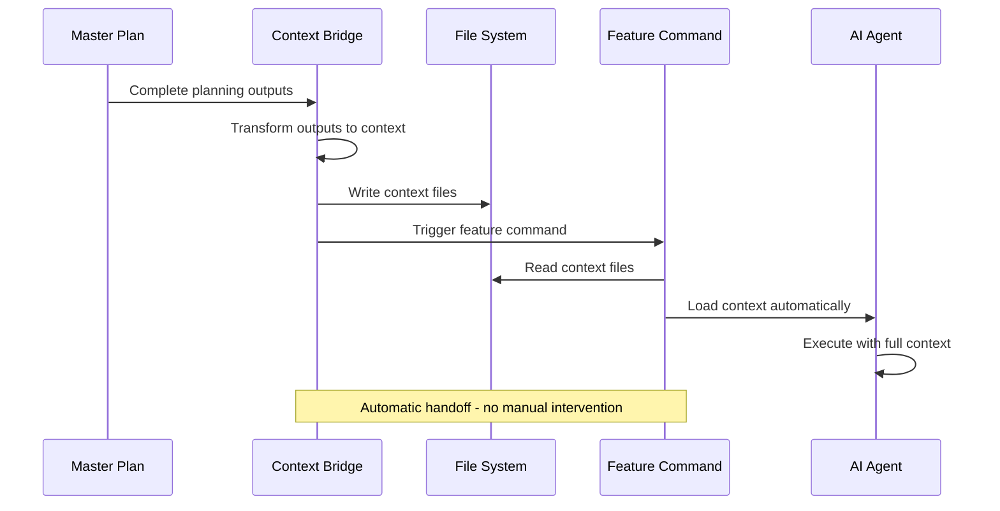

## 2. Data Transformation Pipeline

### Transformation Process
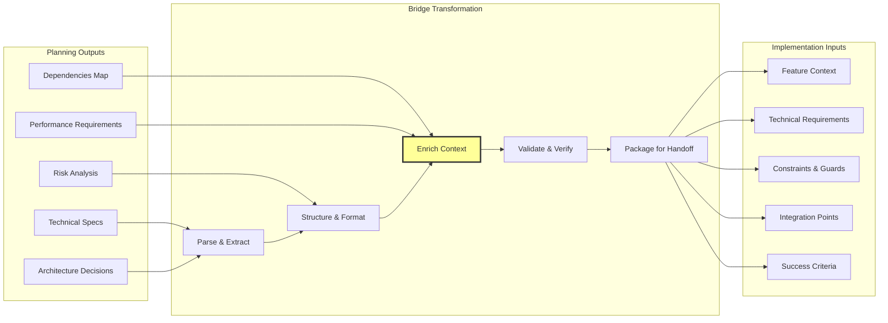

### Context Enrichment Process
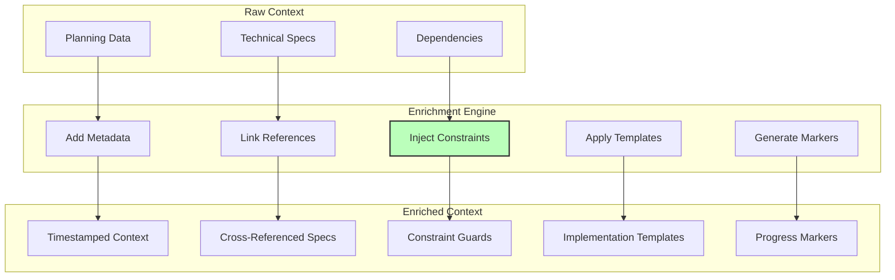

## 3. Mode Detection Logic

### Detection Flowchart
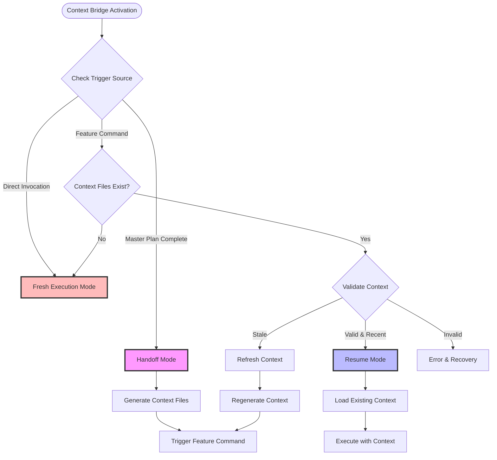

### Context Validation Logic
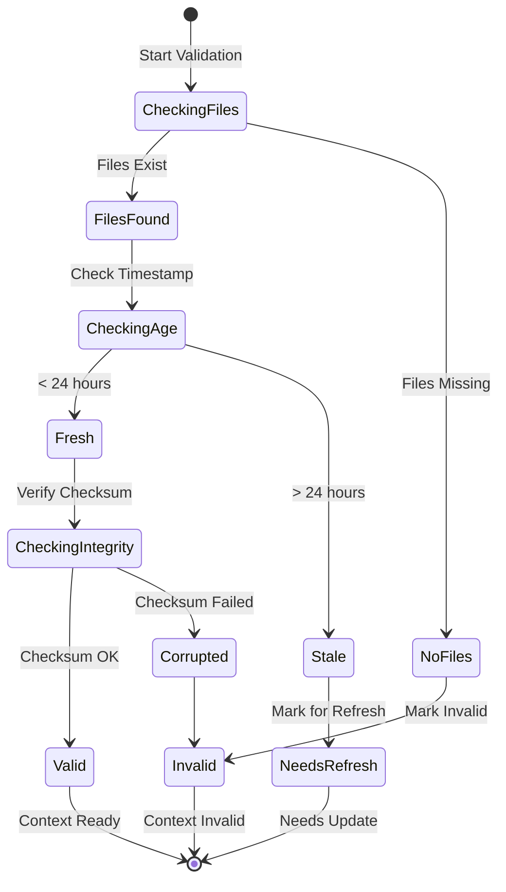

## 4. Seamless Integration Flow

### End-to-End Workflow
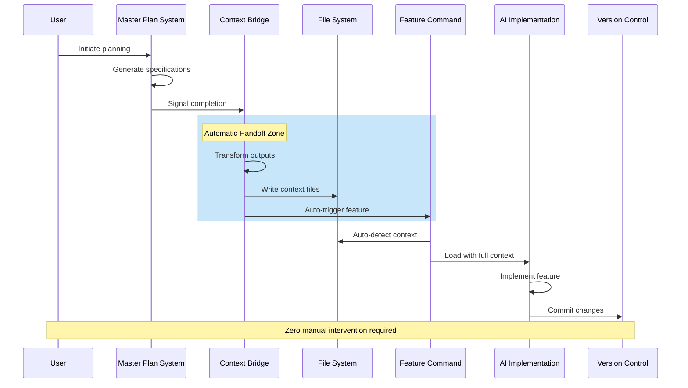

### Context File Generation
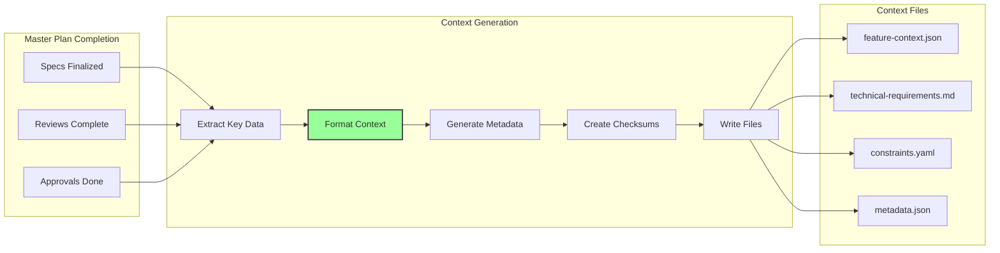

## 5. Context Preservation Details

### What Gets Preserved
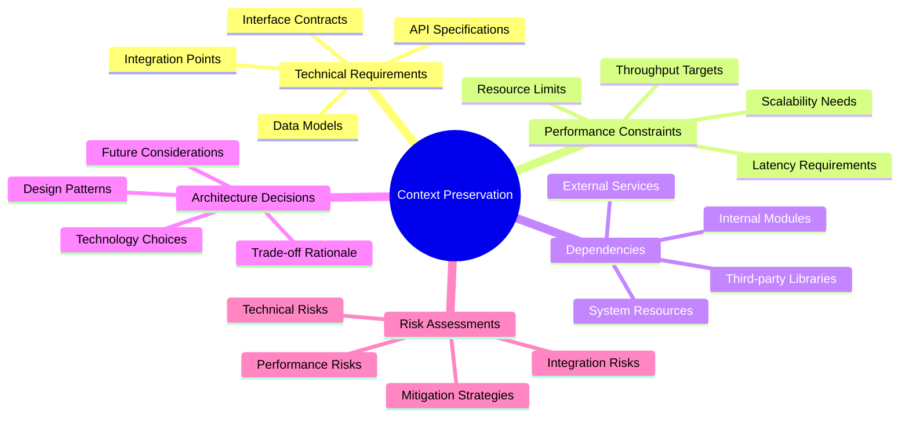

### Context Storage Structure
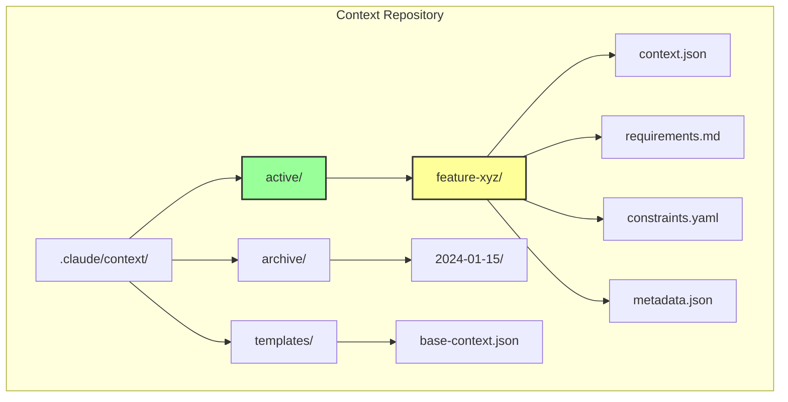

### Context Lifecycle
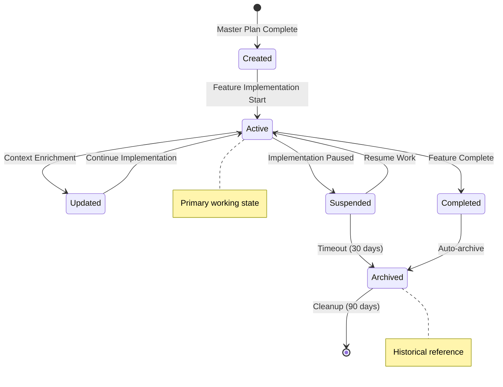

## Key Benefits

### Before vs After
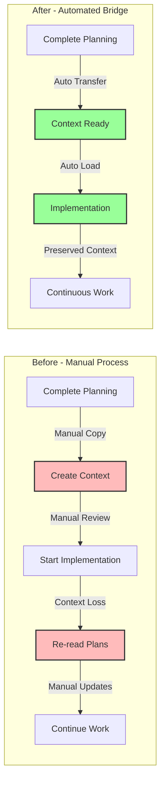

## Implementation Impact

The Context Bridge System transforms the development workflow by:

1. **Eliminating Manual Handoffs** - Context automatically flows from planning to implementation
2. **Preserving Critical Information** - No loss of decisions, constraints, or requirements
3. **Enabling Infinite Handoff Time** - Work can resume days/weeks later with full context
4. **Reducing Cognitive Load** - Developers start with complete context loaded
5. **Improving Consistency** - Standardized context format across all features

This system is the foundation for achieving truly seamless AI-assisted development workflows.