# Interactive Workflow Guides

> Visual, interactive guides for daily DCE development workflows

## 1. End-to-End Development Workflows

### Complete Feature Development Journey


### Bug Fix Workflow


### Performance Optimization Workflow


## 2. Decision-Based Workflows

### Command Selection Decision Tree

```mermaid
flowchart TD
    Start{What do you need to do?} --> Dev{Development Task?}
    Start --> Test{Testing Task?}
    Start --> Debug{Debugging Task?}
    Start --> Deploy{Deployment Task?}
    
    Dev --> |New Feature| DevNew[make dev-watch]
    Dev --> |Modify Code| DevMod[make fmt && make lint]
    Dev --> |Check Quality| DevQual[make ci]
    
    Test --> |Unit Tests| TestUnit[make test]
    Test --> |Race Tests| TestRace[make test-race]
    Test --> |Coverage| TestCov[make coverage]
    Test --> |Benchmarks| TestBench[make bench]
    
    Debug --> |Compilation| DebugComp[go build -gcflags="-e" ./...]
    Debug --> |Runtime| DebugRun[dlv debug]
    Debug --> |Performance| DebugPerf[go tool pprof]
    
    Deploy --> |Local| DeployLocal[make docker-build]
    Deploy --> |Staging| DeployStage[make deploy-staging]
    Deploy --> |Production| DeployProd[make deploy-prod]
    
    style Start fill:#fff4e1
    style Dev fill:#e1f5e1
    style Test fill:#e1f5e1
    style Debug fill:#e1f5e1
    style Deploy fill:#e1f5e1
```

### Failure Recovery Decision Tree


### Handoff vs Standalone Decision


## 3. User Journey Maps

### New Developer Onboarding Journey

```mermaid
journey
    title New Developer Onboarding
    section Day 1: Setup
      Clone Repository: 5: Developer
      Install Tools: 4: Developer
      Read CLAUDE.md: 5: Developer
      Run make install-tools: 5: Developer
    section Day 2-3: Exploration
      Run make dev-watch: 5: Developer
      Explore API docs: 4: Developer
      Read domain model: 3: Developer
      Run sample tests: 4: Developer
    section Day 4-5: First Task
      Pick starter issue: 4: Developer
      Create feature branch: 5: Developer
      Write first test: 3: Developer
      Implement feature: 4: Developer
    section Week 2: Integration
      Submit first PR: 4: Developer
      Address review feedback: 3: Developer
      Merge to main: 5: Developer
      Monitor in production: 4: Developer
```

### Feature Implementation Journey


### System Maintenance Workflow


## 4. Interactive Troubleshooting Guides

### Error Diagnosis Flowchart

```mermaid
flowchart TD
    Error{Error Type?} --> Compile{Compilation Error?}
    Error --> Runtime{Runtime Error?}
    Error --> Test{Test Error?}
    Error --> Network{Network Error?}
    
    Compile --> C1{Import Issue?}
    C1 --> |Yes| C2[Run: go mod tidy]
    C1 --> |No| C3{Type Error?}
    C3 --> |Yes| C4[Check: go build -gcflags="-e" ./...]
    C3 --> |No| C5[Review recent changes]
    
    Runtime --> R1{Panic?}
    R1 --> |Yes| R2[Check stack trace]
    R1 --> |No| R3{Deadlock?}
    R3 --> |Yes| R4[Run with race detector]
    R3 --> |No| R5[Add logging/debugging]
    
    Test --> T1{Flaky?}
    T1 --> |Yes| T2[Use synctest]
    T1 --> |No| T3{Integration?}
    T3 --> |Yes| T4[Check test containers]
    T3 --> |No| T5[Verify test data]
    
    Network --> N1{Timeout?}
    N1 --> |Yes| N2[Increase timeouts]
    N1 --> |No| N3{Connection?}
    N3 --> |Yes| N4[Check firewall/ports]
    N3 --> |No| N5[Verify endpoints]
    
    style Error fill:#ffe4e1
    style C2 fill:#e1f5e1
    style C4 fill:#e1f5e1
    style R2 fill:#e1f5e1
    style R4 fill:#e1f5e1
    style T2 fill:#e1f5e1
    style T4 fill:#e1f5e1
    style N2 fill:#e1f5e1
    style N4 fill:#e1f5e1
```

### Performance Issue Resolution


### State Corruption Recovery


## 5. Best Practice Workflows

### Optimal Command Sequencing


### Resource Management Best Practices


### Quality Gate Implementation


## 6. Team Collaboration Workflows

### Code Handoff Process


### Code Review Integration


### Deployment Coordination


### Knowledge Sharing Practices


## Quick Reference Cards

### Daily Development Checklist

```mermaid
flowchart LR
    Morning[🌅 Morning] --> M1[Pull latest main]
    M1 --> M2[Check CI status]
    M2 --> M3[Review PR comments]
    
    Development[💻 Development] --> D1[Run make dev-watch]
    D1 --> D2[Write tests first]
    D2 --> D3[Implement feature]
    D3 --> D4[Run make ci]
    
    Evening[🌆 Evening] --> E1[Commit changes]
    E1 --> E2[Push to branch]
    E2 --> E3[Update tickets]
    E3 --> E4[Plan tomorrow]
    
    style Morning fill:#ffe4e1
    style Development fill:#fff4e1
    style Evening fill:#e1f5e1
```



### Emergency Response Guide

```mermaid
flowchart TD
    Alert[🚨 Production Alert] --> Assess{Severity?}
    
    Assess --> |Critical| Immediate[Immediate Action]
    Assess --> |High| Quick[Quick Response]
    Assess --> |Medium| Standard[Standard Process]
    
    Immediate --> I1[Page on-call]
    Immediate --> I2[Create war room]
    Immediate --> I3[Start incident log]
    Immediate --> I4[Deploy hotfix]
    
    Quick --> Q1[Investigate issue]
    Quick --> Q2[Notify team]
    Quick --> Q3[Plan fix]
    Quick --> Q4[Schedule deploy]
    
    Standard --> S1[Create ticket]
    Standard --> S2[Add to backlog]
    Standard --> S3[Plan for sprint]
    
    I4 --> PostMortem[Post-Mortem]
    Q4 --> Monitor[Monitor Fix]
    S3 --> Track[Track Progress]
    
    style Alert fill:#ff0000,color:#fff
    style Immediate fill:#ffe4e1
    style PostMortem fill:#e1f5e1
```

## Interactive Decision Helper

### "What Should I Do?" Decision Tree

```mermaid
flowchart TD
    Start{I need to...} --> Create{Create something?}
    Start --> Fix{Fix something?}
    Start --> Learn{Learn something?}
    Start --> Deploy{Deploy something?}
    
    Create --> |Feature| CF[Start with domain model]
    Create --> |Test| CT[Use fixture builders]
    Create --> |API| CA[Define OpenAPI spec]
    
    Fix --> |Bug| FB[Reproduce first]
    Fix --> |Performance| FP[Profile first]
    Fix --> |Test| FT[Check isolation]
    
    Learn --> |Codebase| LC[Read CLAUDE.md]
    Learn --> |Domain| LD[Explore models]
    Learn --> |Process| LP[Check workflows]
    
    Deploy --> |Local| DL[make docker-build]
    Deploy --> |Staging| DS[Follow CI/CD]
    Deploy --> |Production| DP[Get approval first]
    
    style Start fill:#fff4e1
    style CF fill:#e1f5e1
    style FB fill:#e1f5e1
    style LC fill:#e1f5e1
    style DL fill:#e1f5e1
```

---

## Summary

These interactive workflow guides provide:

1. **Visual Navigation** - Clear paths through complex processes
2. **Decision Support** - Help choosing the right approach
3. **Best Practices** - Proven patterns for success
4. **Team Alignment** - Shared understanding of workflows
5. **Quick Reference** - Fast answers to common questions

Remember: These are living documents. Update them as processes evolve and new patterns emerge.

### Next Steps

- Bookmark this guide for daily reference
- Share with team members
- Suggest improvements based on experience
- Create custom workflows for your specific needs

---

*"The best workflow is the one your team actually follows"* - Keep it practical, keep it visual, keep it current.