# Optimization Strategy Visualizations

## 1. Optimization Decision Trees

### Execution Strategy Decision Tree

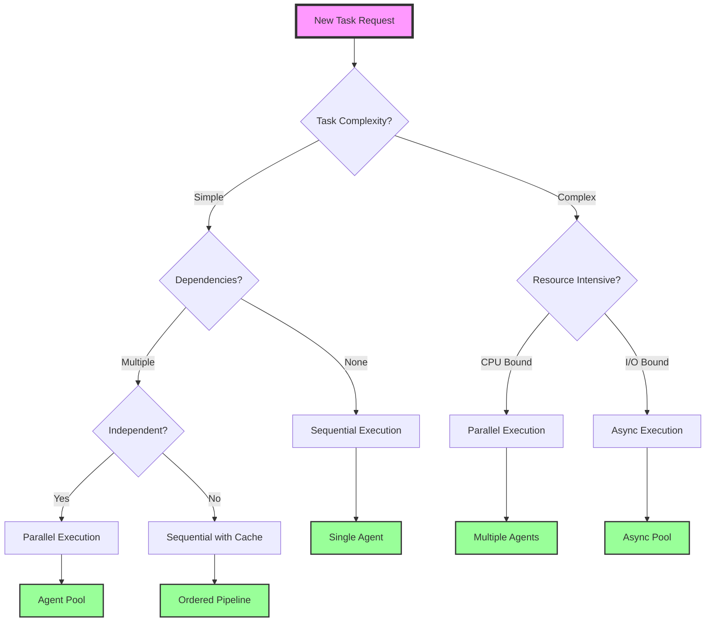

### Cache Strategy Decision Tree

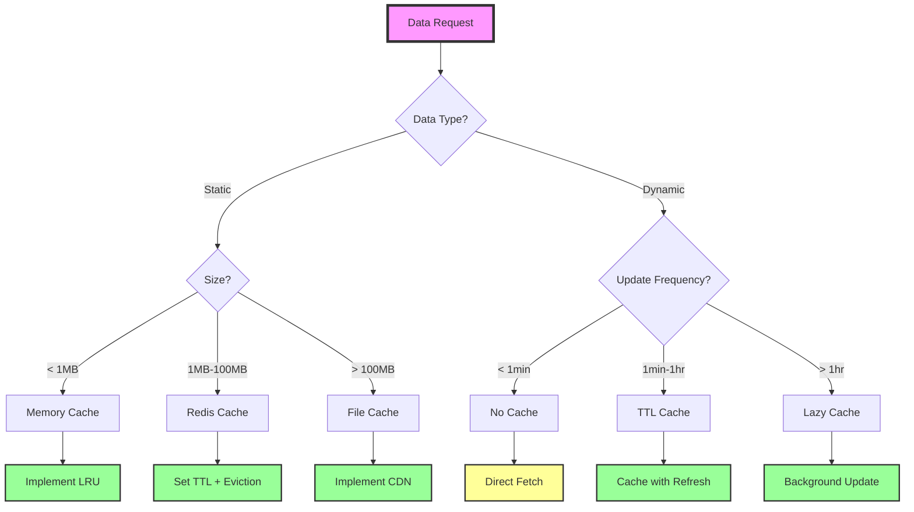

### Resource Allocation Decision Tree

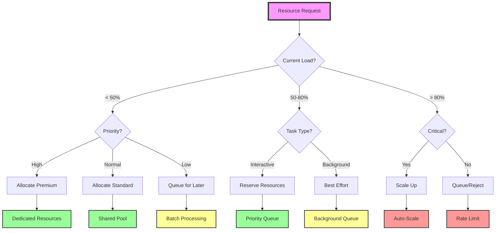

## 2. Bottleneck Analysis Diagrams

### Common Performance Bottlenecks

```mermaid
graph LR
    subgraph "Input Processing"
        A[Request Queue] -->|Bottleneck 1| B[Validation]
        B --> C[Parsing]
    end
    
    subgraph "Core Processing"
        C -->|Bottleneck 2| D[Resource Lock]
        D --> E[Agent Pool]
        E -->|Bottleneck 3| F[Consensus Wait]
    end
    
    subgraph "Output Processing"
        F -->|Bottleneck 4| G[Result Merge]
        G --> H[Response Format]
        H -->|Bottleneck 5| I[Network I/O]
    end
    
    style D fill:#f99,stroke:#333,stroke-width:3px
    style F fill:#f99,stroke:#333,stroke-width:3px
    style I fill:#f99,stroke:#333,stroke-width:3px
```

### Resource Contention Analysis

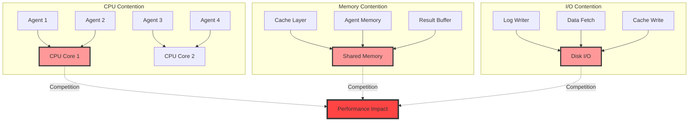

### Performance Profile Analysis

```mermaid
gantt
    title Task Execution Timeline with Bottlenecks
    dateFormat ss
    axisFormat %S
    
    section Request Phase
    Input Validation    :done, inp1, 00, 2s
    Queue Wait         :crit, q1, after inp1, 5s
    
    section Processing
    Agent Assignment   :done, ag1, after q1, 1s
    Task Execution    :active, ex1, after ag1, 10s
    Consensus Wait    :crit, con1, after ex1, 8s
    
    section Response
    Result Merge      :done, mer1, after con1, 3s
    Network Send      :crit, net1, after mer1, 4s
```

## 3. Scaling Strategies

### Horizontal Agent Scaling

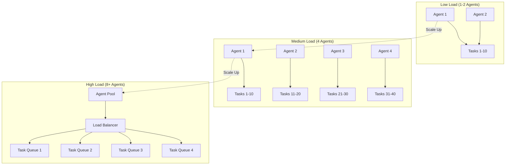

### Vertical Resource Scaling

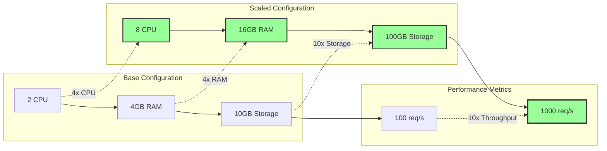

### Cache Optimization Strategy

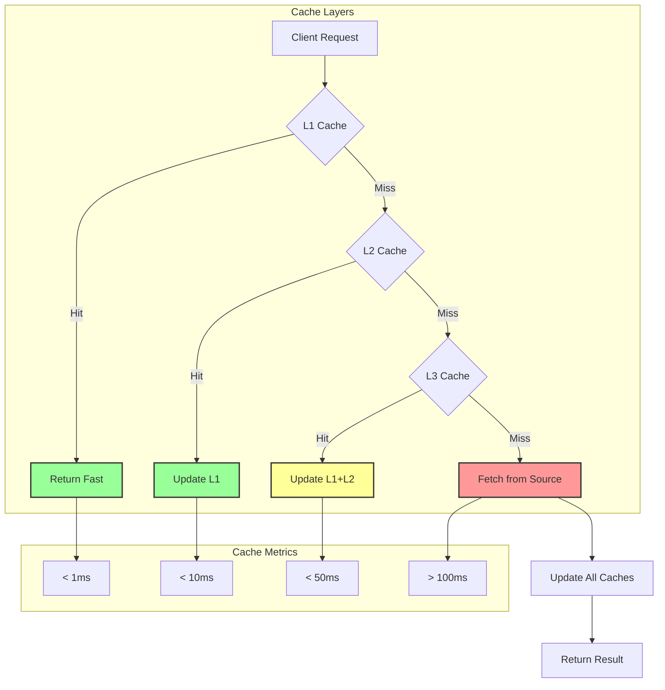

## 4. Performance Tuning Workflows

### Problem Identification Workflow

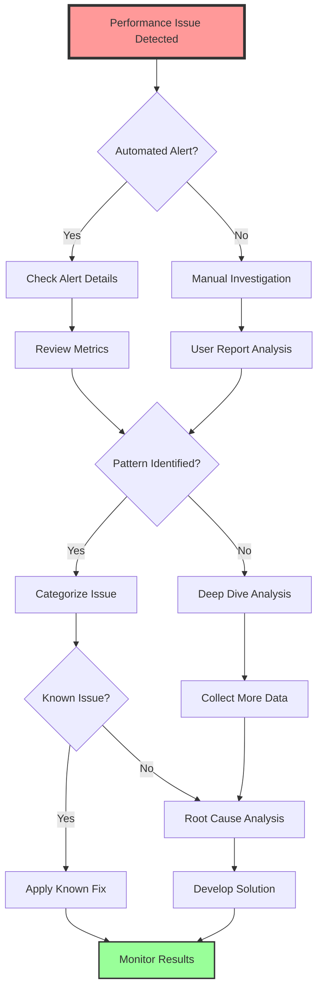

### Diagnostic Data Collection

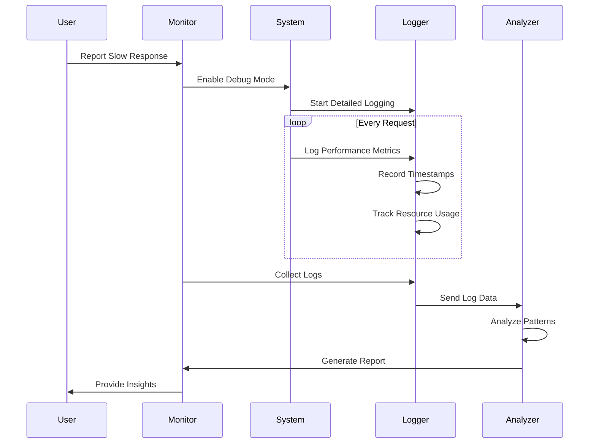

### Optimization Implementation

```mermaid
graph LR
    subgraph "Before Optimization"
        A1[Serial Processing] --> A2[Single Thread]
        A2 --> A3[No Cache]
        A3 --> A4[5s Response]
    end
    
    subgraph "Optimization Steps"
        B1[Add Parallelism] --> B2[Multi-Threading]
        B2 --> B3[Implement Cache]
        B3 --> B4[Optimize Queries]
    end
    
    subgraph "After Optimization"
        C1[Parallel Processing] --> C2[Thread Pool]
        C2 --> C3[Multi-Layer Cache]
        C3 --> C4[500ms Response]
    end
    
    A4 -.->|Apply| B1
    B4 -.->|Result| C1
    
    style A4 fill:#f99,stroke:#333,stroke-width:2px
    style C4 fill:#9f9,stroke:#333,stroke-width:2px
```

## 5. Cost-Benefit Analysis

### Performance vs Resource Cost

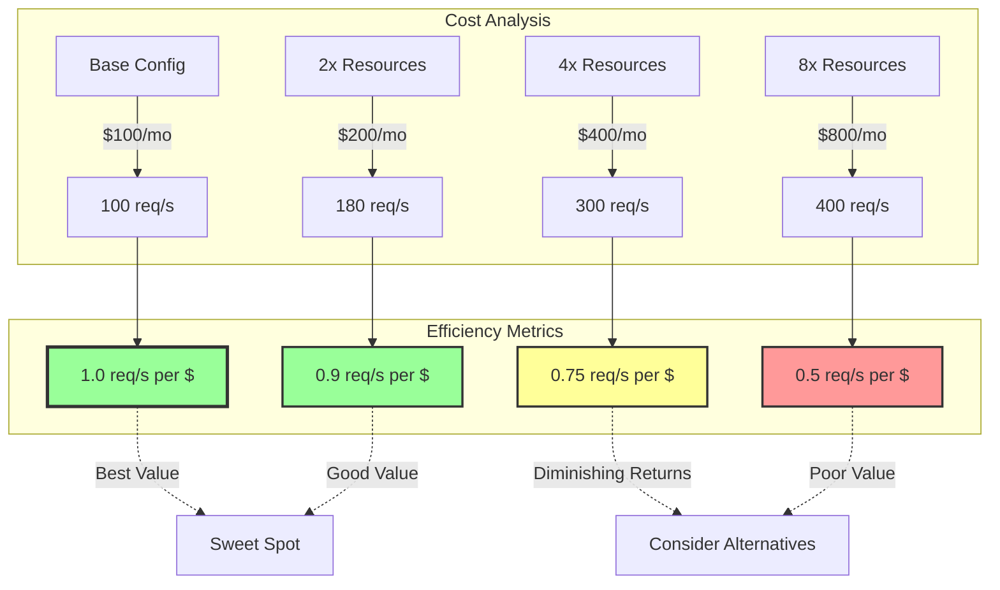

### Speed vs Accuracy Trade-offs

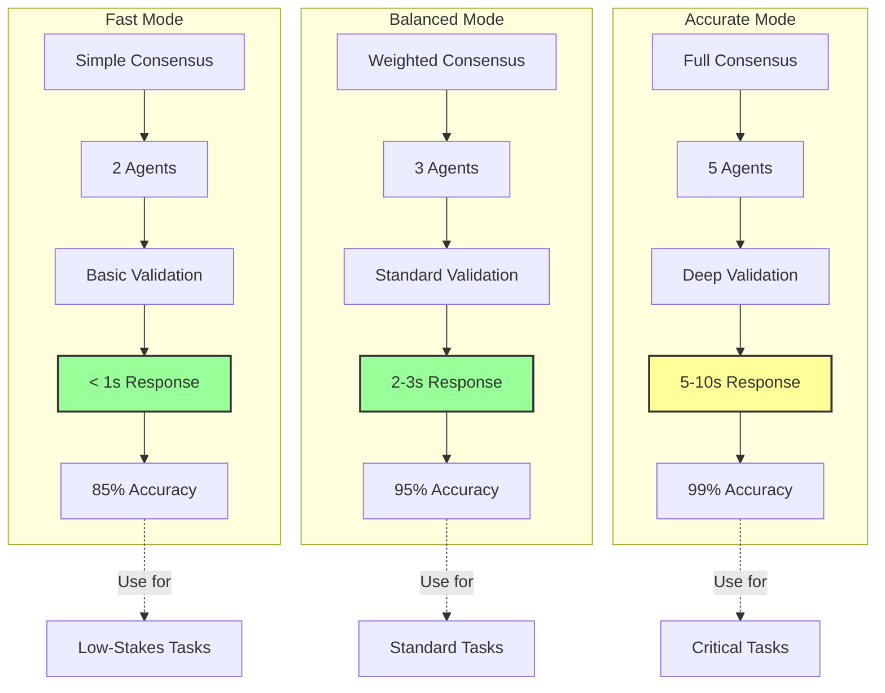

### Memory vs Execution Time

```mermaid
scatter
    title Memory Usage vs Execution Time Trade-off
    x-axis "Memory Usage (GB)" [0, 1, 2, 4, 8, 16]
    y-axis "Execution Time (seconds)" [0, 2, 4, 6, 8, 10]
    
    "No Cache" : [0.5, 10]
    "Small Cache" : [1, 5]
    "Medium Cache" : [2, 2]
    "Large Cache" : [4, 1]
    "Full Memory" : [8, 0.5]
    "Oversized" : [16, 0.4]
```

## 6. Future Optimization Roadmap

### Short-term Improvements (Q1 2025)

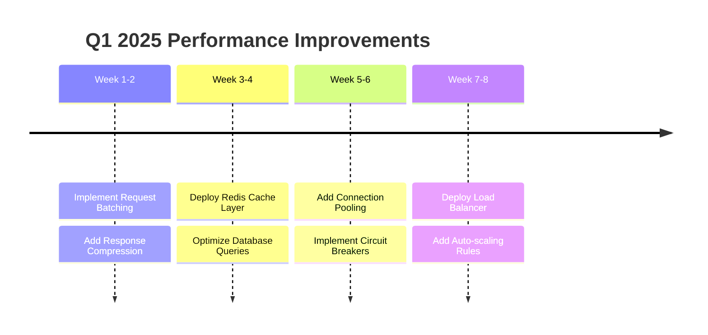

### Medium-term Architecture (Q2-Q3 2025)

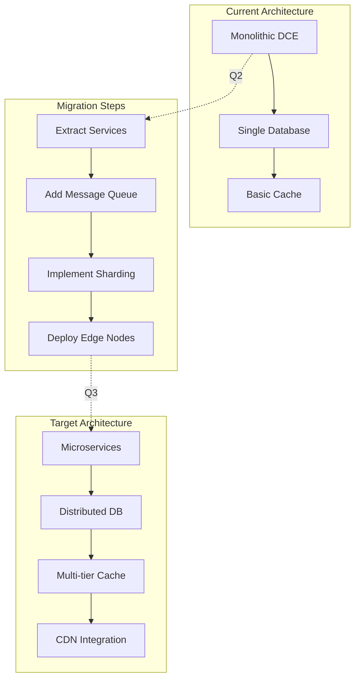

### Long-term Scalability (2026+)

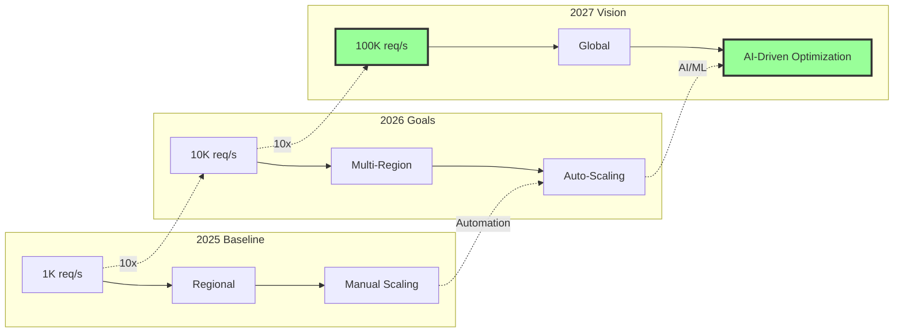

### Technology Evolution Plan

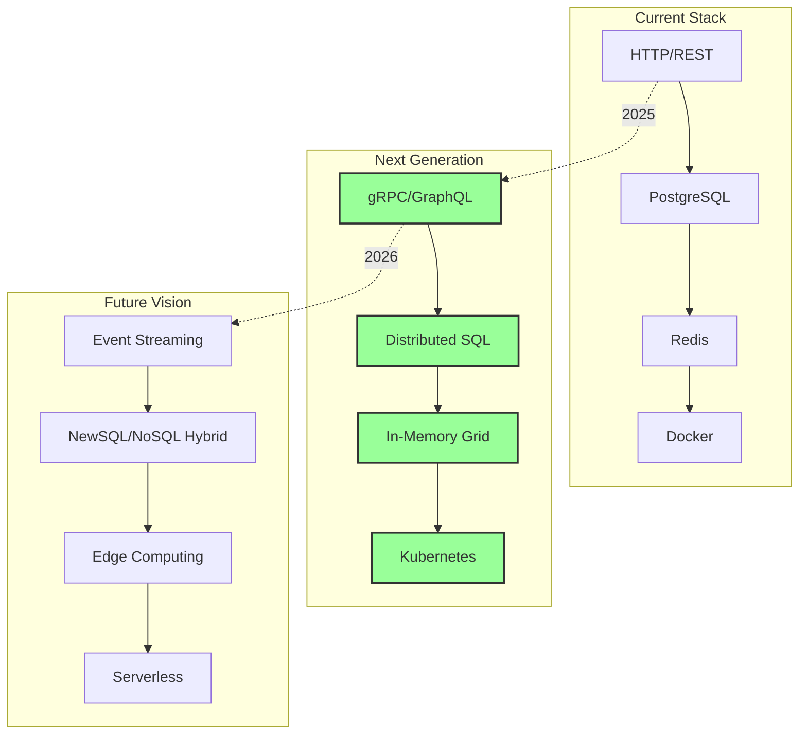

## Implementation Priority Matrix

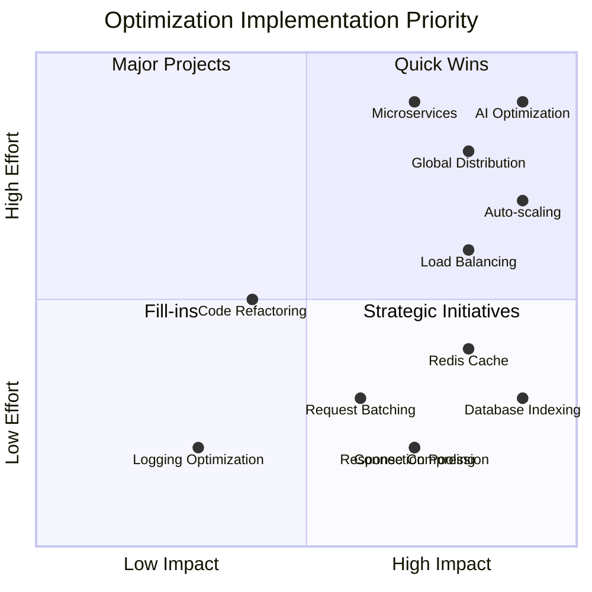

## Optimization Checklist

### Before Optimization
- [ ] Measure baseline performance
- [ ] Identify specific bottlenecks
- [ ] Set performance targets
- [ ] Calculate ROI

### During Optimization
- [ ] Implement incrementally
- [ ] Monitor impact continuously
- [ ] Document changes
- [ ] Test thoroughly

### After Optimization
- [ ] Validate improvements
- [ ] Update documentation
- [ ] Share learnings
- [ ] Plan next steps

## Key Takeaways

1. **Start with measurements** - Never optimize blind
2. **Target bottlenecks first** - 80/20 rule applies
3. **Consider trade-offs** - Every optimization has a cost
4. **Monitor continuously** - Performance degrades over time
5. **Plan for scale** - Build with 10x growth in mind