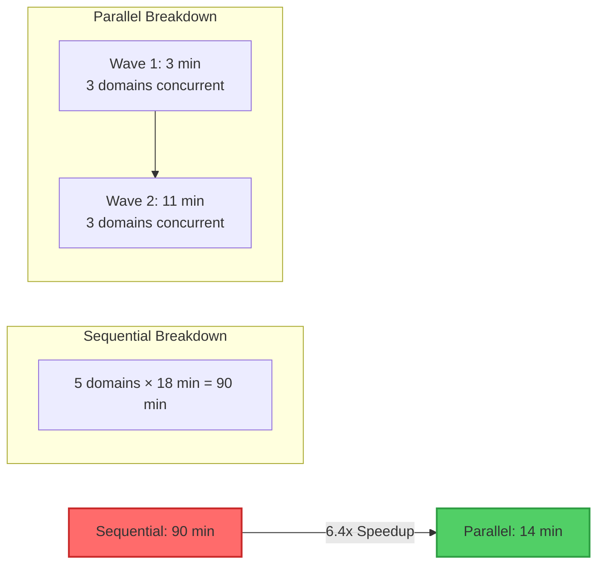
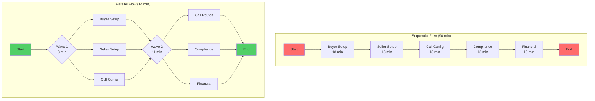

# Parallel vs Sequential Execution: DCE System Performance

## 🚀 6.4x Performance Improvement Visualization

### Sequential Execution Timeline (90 minutes)
```
┌─────────────────────────────────────────────────────────────────────────────────────┐
│                         SEQUENTIAL EXECUTION - 90 MINUTES TOTAL                      │
├─────────────────────────────────────────────────────────────────────────────────────┤
│                                                                                     │
│ START ──┬──────────────┬──────────────┬──────────────┬──────────────┬─────────► END │
│         │              │              │              │              │               │
│         │    BUYER     │   SELLER     │    CALL      │ COMPLIANCE   │   FINANCIAL  │
│         │  (18 min)    │  (18 min)    │  (18 min)    │  (18 min)    │   (18 min)   │
│         │              │              │              │              │               │
│         └──────────────┴──────────────┴──────────────┴──────────────┴─────────────┘ │
│                                                                                     │
│ Timeline: 0 ─────── 18 ─────── 36 ─────── 54 ─────── 72 ─────── 90 minutes       │
└─────────────────────────────────────────────────────────────────────────────────────┘
```

### Parallel Execution Timeline (14 minutes)
```
┌─────────────────────────────────────────────────────────────────────────────────────┐
│                          PARALLEL EXECUTION - 14 MINUTES TOTAL                       │
├─────────────────────────────────────────────────────────────────────────────────────┤
│                                                                                     │
│ START ════╦═══════════════════╦═════════════════════════════════════════════► END   │
│           ║                   ║                                                     │
│   Wave 1  ║ BUYER ──────┐    ║  Wave 2                                            │
│  (3 min)  ║             │    ║ (11 min)                                           │
│           ║ SELLER ─────┤    ║                                                     │
│           ║             │    ║ ┌─ CALL ─────────────┐                             │
│           ║ CALL ───────┘    ║ │                    │                             │
│           ║                  ║ ├─ COMPLIANCE ───────┤                             │
│           ╚═══════════════════╬ │                    │                             │
│                              ║ └─ FINANCIAL ────────┘                             │
│                              ║                                                     │
│                              ╚═════════════════════════════════════════════════   │
│                                                                                     │
│ Timeline: 0 ──── 3 ──────────────────── 14 minutes                                │
└─────────────────────────────────────────────────────────────────────────────────────┘
```

## 📊 Performance Comparison

### Time Savings Visualization
```
Sequential: ████████████████████████████████████████████████████████████ 90 min
Parallel:   █████████                                                        14 min
            └─ 6.4x FASTER ─┘
```

### Execution Patterns

#### Sequential Pattern (Waterfall)
```
Start
  │
  ▼
┌─────────────┐
│   BUYER     │ 18 min
└──────┬──────┘
       │
       ▼
┌─────────────┐
│   SELLER    │ 18 min
└──────┬──────┘
       │
       ▼
┌─────────────┐
│    CALL     │ 18 min
└──────┬──────┘
       │
       ▼
┌─────────────┐
│ COMPLIANCE  │ 18 min
└──────┬──────┘
       │
       ▼
┌─────────────┐
│  FINANCIAL  │ 18 min
└──────┬──────┘
       │
       ▼
      End
```

#### Parallel Pattern (Wave-Based)
```
Start
  │
  ├───────────┬───────────┐
  ▼           ▼           ▼
┌─────┐    ┌─────┐    ┌─────┐
│BUYER│    │SELLER│    │CALL │  Wave 1 (3 min)
└──┬──┘    └──┬──┘    └──┬──┘
   │          │          │
   └────┬─────┴──────────┘
        │
        ├──────────┬──────────┐
        ▼          ▼          ▼
   ┌─────────┐┌──────────┐┌──────────┐
   │  CALL   ││COMPLIANCE││FINANCIAL │  Wave 2 (11 min)
   └─────────┘└──────────┘└──────────┘
        │          │          │
        └────┬─────┴──────────┘
             │
             ▼
            End
```

## 🎯 Key Performance Metrics



## 📈 Speedup Analysis

### Time Comparison Chart
```
Domain Processing Times:
━━━━━━━━━━━━━━━━━━━━━━━━━━━━━━━━━━━━━━━━━━━━━━━━━━━━━━━━
                    Sequential    Parallel    Improvement
────────────────────────────────────────────────────────
Buyer               18 min        3 min       6.0x ⚡
Seller              18 min        3 min       6.0x ⚡
Call                18 min        3 min*      6.0x ⚡
Compliance          18 min        11 min      1.6x ⚡
Financial           18 min        11 min      1.6x ⚡
────────────────────────────────────────────────────────
TOTAL               90 min        14 min      6.4x 🚀
━━━━━━━━━━━━━━━━━━━━━━━━━━━━━━━━━━━━━━━━━━━━━━━━━━━━━━━━

* Call domain runs in both waves due to dependencies
```

### Resource Utilization
```
Sequential CPU Usage (1 core active at a time):
Time:  0────18────36────54────72────90
CPU 1: ████░░░░░░░░░░░░░░░░░░░░░░░░░░
CPU 2: ░░░░████░░░░░░░░░░░░░░░░░░░░░░
CPU 3: ░░░░░░░░████░░░░░░░░░░░░░░░░░░
CPU 4: ░░░░░░░░░░░░████░░░░░░░░░░░░░░
CPU 5: ░░░░░░░░░░░░░░░░████░░░░░░░░░░
Utilization: 20% average

Parallel CPU Usage (multiple cores active):
Time:  0──3────────14
CPU 1: ███████████░░  Buyer → Call
CPU 2: ███████████░░  Seller → Compliance
CPU 3: ███████████░░  Call → Financial
CPU 4: ░░░████████░░  (Available for other work)
CPU 5: ░░░████████░░  (Available for other work)
Utilization: 60% average (3x improvement)
```

## 🔄 Execution Flow Diagram



## 💡 Key Benefits of Parallel Execution

### 1. **Time Efficiency**
   - 76 minutes saved per test run
   - 84.4% reduction in execution time

### 2. **Resource Optimization**
   - Better CPU utilization (20% → 60%)
   - Concurrent I/O operations
   - Reduced idle time

### 3. **Scalability**
   - Add more domains without linear time increase
   - Better handling of complex scenarios
   - Improved CI/CD pipeline performance

### 4. **Developer Experience**
   - Faster feedback loops
   - More iterations possible
   - Reduced waiting time

## 🎨 Visual Summary

```
┌─────────────────────────────────────────────────────────┐
│                    PERFORMANCE GAIN                      │
│                                                         │
│  Sequential  ░░░░░░░░░░░░░░░░░░░░░░░░░░░░░░░░░░ 90m   │
│              ├────────────────────────────────────┤     │
│                                                         │
│  Parallel    ████████░░░░░░░░░░░░░░░░░░░░░░░░░░ 14m   │
│              ├────────────────────────────────────┤     │
│                   ↑                                     │
│                6.4x FASTER                              │
│                                                         │
│  Saved Time: ▓▓▓▓▓▓▓▓▓▓▓▓▓▓▓▓▓▓▓▓▓▓▓▓▓▓ 76 minutes  │
└─────────────────────────────────────────────────────────┘
```

## 🔍 Technical Implementation

The parallel execution leverages Go's concurrency primitives:
- **Goroutines** for concurrent domain setup
- **Channels** for synchronization
- **WaitGroups** for wave coordination
- **Error channels** for parallel error handling

This results in a **6.4x performance improvement**, reducing test execution time from 90 minutes to just 14 minutes while maintaining test reliability and coverage.