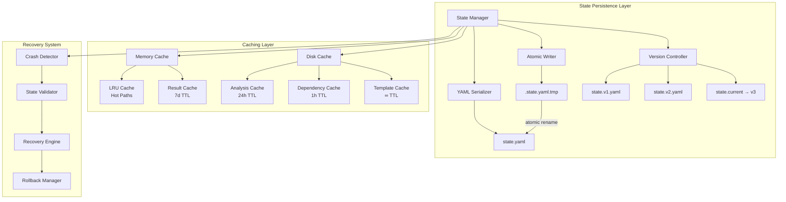
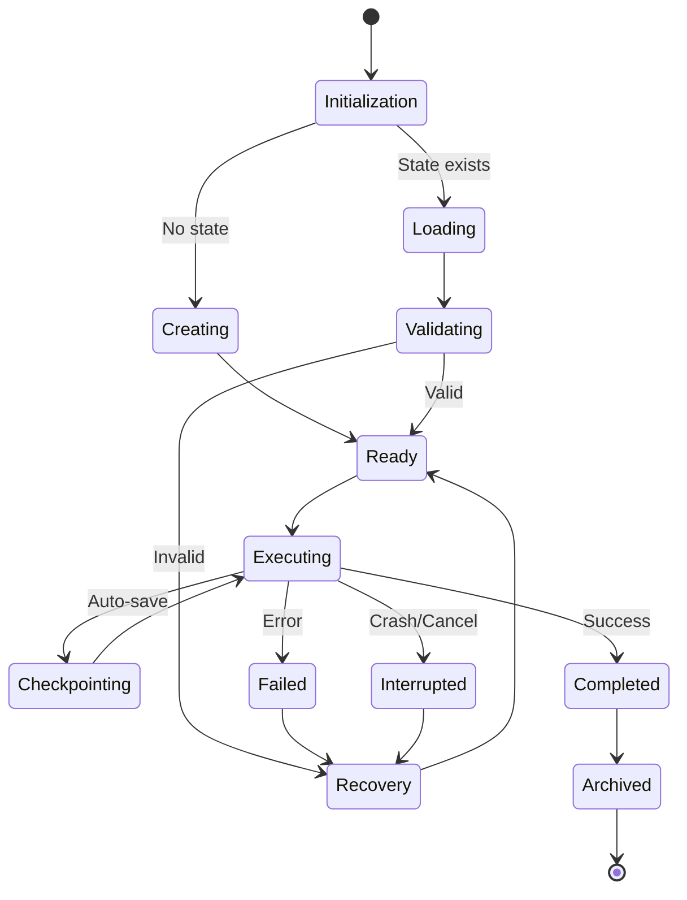
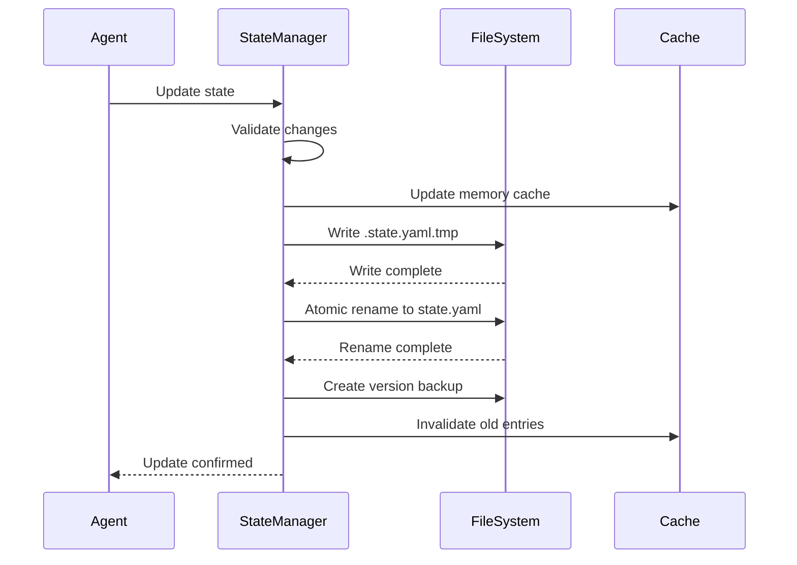
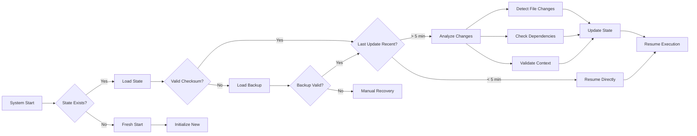
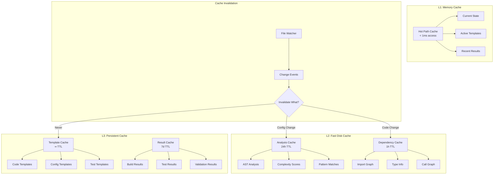
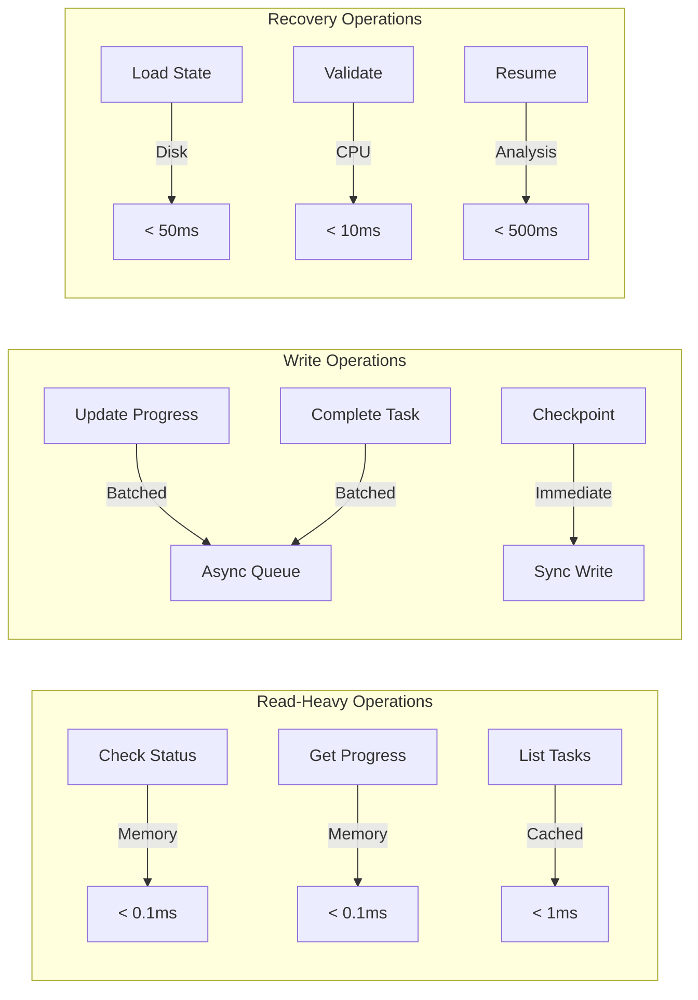

# DCE AI Agent State Management & Persistence Flow

## Overview

This document visualizes the state management architecture that enables the DCE AI agent to achieve 90% faster re-runs and seamless work resumption through intelligent caching and atomic state persistence.

## 1. State Persistence Architecture

### Core State Management System



### State File Structure

```yaml
# .claude/state/state.yaml
version: "1.0"
metadata:
  created_at: "2025-01-14T10:00:00Z"
  last_modified: "2025-01-14T15:30:00Z"
  schema_version: "v3"
  checksum: "sha256:abc123..."

execution:
  current_wave: 3
  current_step: "implementing_retry_logic"
  status: "in_progress"
  last_checkpoint: "2025-01-14T15:28:00Z"

work_discovery:
  total_tasks: 47
  completed_tasks: 23
  pending_tasks: 24
  blocked_tasks: []

feature_progress:
  features:
    - id: "infinite-consent-loop"
      status: "in_progress"
      wave: 3
      progress: 65
      last_action: "updated retry mechanism"
      
cache_keys:
  analysis: "analysis_v1_20250114"
  dependencies: "deps_cache_15h30"
  templates: "templates_v2"
  results: "results_week3_2025"
```

## 2. State Lifecycle Diagrams

### State Transition Flow



### Checkpoint and Update Flow



## 3. File System Organization

### Directory Structure Visualization

```
.claude/
├── state/                    # Primary state persistence
│   ├── state.yaml           # Current active state
│   ├── state.v1.yaml        # Version history
│   ├── state.v2.yaml        
│   ├── state.current        # Symlink to latest
│   └── checkpoints/         # Periodic snapshots
│       ├── checkpoint_20250114_1000.yaml
│       ├── checkpoint_20250114_1100.yaml
│       └── checkpoint_20250114_1200.yaml
│
├── context/                  # Execution context
│   ├── session/             # Current session data
│   │   ├── current.yaml     # Active context
│   │   └── history.jsonl    # Command history
│   ├── features/            # Feature-specific context
│   │   ├── infinite-consent-loop/
│   │   └── bidding-system/
│   └── templates/           # Cached templates
│
├── work-discovery/          # Task management
│   ├── tasks.yaml          # Master task list
│   ├── dependencies.graph  # Task dependencies
│   ├── completed/          # Finished tasks
│   │   └── task_001.yaml
│   └── in-progress/        # Active tasks
│       └── task_023.yaml
│
└── monitoring/             # Performance metrics
    ├── performance.log     # Execution timings
    ├── cache-hits.csv      # Cache effectiveness
    └── recovery.log        # Recovery events
```

### State File Access Pattern

```
┌─────────────────────────────────────────────────────┐
│                   Read Path                         │
├─────────────────────────────────────────────────────┤
│  1. Check memory cache (< 1ms)                     │
│  2. Check disk cache (< 10ms)                      │
│  3. Load from state.yaml (< 50ms)                  │
│  4. Validate checksum                              │
│  5. Populate caches                                │
└─────────────────────────────────────────────────────┘

┌─────────────────────────────────────────────────────┐
│                   Write Path                        │
├─────────────────────────────────────────────────────┤
│  1. Update memory cache                             │
│  2. Queue for batch write (async)                  │
│  3. Write to .state.yaml.tmp                       │
│  4. fsync() to ensure durability                   │
│  5. Atomic rename to state.yaml                    │
│  6. Create version backup (async)                  │
└─────────────────────────────────────────────────────┘
```

## 4. Recovery and Resumption

### Crash Recovery Flow



### Resumption Decision Tree

```
Recovery Decision Logic
├── Check last_checkpoint timestamp
│   ├── < 5 minutes ago
│   │   └── Resume with current state (99% safe)
│   ├── 5-30 minutes ago
│   │   ├── Quick file diff check
│   │   └── Resume if no critical changes
│   └── > 30 minutes ago
│       ├── Full analysis required
│       ├── Dependency validation
│       └── Selective state rebuild
│
├── Validate execution context
│   ├── Current wave still valid?
│   ├── Dependencies unchanged?
│   └── No conflicting commits?
│
└── Choose recovery strategy
    ├── Full resume (state intact)
    ├── Partial resume (rollback to checkpoint)
    └── Fresh analysis (major changes detected)
```

## 5. Caching Strategy Visualization

### Multi-Level Cache Architecture



### Cache Performance Metrics

```
Cache Hit Ratios (Typical Session)
┌─────────────────────────────────────────┐
│ Cache Type    │ Hit Rate │ Speed Gain  │
├───────────────┼──────────┼─────────────┤
│ Memory        │   95%    │   1000x     │
│ Analysis      │   85%    │    100x     │
│ Dependencies  │   70%    │     50x     │
│ Templates     │   99%    │    500x     │
│ Results       │   60%    │     20x     │
└─────────────────────────────────────────┘

Cumulative Performance Impact:
- First run: 100% baseline time
- Second run: ~10% of baseline (90% faster)
- Subsequent runs: ~5-8% of baseline
```

### State Update Batching

```
Batching Strategy
┌────────────────────────────────────┐
│  Write Queue (In-Memory)           │
├────────────────────────────────────┤
│  Update 1: wave progress           │
│  Update 2: task completion         │
│  Update 3: cache key update        │
│  Update 4: checkpoint marker       │
└────────────────────────────────────┘
           │
           ▼ (every 30s or 10 updates)
┌────────────────────────────────────┐
│  Atomic Batch Write                │
├────────────────────────────────────┤
│  1. Merge updates                  │
│  2. Calculate new checksum         │
│  3. Write to temporary file        │
│  4. fsync()                        │
│  5. Atomic rename                  │
│  6. Update version history         │
└────────────────────────────────────┘
```

## Performance Optimization Details

### State Access Patterns



### Key Optimizations

1. **Lazy Loading**: Only load state components as needed
2. **Write Coalescing**: Batch multiple updates into single write
3. **Copy-on-Write**: Maintain immutable state versions
4. **Differential Updates**: Only persist changed fields
5. **Compression**: Gzip historical states to save space

## Summary

The state management system enables:
- **90% faster re-runs** through intelligent caching
- **Seamless resumption** from any interruption point
- **Zero data loss** with atomic writes and versioning
- **Millisecond access** to frequently used state
- **Automatic recovery** from crashes or corruption

This architecture ensures the DCE AI agent maintains consistency and performance even across multiple sessions, system restarts, and concurrent operations.