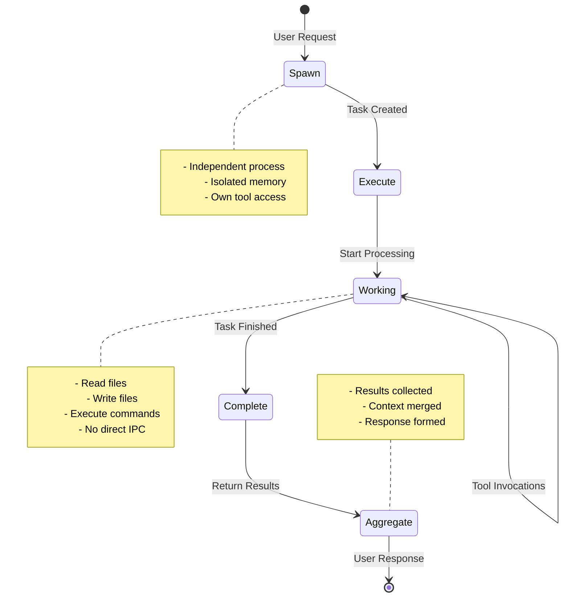
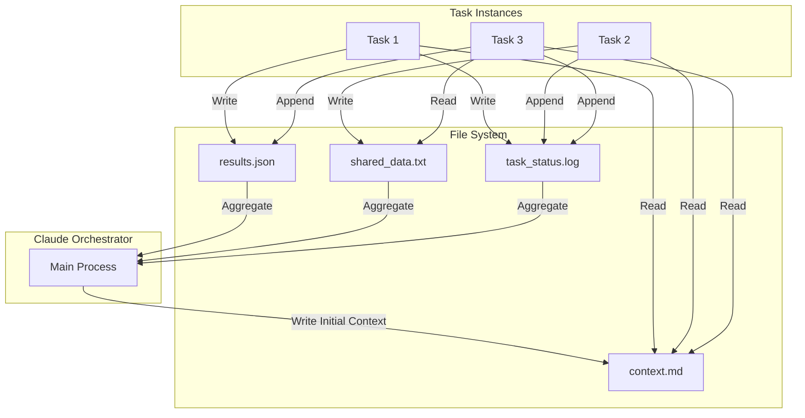
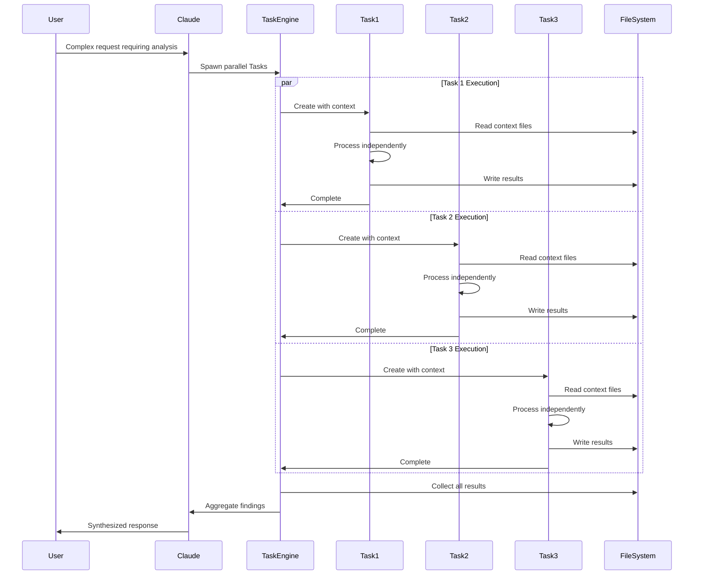

# Claude Task Tool Architecture

## Overview

This document illustrates the technical architecture of Claude's Task tool spawning mechanism, demonstrating how true parallel execution is achieved through independent Task instances.

## 1. High-Level Architecture

```
┌─────────────────────────────────────────────────────────────────────────┐
│                        Claude Main Orchestrator                         │
│  ┌─────────────────────────────────────────────────────────────────┐  │
│  │                     Task Spawning Engine                         │  │
│  │  • Parses user request                                          │  │
│  │  • Identifies parallelizable work                               │  │
│  │  • Spawns independent Task instances                            │  │
│  │  • Manages lifecycle and aggregation                            │  │
│  └─────────────────────────────────────────────────────────────────┘  │
└─────────────────────────┬───────────────────────────────────────────────┘
                          │ Spawns Tasks
    ┌─────────────────────┼─────────────────────┐
    │                     │                     │
    ▼                     ▼                     ▼
┌─────────┐         ┌─────────┐         ┌─────────┐
│ Task #1 │         │ Task #2 │         │ Task #3 │
│ Process │         │ Process │         │ Process │
├─────────┤         ├─────────┤         ├─────────┤
│ Memory  │         │ Memory  │         │ Memory  │
│ Space 1 │         │ Space 2 │         │ Space 3 │
├─────────┤         ├─────────┤         ├─────────┤
│ Tools   │         │ Tools   │         │ Tools   │
│ Access  │         │ Access  │         │ Access  │
└─────────┘         └─────────┘         └─────────┘
     │                   │                   │
     └───────────────────┴───────────────────┘
                         │
                    File System
                 (Shared Context)
```

## 2. Task Lifecycle



## 3. Memory Isolation Model

```
┌──────────────────────────────────────────────────────────────┐
│                     Operating System                          │
├──────────────────────────────────────────────────────────────┤
│                                                               │
│  ┌─────────────────┐  ┌─────────────────┐  ┌─────────────┐ │
│  │   Task #1       │  │   Task #2       │  │   Task #3   │ │
│  │                 │  │                 │  │             │ │
│  │ ┌─────────────┐ │  │ ┌─────────────┐ │  │ ┌─────────┐ │ │
│  │ │   Memory    │ │  │ │   Memory    │ │  │ │ Memory  │ │ │
│  │ │   Space     │ │  │ │   Space     │ │  │ │ Space   │ │ │
│  │ │             │ │  │ │             │ │  │ │         │ │ │
│  │ │ • Variables │ │  │ │ • Variables │ │  │ │ • Vars  │ │ │
│  │ │ • State     │ │  │ │ • State     │ │  │ │ • State │ │ │
│  │ │ • Stack     │ │  │ │ • Stack     │ │  │ │ • Stack │ │ │
│  │ └─────────────┘ │  │ └─────────────┘ │  │ └─────────┘ │ │
│  │                 │  │                 │  │             │ │
│  │   ❌ No IPC    │  │   ❌ No IPC    │  │  ❌ No IPC │ │
│  │   ❌ No Shared │  │   ❌ No Shared │  │  ❌ No     │ │
│  │      Memory    │  │      Memory    │  │    Shared   │ │
│  └────────┬────────┘  └────────┬────────┘  └──────┬──────┘ │
│           │                    │                   │         │
│           └────────────────────┼───────────────────┘         │
│                               │                              │
│                          File System                         │
│                     ✓ Shared Access                         │
└──────────────────────────────────────────────────────────────┘
```

## 4. Context Sharing Through Files



## 5. Task Spawning Syntax and Patterns

### Basic Task Spawning
```python
# Claude's internal Task spawning (conceptual representation)
task = Task(
    description="Analyze security vulnerabilities in authentication module",
    context_files=[
        "/project/auth/*.go",
        "/project/docs/security.md"
    ],
    tools_available=["Read", "Grep", "Edit"],
    independent=True,
    timeout=300  # seconds
)

# Multiple parallel Tasks
tasks = [
    Task("Review domain model", context="/domain/"),
    Task("Analyze API endpoints", context="/api/"),
    Task("Check test coverage", context="/test/")
]

# Execute in parallel
results = execute_parallel(tasks)
```

### Result Aggregation Pattern
```python
# Aggregation happens after all Tasks complete
aggregated_results = {
    "task_1": {
        "status": "complete",
        "findings": [...],
        "files_modified": [...]
    },
    "task_2": {
        "status": "complete",
        "findings": [...],
        "files_created": [...]
    }
}

# Main orchestrator synthesizes final response
final_response = synthesize_results(aggregated_results)
```

## 6. True Concurrency vs Narrative Parallelism

### True Concurrency (Task Tool)
```
Time →
T0 ─────┬─────────┬──────────┬───────── Main Process
        │         │          │
        ├─────────┴──────────┤ Task 1 (Real Process)
        │                    │
        ├────────────────────┤ Task 2 (Real Process)
        │                    │
        └──────────┬─────────┘ Task 3 (Real Process)
                   │
                   └─ All Complete Simultaneously
```

### Narrative Parallelism (Sequential)
```
Time →
T0 ─────┬─────────┬──────────┬───────── Single Process
        │         │          │
        ├─────────┘          │ "Task 1" (Narrative)
        │                    │
        ├────────────────────┘ "Task 2" (Narrative)
        │                    
        └──────────────────── "Task 3" (Narrative)
        
        Sequential execution with parallel narrative
```

## 7. Task Characteristics Reference

Per PARALLEL_EXECUTION.md, Tasks exhibit:

1. **Independent Execution**
   - Separate process space
   - No shared memory
   - Own tool invocation context

2. **File-Based Context**
   - Read shared files for input
   - Write results to filesystem
   - No direct inter-process communication

3. **Parallel Completion**
   - Tasks complete independently
   - No ordering constraints
   - Aggregation only after all complete

4. **Tool Access**
   - Each Task has full tool access
   - Independent file handles
   - Separate execution contexts

## 8. Implementation Example



## Key Takeaways

1. **Tasks are real parallel processes**, not simulated concurrency
2. **Memory isolation is absolute** - no shared state between Tasks
3. **File system is the only communication channel**
4. **Aggregation happens post-completion**, not during execution
5. **Each Task has independent tool access** and execution context

This architecture enables Claude to perform genuinely concurrent analysis, significantly reducing response time for complex, parallelizable requests while maintaining clean separation of concerns and predictable behavior.