# DCE System Troubleshooting Decision Trees

## Overview
This document provides comprehensive troubleshooting decision trees for diagnosing and resolving issues in the DCE system. Each section includes diagnostic flows, root cause analysis procedures, and recovery strategies.

## 1. System Health Decision Trees

### Overall System Health Assessment

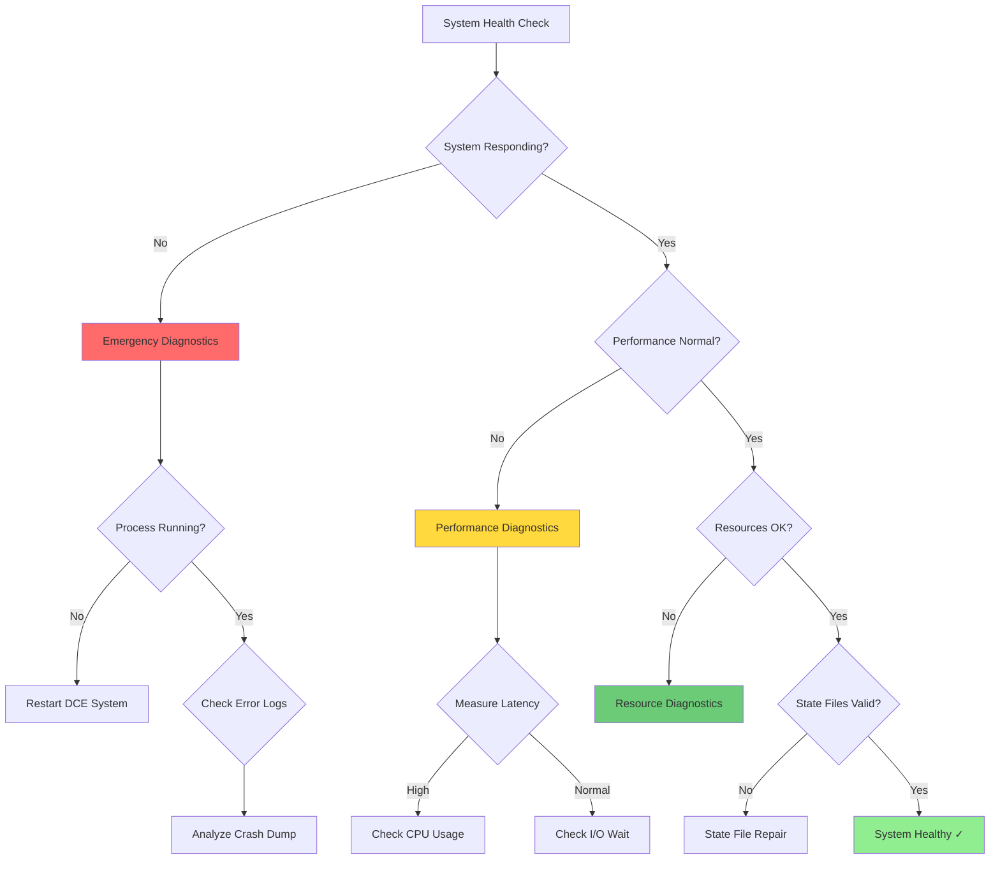
```mermaid
graph TD
    Start[System Health Check] --> CheckResponse{System Responding?}
    
    CheckResponse -->|No| EmergencyDiag[Emergency Diagnostics]
    CheckResponse -->|Yes| CheckPerf{Performance Normal?}
    
    EmergencyDiag --> CheckProcess{Process Running?}
    CheckProcess -->|No| RestartSystem[Restart DCE System]
    CheckProcess -->|Yes| CheckLogs{Check Error Logs}
    CheckLogs --> AnalyzeCrash[Analyze Crash Dump]
    
    CheckPerf -->|No| PerfDiag[Performance Diagnostics]
    CheckPerf -->|Yes| CheckResource{Resources OK?}
    
    PerfDiag --> MeasureLatency{Measure Latency}
    MeasureLatency -->|High| CheckCPU[Check CPU Usage]
    MeasureLatency -->|Normal| CheckIO[Check I/O Wait]
    
    CheckResource -->|No| ResourceDiag[Resource Diagnostics]
    CheckResource -->|Yes| CheckState{State Files Valid?}
    
    CheckState -->|No| StateRepair[State File Repair]
    CheckState -->|Yes| HealthySystem[System Healthy ✓]
    
    style HealthySystem fill:#90EE90
    style EmergencyDiag fill:#FF6B6B
    style PerfDiag fill:#FFD93D
    style ResourceDiag fill:#6BCB77
```

### Performance Degradation Diagnosis

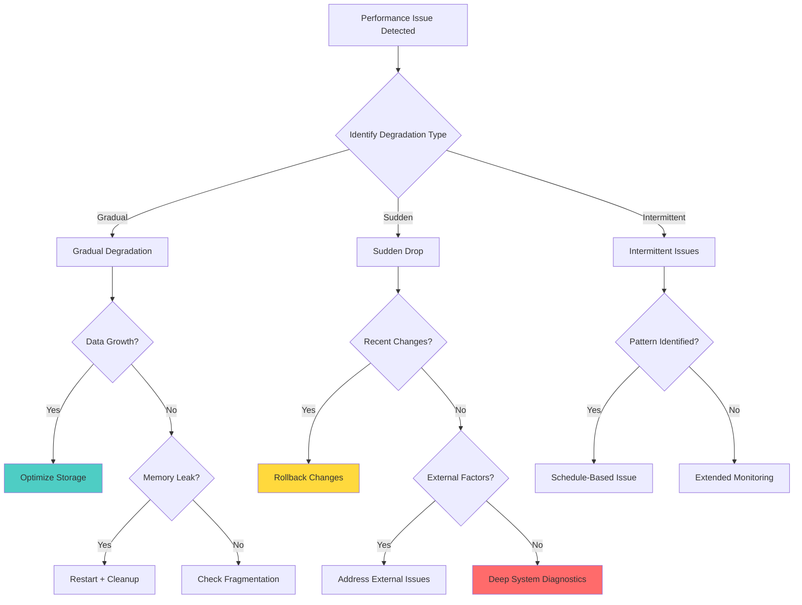
```mermaid
graph TD
    PerfIssue[Performance Issue Detected] --> IdentifyType{Identify Degradation Type}
    
    IdentifyType -->|Gradual| GradualDeg[Gradual Degradation]
    IdentifyType -->|Sudden| SuddenDeg[Sudden Drop]
    IdentifyType -->|Intermittent| IntermDeg[Intermittent Issues]
    
    GradualDeg --> CheckGrowth{Data Growth?}
    CheckGrowth -->|Yes| OptimizeStorage[Optimize Storage]
    CheckGrowth -->|No| CheckLeak{Memory Leak?}
    CheckLeak -->|Yes| RestartCleanup[Restart + Cleanup]
    CheckLeak -->|No| CheckFragmentation[Check Fragmentation]
    
    SuddenDeg --> CheckChanges{Recent Changes?}
    CheckChanges -->|Yes| RollbackChanges[Rollback Changes]
    CheckChanges -->|No| CheckExternal{External Factors?}
    CheckExternal -->|Yes| AddressExternal[Address External Issues]
    CheckExternal -->|No| DeepDiagnostics[Deep System Diagnostics]
    
    IntermDeg --> CheckPattern{Pattern Identified?}
    CheckPattern -->|Yes| ScheduleIssue[Schedule-Based Issue]
    CheckPattern -->|No| MonitorExtended[Extended Monitoring]
    
    style OptimizeStorage fill:#4ECDC4
    style RollbackChanges fill:#FFD93D
    style DeepDiagnostics fill:#FF6B6B
```

### Resource Utilization Problems

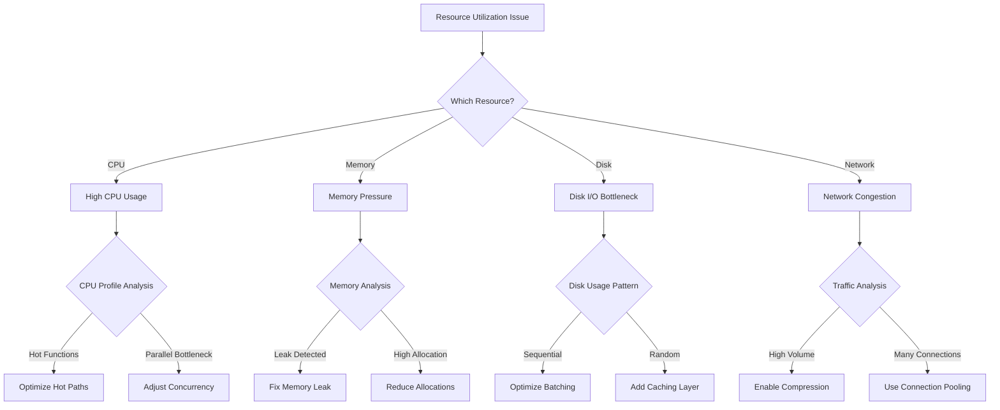
```mermaid
graph TD
    ResourceIssue[Resource Utilization Issue] --> IdentifyResource{Which Resource?}
    
    IdentifyResource -->|CPU| CPUIssue[High CPU Usage]
    IdentifyResource -->|Memory| MemIssue[Memory Pressure]
    IdentifyResource -->|Disk| DiskIssue[Disk I/O Bottleneck]
    IdentifyResource -->|Network| NetIssue[Network Congestion]
    
    CPUIssue --> ProfileCPU{CPU Profile Analysis}
    ProfileCPU -->|Hot Functions| OptimizeCode[Optimize Hot Paths]
    ProfileCPU -->|Parallel Bottleneck| AdjustConcurrency[Adjust Concurrency]
    
    MemIssue --> AnalyzeMem{Memory Analysis}
    AnalyzeMem -->|Leak Detected| FixLeak[Fix Memory Leak]
    AnalyzeMem -->|High Allocation| ReduceAllocations[Reduce Allocations]
    
    DiskIssue --> CheckDiskUsage{Disk Usage Pattern}
    CheckDiskUsage -->|Sequential| OptimizeBatching[Optimize Batching]
    CheckDiskUsage -->|Random| AddCaching[Add Caching Layer]
    
    NetIssue --> AnalyzeTraffic{Traffic Analysis}
    AnalyzeTraffic -->|High Volume| CompressData[Enable Compression]
    AnalyzeTraffic -->|Many Connections| ConnectionPool[Use Connection Pooling]
```

## 2. Command Failure Analysis

### Master-Plan Execution Failures

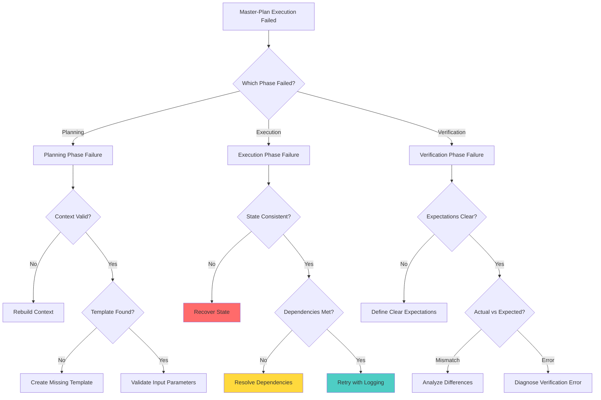
```mermaid
graph TD
    MasterPlanFail[Master-Plan Execution Failed] --> CheckPhase{Which Phase Failed?}
    
    CheckPhase -->|Planning| PlanningFail[Planning Phase Failure]
    CheckPhase -->|Execution| ExecFail[Execution Phase Failure]
    CheckPhase -->|Verification| VerifyFail[Verification Phase Failure]
    
    PlanningFail --> CheckContext{Context Valid?}
    CheckContext -->|No| RebuildContext[Rebuild Context]
    CheckContext -->|Yes| CheckTemplate{Template Found?}
    CheckTemplate -->|No| CreateTemplate[Create Missing Template]
    CheckTemplate -->|Yes| ValidateInput[Validate Input Parameters]
    
    ExecFail --> CheckState{State Consistent?}
    CheckState -->|No| RecoverState[Recover State]
    CheckState -->|Yes| CheckDeps{Dependencies Met?}
    CheckDeps -->|No| ResolveDeps[Resolve Dependencies]
    CheckDeps -->|Yes| RetryExecution[Retry with Logging]
    
    VerifyFail --> CheckExpectations{Expectations Clear?}
    CheckExpectations -->|No| DefineExpectations[Define Clear Expectations]
    CheckExpectations -->|Yes| CheckActual{Actual vs Expected?}
    CheckActual -->|Mismatch| AnalyzeDifference[Analyze Differences]
    CheckActual -->|Error| DiagnoseError[Diagnose Verification Error]
    
    style RecoverState fill:#FF6B6B
    style ResolveDeps fill:#FFD93D
    style RetryExecution fill:#4ECDC4
```

### Feature Implementation Errors

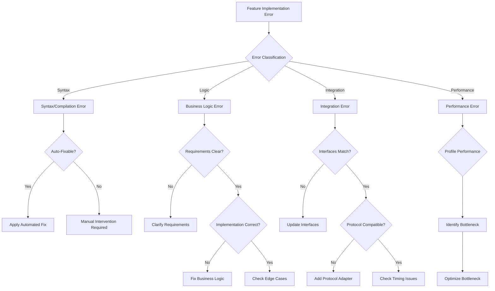
```mermaid
graph TD
    FeatureError[Feature Implementation Error] --> ErrorType{Error Classification}
    
    ErrorType -->|Syntax| SyntaxError[Syntax/Compilation Error]
    ErrorType -->|Logic| LogicError[Business Logic Error]
    ErrorType -->|Integration| IntegError[Integration Error]
    ErrorType -->|Performance| PerfError[Performance Error]
    
    SyntaxError --> AutoFix{Auto-Fixable?}
    AutoFix -->|Yes| ApplyAutoFix[Apply Automated Fix]
    AutoFix -->|No| ManualFix[Manual Intervention Required]
    
    LogicError --> CheckRequirements{Requirements Clear?}
    CheckRequirements -->|No| ClarifyReqs[Clarify Requirements]
    CheckRequirements -->|Yes| CheckImplementation{Implementation Correct?}
    CheckImplementation -->|No| FixLogic[Fix Business Logic]
    CheckImplementation -->|Yes| CheckEdgeCases[Check Edge Cases]
    
    IntegError --> CheckInterfaces{Interfaces Match?}
    CheckInterfaces -->|No| UpdateInterfaces[Update Interfaces]
    CheckInterfaces -->|Yes| CheckProtocol{Protocol Compatible?}
    CheckProtocol -->|No| AdaptProtocol[Add Protocol Adapter]
    CheckProtocol -->|Yes| CheckTiming[Check Timing Issues]
    
    PerfError --> ProfilePerf{Profile Performance}
    ProfilePerf --> IdentifyBottleneck[Identify Bottleneck]
    IdentifyBottleneck --> OptimizeBottleneck[Optimize Bottleneck]
```

### State Corruption Problems

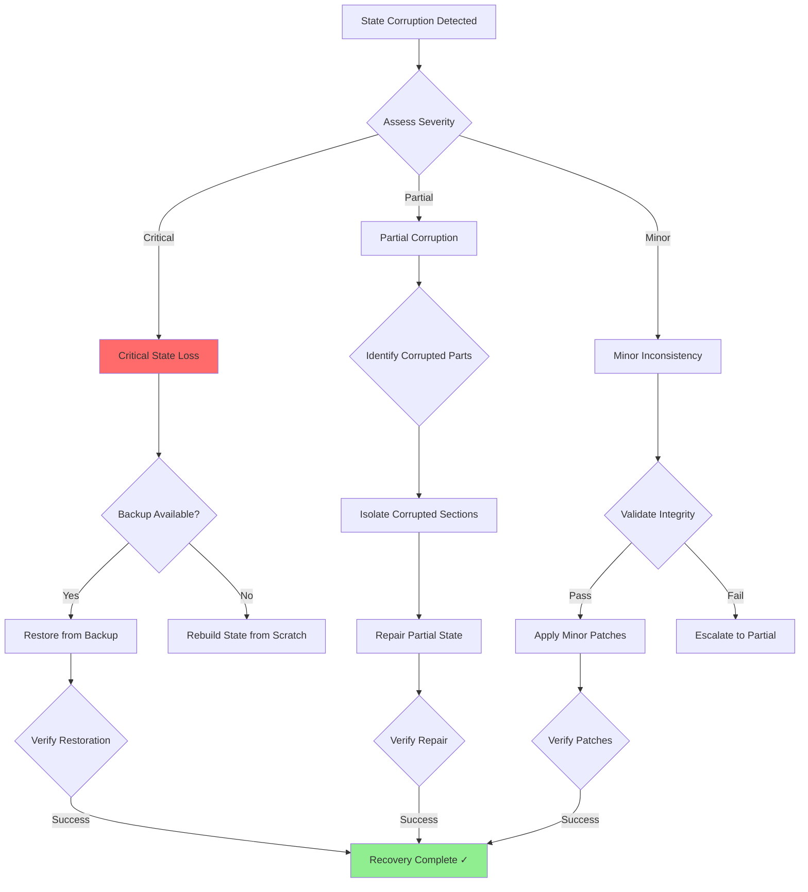
```mermaid
graph TD
    StateCorruption[State Corruption Detected] --> AssessSeverity{Assess Severity}
    
    AssessSeverity -->|Critical| CriticalCorruption[Critical State Loss]
    AssessSeverity -->|Partial| PartialCorruption[Partial Corruption]
    AssessSeverity -->|Minor| MinorCorruption[Minor Inconsistency]
    
    CriticalCorruption --> BackupAvailable{Backup Available?}
    BackupAvailable -->|Yes| RestoreBackup[Restore from Backup]
    BackupAvailable -->|No| RebuildState[Rebuild State from Scratch]
    
    PartialCorruption --> IdentifyCorrupted{Identify Corrupted Parts}
    IdentifyCorrupted --> IsolateCorruption[Isolate Corrupted Sections]
    IsolateCorruption --> RepairPartial[Repair Partial State]
    
    MinorCorruption --> ValidateIntegrity{Validate Integrity}
    ValidateIntegrity -->|Pass| ApplyPatches[Apply Minor Patches]
    ValidateIntegrity -->|Fail| EscalateToPartial[Escalate to Partial]
    
    RestoreBackup --> VerifyRestore{Verify Restoration}
    RepairPartial --> VerifyRepair{Verify Repair}
    ApplyPatches --> VerifyPatches{Verify Patches}
    
    VerifyRestore -->|Success| RecoveryComplete[Recovery Complete ✓]
    VerifyRepair -->|Success| RecoveryComplete
    VerifyPatches -->|Success| RecoveryComplete
    
    style CriticalCorruption fill:#FF6B6B
    style RecoveryComplete fill:#90EE90
```

## 3. Performance Problem Diagnosis

### Slow Execution Identification

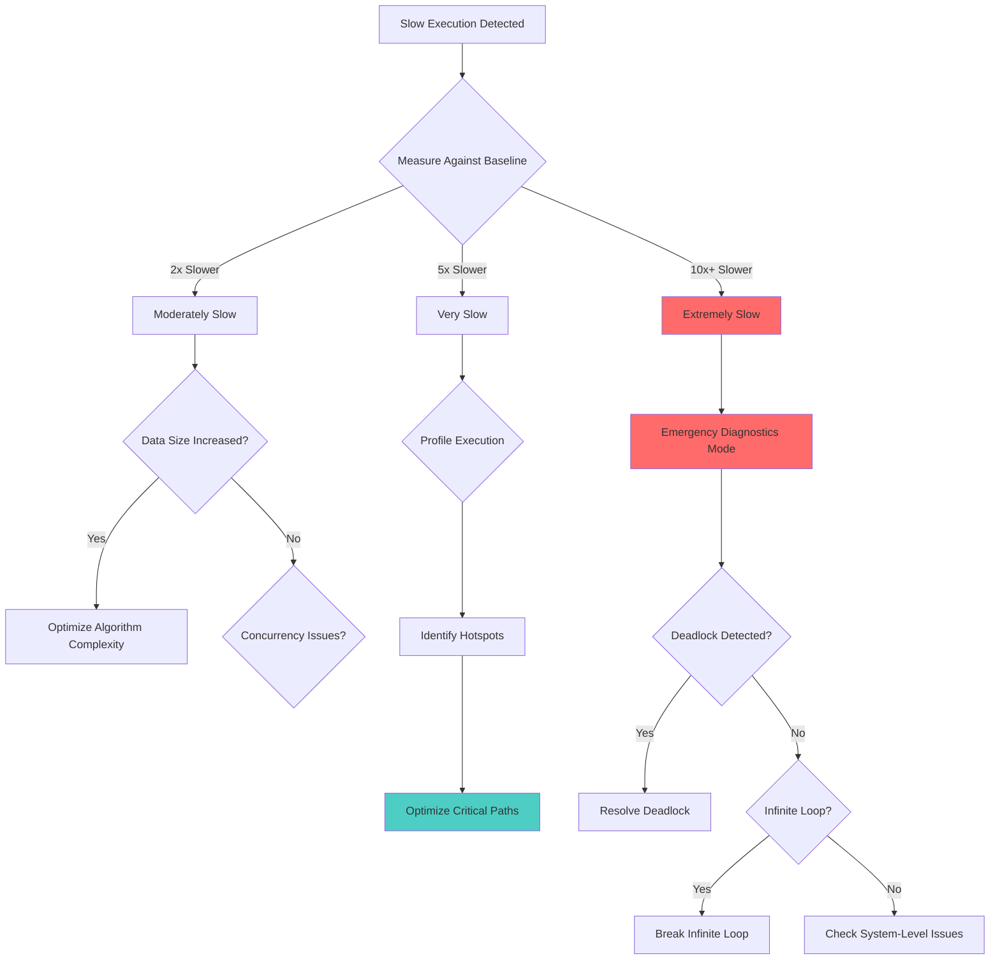
```mermaid
graph TD
    SlowExecution[Slow Execution Detected] --> MeasureBaseline{Measure Against Baseline}
    
    MeasureBaseline -->|2x Slower| ModeratelySlow[Moderately Slow]
    MeasureBaseline -->|5x Slower| VerySlow[Very Slow]
    MeasureBaseline -->|10x+ Slower| ExtremelySlow[Extremely Slow]
    
    ModeratelySlow --> CheckDataSize{Data Size Increased?}
    CheckDataSize -->|Yes| OptimizeAlgorithm[Optimize Algorithm Complexity]
    CheckDataSize -->|No| CheckConcurrent{Concurrency Issues?}
    
    VerySlow --> ProfileExecution{Profile Execution}
    ProfileExecution --> IdentifyHotspots[Identify Hotspots]
    IdentifyHotspots --> OptimizeHotspots[Optimize Critical Paths]
    
    ExtremelySlow --> EmergencyMode[Emergency Diagnostics Mode]
    EmergencyMode --> CheckDeadlock{Deadlock Detected?}
    CheckDeadlock -->|Yes| ResolveDeadlock[Resolve Deadlock]
    CheckDeadlock -->|No| CheckInfiniteLoop{Infinite Loop?}
    CheckInfiniteLoop -->|Yes| BreakLoop[Break Infinite Loop]
    CheckInfiniteLoop -->|No| SystemIssue[Check System-Level Issues]
    
    style ExtremelySlow fill:#FF6B6B
    style EmergencyMode fill:#FF6B6B
    style OptimizeHotspots fill:#4ECDC4
```

### Bottleneck Root Cause Analysis

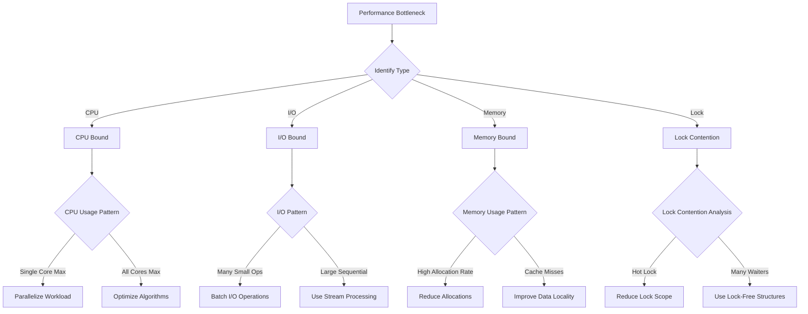
```mermaid
graph TD
    Bottleneck[Performance Bottleneck] --> BottleneckType{Identify Type}
    
    BottleneckType -->|CPU| CPUBottleneck[CPU Bound]
    BottleneckType -->|I/O| IOBottleneck[I/O Bound]
    BottleneckType -->|Memory| MemBottleneck[Memory Bound]
    BottleneckType -->|Lock| LockBottleneck[Lock Contention]
    
    CPUBottleneck --> CPUAnalysis{CPU Usage Pattern}
    CPUAnalysis -->|Single Core Max| ParallelizeWork[Parallelize Workload]
    CPUAnalysis -->|All Cores Max| OptimizeAlgo[Optimize Algorithms]
    
    IOBottleneck --> IOAnalysis{I/O Pattern}
    IOAnalysis -->|Many Small Ops| BatchOperations[Batch I/O Operations]
    IOAnalysis -->|Large Sequential| StreamProcessing[Use Stream Processing]
    
    MemBottleneck --> MemAnalysis{Memory Usage Pattern}
    MemAnalysis -->|High Allocation Rate| ReduceAllocations[Reduce Allocations]
    MemAnalysis -->|Cache Misses| ImproveLocality[Improve Data Locality]
    
    LockBottleneck --> LockAnalysis{Lock Contention Analysis}
    LockAnalysis -->|Hot Lock| ReduceScope[Reduce Lock Scope]
    LockAnalysis -->|Many Waiters| UseLockFree[Use Lock-Free Structures]
```

## 4. Recovery Decision Trees

### State File Corruption Recovery

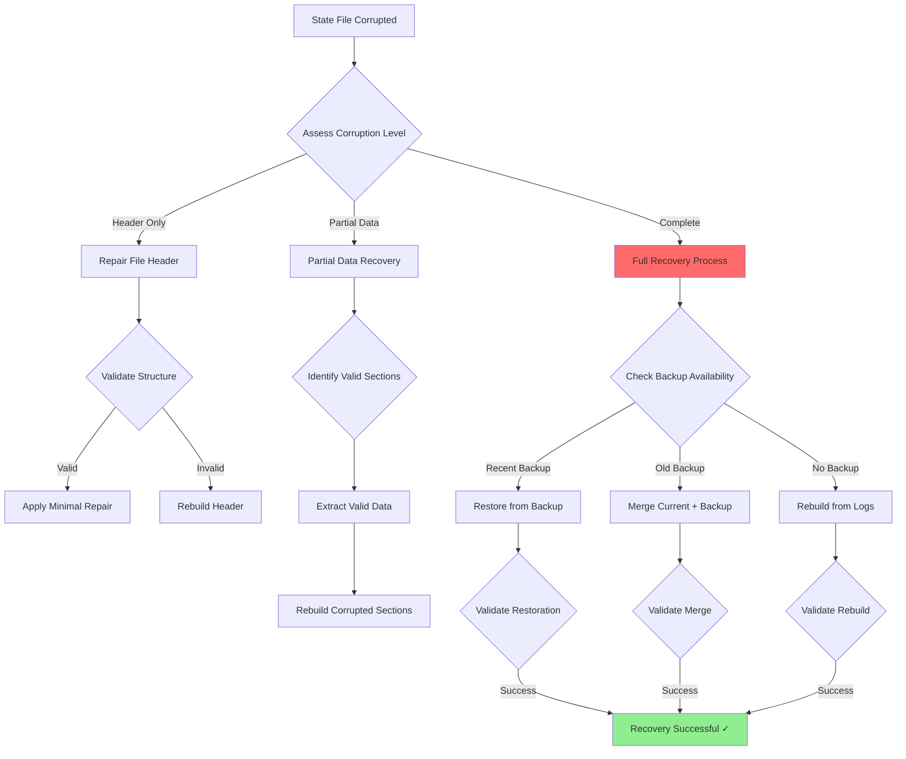
```mermaid
graph TD
    StateFileCorruption[State File Corrupted] --> AssessCorruption{Assess Corruption Level}
    
    AssessCorruption -->|Header Only| RepairHeader[Repair File Header]
    AssessCorruption -->|Partial Data| PartialRecovery[Partial Data Recovery]
    AssessCorruption -->|Complete| FullRecovery[Full Recovery Process]
    
    RepairHeader --> ValidateStructure{Validate Structure}
    ValidateStructure -->|Valid| MinimalRepair[Apply Minimal Repair]
    ValidateStructure -->|Invalid| RebuildHeader[Rebuild Header]
    
    PartialRecovery --> IdentifyValid{Identify Valid Sections}
    IdentifyValid --> ExtractValid[Extract Valid Data]
    ExtractValid --> RebuildCorrupted[Rebuild Corrupted Sections]
    
    FullRecovery --> CheckBackups{Check Backup Availability}
    CheckBackups -->|Recent Backup| RestoreFromBackup[Restore from Backup]
    CheckBackups -->|Old Backup| MergeWithBackup[Merge Current + Backup]
    CheckBackups -->|No Backup| RebuildFromLogs[Rebuild from Logs]
    
    RestoreFromBackup --> ValidateRestore{Validate Restoration}
    MergeWithBackup --> ValidateMerge{Validate Merge}
    RebuildFromLogs --> ValidateRebuild{Validate Rebuild}
    
    ValidateRestore -->|Success| RecoverySuccess[Recovery Successful ✓]
    ValidateMerge -->|Success| RecoverySuccess
    ValidateRebuild -->|Success| RecoverySuccess
    
    style FullRecovery fill:#FF6B6B
    style RecoverySuccess fill:#90EE90
```

### Partial Execution Cleanup

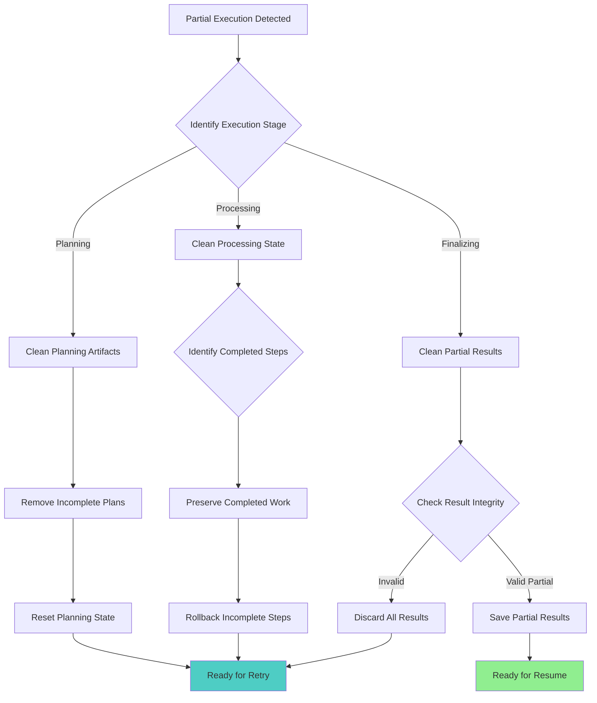
```mermaid
graph TD
    PartialExecution[Partial Execution Detected] --> IdentifyStage{Identify Execution Stage}
    
    IdentifyStage -->|Planning| CleanPlanning[Clean Planning Artifacts]
    IdentifyStage -->|Processing| CleanProcessing[Clean Processing State]
    IdentifyStage -->|Finalizing| CleanFinalizing[Clean Partial Results]
    
    CleanPlanning --> RemovePlans[Remove Incomplete Plans]
    RemovePlans --> ResetPlanningState[Reset Planning State]
    
    CleanProcessing --> IdentifyCompleted{Identify Completed Steps}
    IdentifyCompleted --> PreserveCompleted[Preserve Completed Work]
    PreserveCompleted --> RollbackIncomplete[Rollback Incomplete Steps]
    
    CleanFinalizing --> CheckIntegrity{Check Result Integrity}
    CheckIntegrity -->|Valid Partial| SavePartialResults[Save Partial Results]
    CheckIntegrity -->|Invalid| DiscardResults[Discard All Results]
    
    ResetPlanningState --> ReadyForRetry[Ready for Retry]
    RollbackIncomplete --> ReadyForRetry
    SavePartialResults --> ReadyForResume[Ready for Resume]
    DiscardResults --> ReadyForRetry
    
    style ReadyForRetry fill:#4ECDC4
    style ReadyForResume fill:#90EE90
```

### Context Restoration Procedures

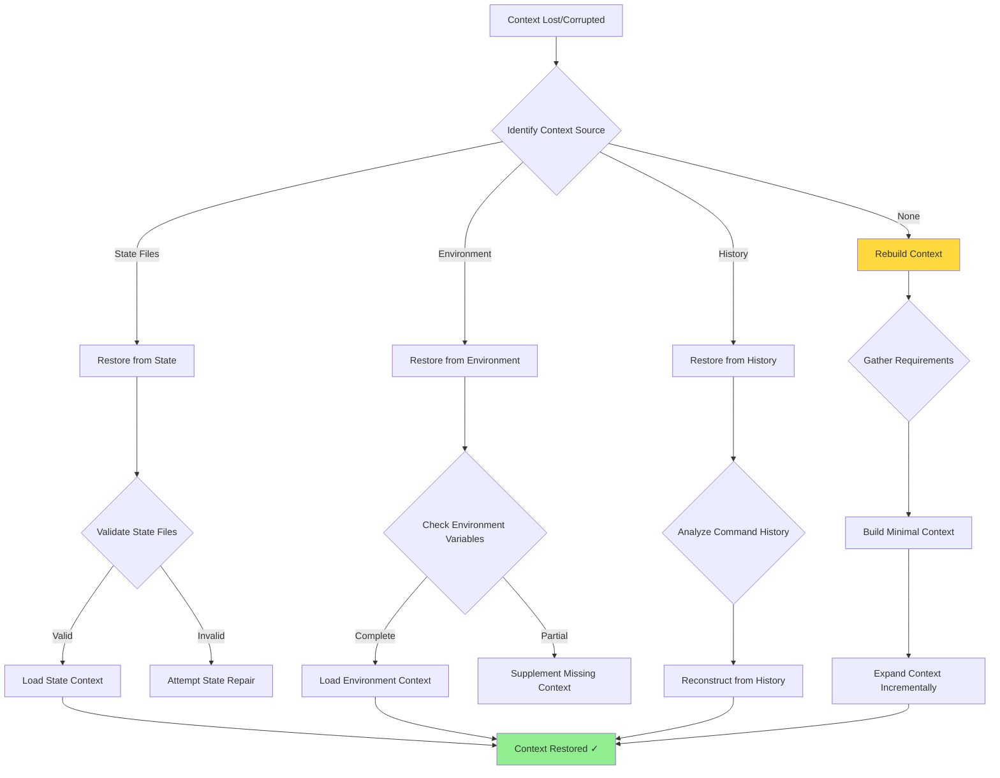
```mermaid
graph TD
    ContextLost[Context Lost/Corrupted] --> ContextSource{Identify Context Source}
    
    ContextSource -->|State Files| RestoreFromState[Restore from State]
    ContextSource -->|Environment| RestoreFromEnv[Restore from Environment]
    ContextSource -->|History| RestoreFromHistory[Restore from History]
    ContextSource -->|None| RebuildContext[Rebuild Context]
    
    RestoreFromState --> ValidateState{Validate State Files}
    ValidateState -->|Valid| LoadStateContext[Load State Context]
    ValidateState -->|Invalid| AttemptRepair[Attempt State Repair]
    
    RestoreFromEnv --> CheckEnvVars{Check Environment Variables}
    CheckEnvVars -->|Complete| LoadEnvContext[Load Environment Context]
    CheckEnvVars -->|Partial| SupplementContext[Supplement Missing Context]
    
    RestoreFromHistory --> AnalyzeHistory{Analyze Command History}
    AnalyzeHistory --> ReconstructContext[Reconstruct from History]
    
    RebuildContext --> GatherRequirements{Gather Requirements}
    GatherRequirements --> BuildMinimalContext[Build Minimal Context]
    BuildMinimalContext --> ExpandContext[Expand Context Incrementally]
    
    LoadStateContext --> ContextRestored[Context Restored ✓]
    LoadEnvContext --> ContextRestored
    ReconstructContext --> ContextRestored
    ExpandContext --> ContextRestored
    
    style RebuildContext fill:#FFD93D
    style ContextRestored fill:#90EE90
```

## 5. Error Code Resolution

### Common Error Patterns and Solutions

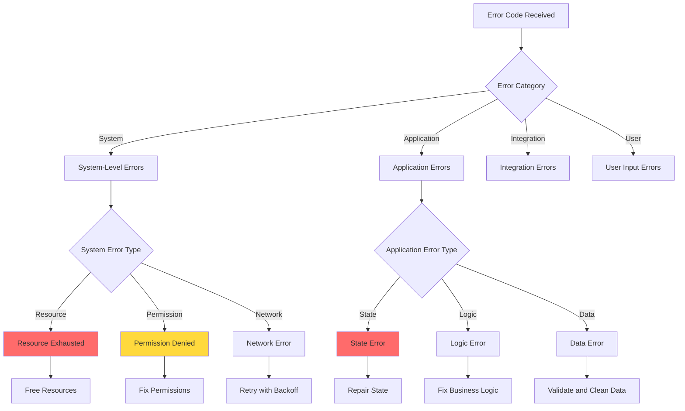
```mermaid
graph TD
    ErrorCode[Error Code Received] --> ErrorCategory{Error Category}
    
    ErrorCategory -->|System| SystemErrors[System-Level Errors]
    ErrorCategory -->|Application| AppErrors[Application Errors]
    ErrorCategory -->|Integration| IntegErrors[Integration Errors]
    ErrorCategory -->|User| UserErrors[User Input Errors]
    
    SystemErrors --> SysErrorType{System Error Type}
    SysErrorType -->|Resource| ResourceExhausted[Resource Exhausted]
    SysErrorType -->|Permission| PermissionDenied[Permission Denied]
    SysErrorType -->|Network| NetworkError[Network Error]
    
    AppErrors --> AppErrorType{Application Error Type}
    AppErrorType -->|State| StateError[State Error]
    AppErrorType -->|Logic| LogicError[Logic Error]
    AppErrorType -->|Data| DataError[Data Error]
    
    ResourceExhausted --> FreeResources[Free Resources]
    PermissionDenied --> FixPermissions[Fix Permissions]
    NetworkError --> RetryWithBackoff[Retry with Backoff]
    
    StateError --> RepairState[Repair State]
    LogicError --> FixBusinessLogic[Fix Business Logic]
    DataError --> ValidateData[Validate and Clean Data]
    
    style ResourceExhausted fill:#FF6B6B
    style PermissionDenied fill:#FFD93D
    style StateError fill:#FF6B6B
```

### Critical vs Non-Critical Error Classification

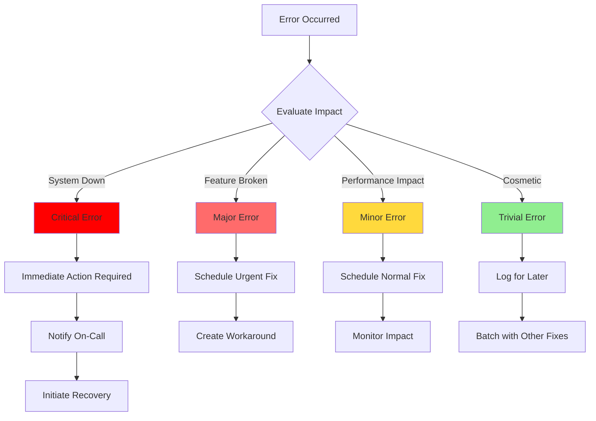
```mermaid
graph TD
    Error[Error Occurred] --> EvaluateImpact{Evaluate Impact}
    
    EvaluateImpact -->|System Down| Critical[Critical Error]
    EvaluateImpact -->|Feature Broken| Major[Major Error]
    EvaluateImpact -->|Performance Impact| Minor[Minor Error]
    EvaluateImpact -->|Cosmetic| Trivial[Trivial Error]
    
    Critical --> ImmediateAction[Immediate Action Required]
    ImmediateAction --> NotifyOncall[Notify On-Call]
    NotifyOncall --> InitiateRecovery[Initiate Recovery]
    
    Major --> ScheduleUrgent[Schedule Urgent Fix]
    ScheduleUrgent --> CreateWorkaround[Create Workaround]
    
    Minor --> ScheduleNormal[Schedule Normal Fix]
    ScheduleNormal --> MonitorImpact[Monitor Impact]
    
    Trivial --> LogForLater[Log for Later]
    LogForLater --> BatchWithOthers[Batch with Other Fixes]
    
    style Critical fill:#FF0000
    style Major fill:#FF6B6B
    style Minor fill:#FFD93D
    style Trivial fill:#90EE90
```

## 6. Integration Issues

### Git Integration Problems

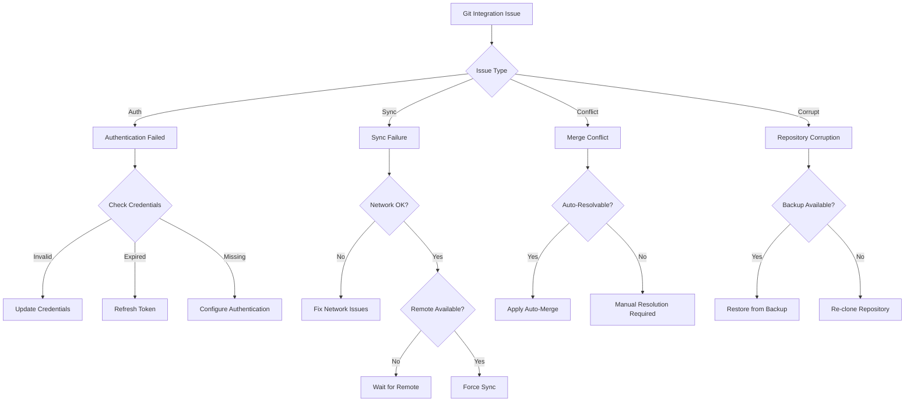
```mermaid
graph TD
    GitIssue[Git Integration Issue] --> IssueType{Issue Type}
    
    IssueType -->|Auth| AuthIssue[Authentication Failed]
    IssueType -->|Sync| SyncIssue[Sync Failure]
    IssueType -->|Conflict| ConflictIssue[Merge Conflict]
    IssueType -->|Corrupt| CorruptRepo[Repository Corruption]
    
    AuthIssue --> CheckCreds{Check Credentials}
    CheckCreds -->|Invalid| UpdateCreds[Update Credentials]
    CheckCreds -->|Expired| RefreshToken[Refresh Token]
    CheckCreds -->|Missing| ConfigureAuth[Configure Authentication]
    
    SyncIssue --> CheckNetwork{Network OK?}
    CheckNetwork -->|No| FixNetwork[Fix Network Issues]
    CheckNetwork -->|Yes| CheckRemote{Remote Available?}
    CheckRemote -->|No| WaitForRemote[Wait for Remote]
    CheckRemote -->|Yes| ForceSync[Force Sync]
    
    ConflictIssue --> AutoResolve{Auto-Resolvable?}
    AutoResolve -->|Yes| ApplyAutoMerge[Apply Auto-Merge]
    AutoResolve -->|No| ManualResolve[Manual Resolution Required]
    
    CorruptRepo --> CloneBackup{Backup Available?}
    CloneBackup -->|Yes| RestoreFromBackup[Restore from Backup]
    CloneBackup -->|No| RecloneRepo[Re-clone Repository]
```

### File System Permission Issues

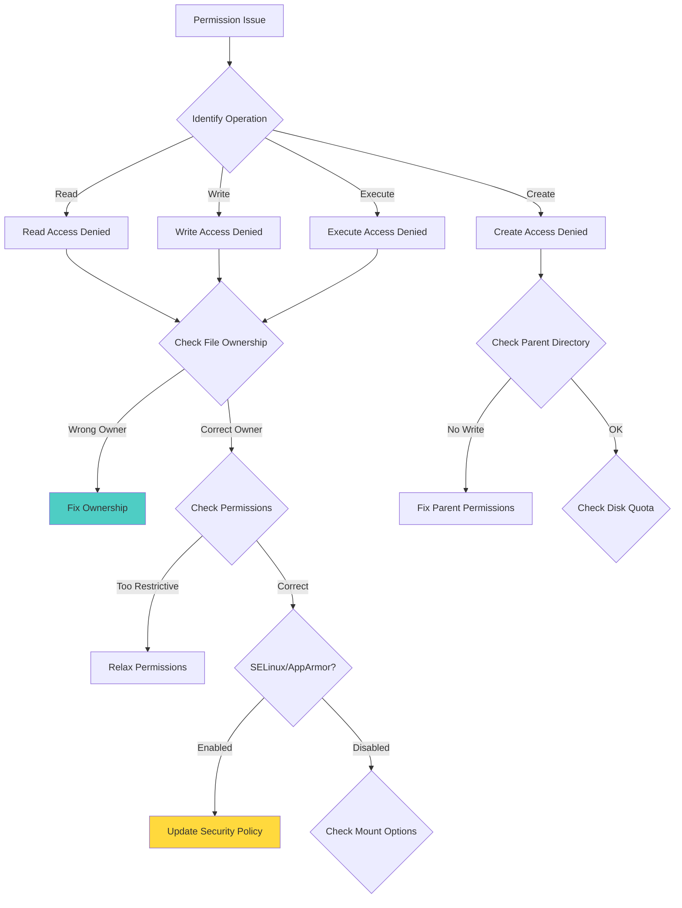
```mermaid
graph TD
    PermIssue[Permission Issue] --> IdentifyOperation{Identify Operation}
    
    IdentifyOperation -->|Read| ReadDenied[Read Access Denied]
    IdentifyOperation -->|Write| WriteDenied[Write Access Denied]
    IdentifyOperation -->|Execute| ExecDenied[Execute Access Denied]
    IdentifyOperation -->|Create| CreateDenied[Create Access Denied]
    
    ReadDenied --> CheckOwnership{Check File Ownership}
    WriteDenied --> CheckOwnership
    ExecDenied --> CheckOwnership
    CreateDenied --> CheckParentPerms{Check Parent Directory}
    
    CheckOwnership -->|Wrong Owner| FixOwnership[Fix Ownership]
    CheckOwnership -->|Correct Owner| CheckPerms{Check Permissions}
    
    CheckPerms -->|Too Restrictive| RelaxPerms[Relax Permissions]
    CheckPerms -->|Correct| CheckSELinux{SELinux/AppArmor?}
    
    CheckSELinux -->|Enabled| UpdatePolicy[Update Security Policy]
    CheckSELinux -->|Disabled| CheckMount{Check Mount Options}
    
    CheckParentPerms -->|No Write| FixParentPerms[Fix Parent Permissions]
    CheckParentPerms -->|OK| CheckQuota{Check Disk Quota}
    
    style FixOwnership fill:#4ECDC4
    style UpdatePolicy fill:#FFD93D
```

## 7. Preventive Maintenance

### Regular Health Checks

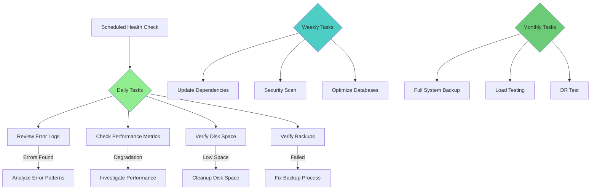
```mermaid
graph TD
    HealthCheck[Scheduled Health Check] --> DailyChecks{Daily Tasks}
    
    DailyChecks --> CheckLogs[Review Error Logs]
    DailyChecks --> CheckPerf[Check Performance Metrics]
    DailyChecks --> CheckSpace[Verify Disk Space]
    DailyChecks --> CheckBackups[Verify Backups]
    
    CheckLogs -->|Errors Found| AnalyzeErrors[Analyze Error Patterns]
    CheckPerf -->|Degradation| InvestigatePerf[Investigate Performance]
    CheckSpace -->|Low Space| CleanupSpace[Cleanup Disk Space]
    CheckBackups -->|Failed| FixBackups[Fix Backup Process]
    
    WeeklyChecks{Weekly Tasks} --> UpdateDeps[Update Dependencies]
    WeeklyChecks --> SecurityScan[Security Scan]
    WeeklyChecks --> OptimizeDB[Optimize Databases]
    
    MonthlyChecks{Monthly Tasks} --> FullBackup[Full System Backup]
    MonthlyChecks --> LoadTest[Load Testing]
    MonthlyChecks --> DisasterRecovery[DR Test]
    
    style DailyChecks fill:#90EE90
    style WeeklyChecks fill:#4ECDC4
    style MonthlyChecks fill:#6BCB77
```

### Performance Monitoring Strategies

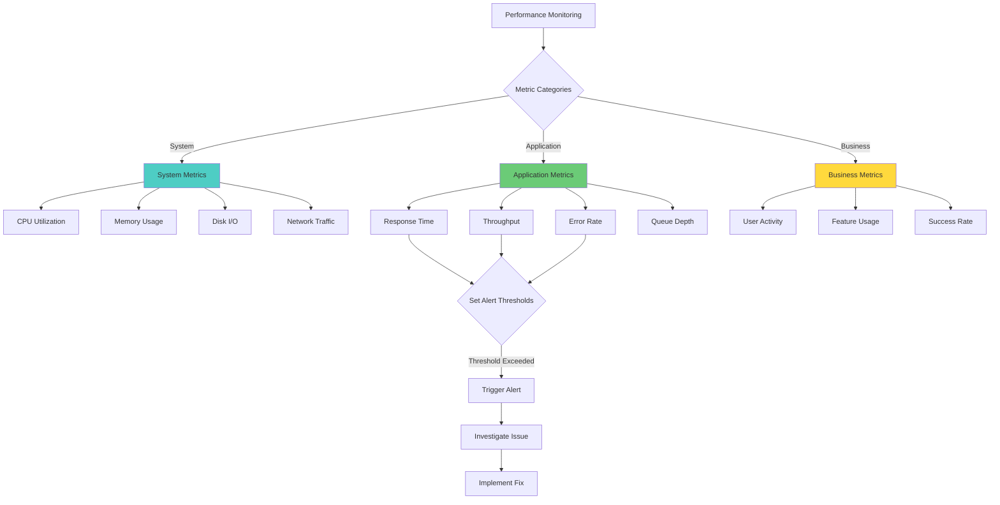
```mermaid
graph TD
    PerfMonitoring[Performance Monitoring] --> MetricTypes{Metric Categories}
    
    MetricTypes -->|System| SystemMetrics[System Metrics]
    MetricTypes -->|Application| AppMetrics[Application Metrics]
    MetricTypes -->|Business| BusinessMetrics[Business Metrics]
    
    SystemMetrics --> CPUMon[CPU Utilization]
    SystemMetrics --> MemMon[Memory Usage]
    SystemMetrics --> DiskMon[Disk I/O]
    SystemMetrics --> NetMon[Network Traffic]
    
    AppMetrics --> ResponseTime[Response Time]
    AppMetrics --> Throughput[Throughput]
    AppMetrics --> ErrorRate[Error Rate]
    AppMetrics --> QueueDepth[Queue Depth]
    
    BusinessMetrics --> UserActivity[User Activity]
    BusinessMetrics --> FeatureUsage[Feature Usage]
    BusinessMetrics --> SuccessRate[Success Rate]
    
    ResponseTime --> SetAlerts{Set Alert Thresholds}
    Throughput --> SetAlerts
    ErrorRate --> SetAlerts
    
    SetAlerts -->|Threshold Exceeded| TriggerAlert[Trigger Alert]
    TriggerAlert --> InvestigateIssue[Investigate Issue]
    InvestigateIssue --> ImplementFix[Implement Fix]
    
    style SystemMetrics fill:#4ECDC4
    style AppMetrics fill:#6BCB77
    style BusinessMetrics fill:#FFD93D
```

### State Cleanup Procedures

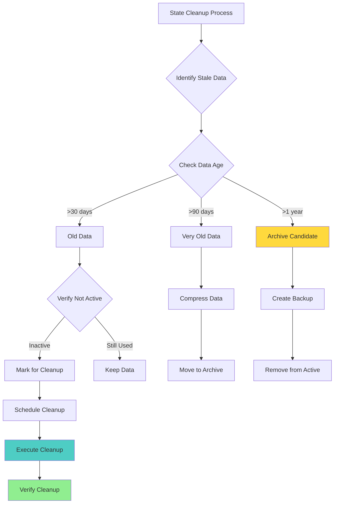
```mermaid
graph TD
    StateCleanup[State Cleanup Process] --> IdentifyStale{Identify Stale Data}
    
    IdentifyStale --> CheckAge{Check Data Age}
    CheckAge -->|>30 days| OldData[Old Data]
    CheckAge -->|>90 days| VeryOldData[Very Old Data]
    CheckAge -->|>1 year| ArchiveData[Archive Candidate]
    
    OldData --> VerifyNotActive{Verify Not Active}
    VerifyNotActive -->|Inactive| MarkForCleanup[Mark for Cleanup]
    VerifyNotActive -->|Still Used| KeepData[Keep Data]
    
    VeryOldData --> CompressData[Compress Data]
    CompressData --> MoveToArchive[Move to Archive]
    
    ArchiveData --> CreateBackup[Create Backup]
    CreateBackup --> RemoveFromActive[Remove from Active]
    
    MarkForCleanup --> ScheduleCleanup[Schedule Cleanup]
    ScheduleCleanup --> ExecuteCleanup[Execute Cleanup]
    ExecuteCleanup --> VerifyCleanup[Verify Cleanup]
    
    style ArchiveData fill:#FFD93D
    style ExecuteCleanup fill:#4ECDC4
    style VerifyCleanup fill:#90EE90
```

### System Optimization Schedules

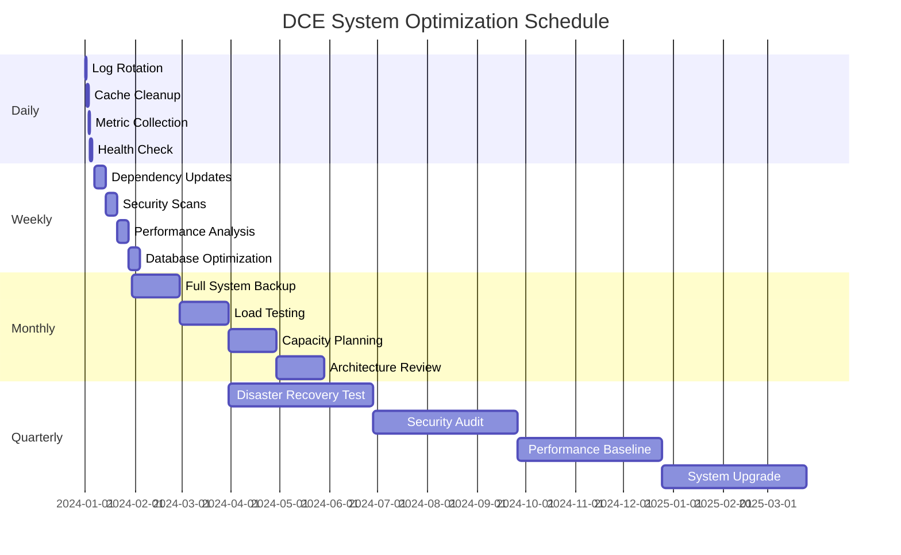
```mermaid
gantt
    title DCE System Optimization Schedule
    dateFormat  YYYY-MM-DD
    section Daily
    Log Rotation           :daily1, 2024-01-01, 1d
    Cache Cleanup          :daily2, after daily1, 1d
    Metric Collection      :daily3, after daily2, 1d
    Health Check           :daily4, after daily3, 1d
    
    section Weekly
    Dependency Updates     :weekly1, 2024-01-07, 7d
    Security Scans         :weekly2, after weekly1, 7d
    Performance Analysis   :weekly3, after weekly2, 7d
    Database Optimization  :weekly4, after weekly3, 7d
    
    section Monthly
    Full System Backup     :monthly1, 2024-01-30, 30d
    Load Testing           :monthly2, after monthly1, 30d
    Capacity Planning      :monthly3, after monthly2, 30d
    Architecture Review    :monthly4, after monthly3, 30d
    
    section Quarterly
    Disaster Recovery Test :quarterly1, 2024-03-30, 90d
    Security Audit         :quarterly2, after quarterly1, 90d
    Performance Baseline   :quarterly3, after quarterly2, 90d
    System Upgrade         :quarterly4, after quarterly3, 90d
```

## Troubleshooting Quick Reference

### Emergency Response Checklist

1. **System Down**
   - [ ] Check process status
   - [ ] Review recent changes
   - [ ] Check system resources
   - [ ] Initiate emergency restart
   - [ ] Notify stakeholders

2. **Data Corruption**
   - [ ] Stop all writes
   - [ ] Assess corruption extent
   - [ ] Initiate backup recovery
   - [ ] Validate recovered data
   - [ ] Resume operations carefully

3. **Performance Crisis**
   - [ ] Identify bottleneck type
   - [ ] Apply immediate mitigation
   - [ ] Scale resources if needed
   - [ ] Plan permanent fix
   - [ ] Monitor closely

4. **Security Incident**
   - [ ] Isolate affected systems
   - [ ] Preserve evidence
   - [ ] Apply security patches
   - [ ] Review access logs
   - [ ] Update security policies

### Common Solutions Matrix

| Problem | Quick Fix | Permanent Solution |
|---------|-----------|-------------------|
| High CPU | Reduce concurrency | Optimize algorithms |
| Memory Leak | Restart service | Fix memory management |
| Slow Queries | Add indexes | Optimize query patterns |
| Lock Contention | Reduce lock scope | Implement lock-free design |
| State Corruption | Restore from backup | Add integrity checks |
| Network Timeout | Increase timeout | Improve network reliability |
| Permission Denied | Fix permissions | Update security model |

### Performance Baselines

| Operation | Normal | Warning | Critical |
|-----------|--------|---------|----------|
| Command Execution | <1s | 1-5s | >5s |
| State Save | <100ms | 100-500ms | >500ms |
| Context Switch | <50ms | 50-200ms | >200ms |
| File Operations | <10ms | 10-50ms | >50ms |
| Memory Usage | <100MB | 100-500MB | >500MB |
| CPU Usage | <20% | 20-70% | >70% |

## Conclusion

This troubleshooting guide provides systematic approaches to diagnosing and resolving issues in the DCE system. Regular use of these decision trees, combined with proactive monitoring and maintenance, will help maintain system reliability and performance.

Key principles to remember:
- **Diagnose before fixing** - Understand the root cause
- **Document issues** - Build a knowledge base
- **Monitor proactively** - Catch issues early
- **Automate recovery** - Reduce manual intervention
- **Learn from incidents** - Improve continuously

For additional support, refer to the system logs, monitoring dashboards, and contact the development team for complex issues that fall outside these documented patterns.