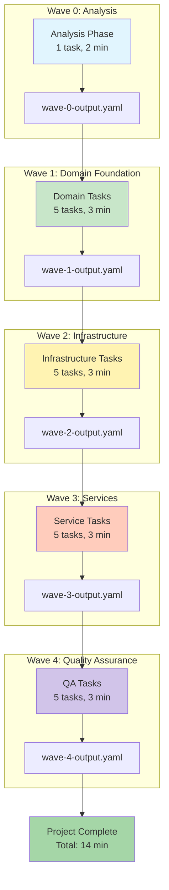
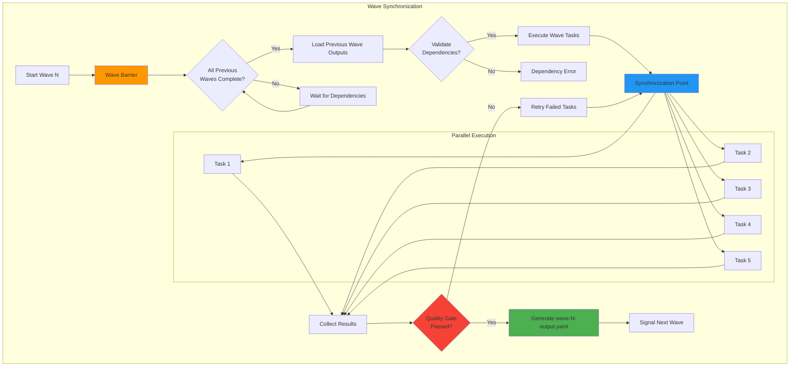
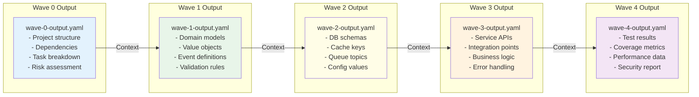
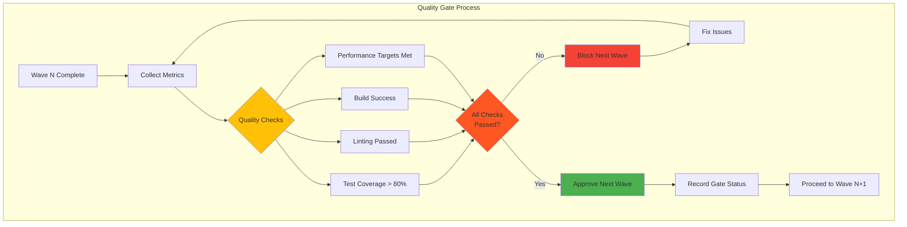
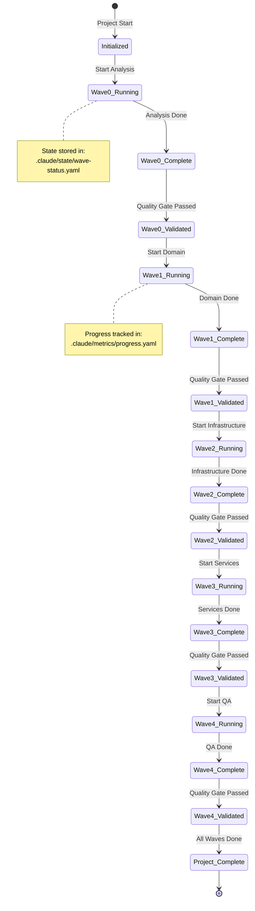
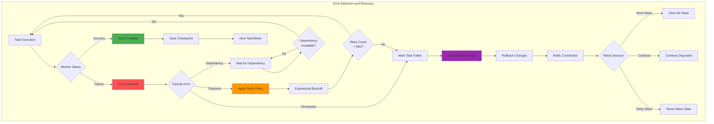
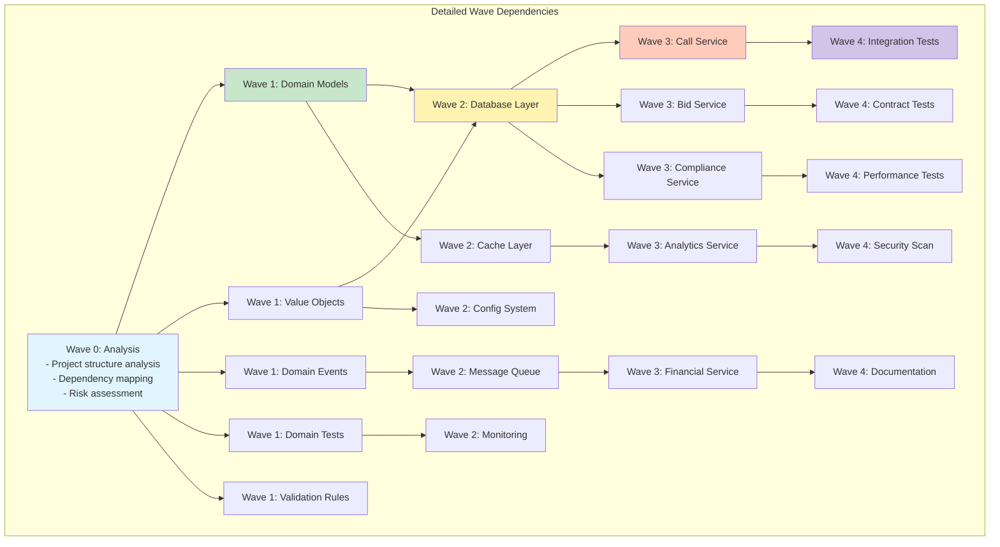
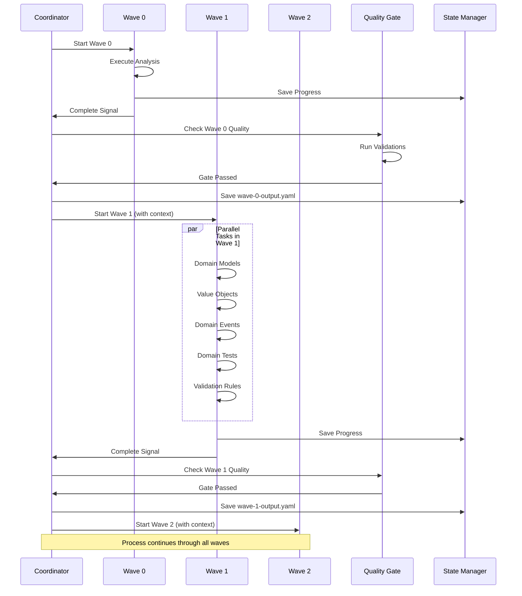
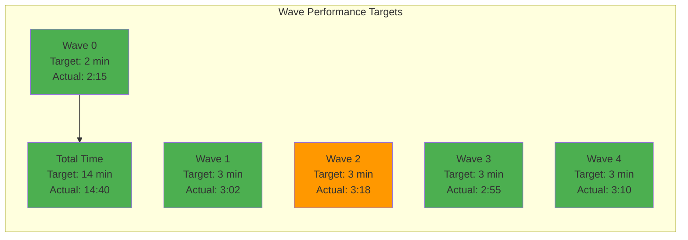

# Wave Synchronization and Execution Flow

This document provides detailed diagrams showing the 5-wave execution model, synchronization mechanisms, and state management in the DCE parallel execution system.

## Overview: 5-Wave Execution Model



## Wave Execution Timeline

```mermaid
gantt
    title DCE Wave Execution Timeline
    dateFormat mm:ss
    axisFormat %M:%S
    
    section Wave 0
    Analysis & Planning    :active, w0, 00:00, 2m
    
    section Wave 1
    Domain Models         :w1a, after w0, 3m
    Value Objects        :w1b, after w0, 3m
    Domain Events        :w1c, after w0, 3m
    Domain Tests         :w1d, after w0, 3m
    Domain Validation    :w1e, after w0, 3m
    
    section Wave 2
    Database Layer       :w2a, after w1a, 3m
    Cache Layer         :w2b, after w1a, 3m
    Message Queue       :w2c, after w1a, 3m
    Config System       :w2d, after w1a, 3m
    Monitoring          :w2e, after w1a, 3m
    
    section Wave 3
    Call Service        :w3a, after w2a, 3m
    Bid Service         :w3b, after w2a, 3m
    Compliance Service  :w3c, after w2a, 3m
    Analytics Service   :w3d, after w2a, 3m
    Financial Service   :w3e, after w2a, 3m
    
    section Wave 4
    Integration Tests   :w4a, after w3a, 3m
    Contract Tests      :w4b, after w3a, 3m
    Performance Tests   :w4c, after w3a, 3m
    Security Scan       :w4d, after w3a, 3m
    Documentation       :w4e, after w3a, 3m
```

## Wave Synchronization Mechanisms



## Context Propagation via YAML Files



## Quality Gates Between Waves



## State Management and Progress Tracking



## Error Handling and Recovery Patterns



## Wave Dependency Graph



## State File Structure

```yaml
# .claude/context/wave-0-output.yaml
wave: 0
status: complete
duration: "2m15s"
tasks_completed: 1
output:
  project_analysis:
    structure:
      - domain_layers: 5
      - service_count: 8
      - api_endpoints: 42
    dependencies:
      - external: ["postgres", "redis", "kafka"]
      - internal: ["domain", "infrastructure", "service"]
    risks:
      - complexity: "high"
      - critical_paths: ["call_routing", "bid_processing"]

# .claude/context/wave-1-output.yaml
wave: 1
status: complete
duration: "3m02s"
tasks_completed: 5
dependencies:
  - wave: 0
    artifacts: ["project_analysis"]
output:
  domain_models:
    - call: "internal/domain/call/call.go"
    - bid: "internal/domain/bid/bid.go"
    - buyer: "internal/domain/account/buyer.go"
  value_objects:
    - money: "internal/domain/values/money.go"
    - phone_number: "internal/domain/values/phone_number.go"
  tests:
    coverage: 85.3
    passing: 142

# .claude/context/wave-2-output.yaml
wave: 2
status: complete
duration: "3m18s"
tasks_completed: 5
dependencies:
  - wave: 1
    artifacts: ["domain_models", "value_objects"]
output:
  infrastructure:
    database:
      - migrations: 15
      - repositories: 8
    cache:
      - strategy: "write-through"
      - ttl: "5m"
    monitoring:
      - metrics: ["latency", "throughput", "errors"]
      - dashboards: 3

# Continue for waves 3 and 4...
```

## Wave Coordination Protocol



## Performance Metrics



## Key Benefits

1. **Predictable Execution**: 14-minute total runtime with clear milestones
2. **Parallel Efficiency**: 5 tasks per wave execute simultaneously
3. **Context Preservation**: YAML files maintain state between waves
4. **Quality Assurance**: Gates ensure each wave meets standards
5. **Error Recovery**: Robust handling of failures with compensation
6. **Progress Visibility**: Real-time tracking of wave completion

## Implementation Notes

- Each wave has a dedicated coordinator thread
- Tasks within a wave share a common context
- State files are atomic and versioned
- Quality gates are configurable per project
- Recovery strategies can be customized per task type
- Metrics are collected in real-time for optimization