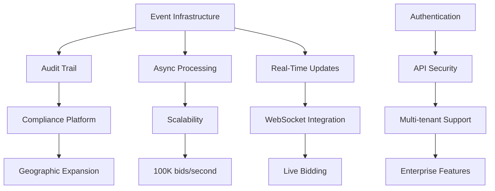

# DCE Strategic Master Plan: Consolidated Insights

**Analysis Date**: January 12, 2025  
**System Health Score**: 73/100 (Weighted Average)

## Executive Summary

The Dependable Call Exchange Backend demonstrates solid architectural foundations with modern Go 1.24 patterns, comprehensive testing infrastructure, and excellent monitoring capabilities. However, critical gaps in business functionality, compliance implementation, and infrastructure scalability present significant barriers to production readiness.

### Overall System Health Score (Weighted)
- **Domain Layer**: 72/100 (Weight: 25%) = 18.0
- **Service Layer**: 72/100 (Weight: 20%) = 14.4
- **API Layer**: 65/100 (Weight: 20%) = 13.0
- **Infrastructure**: 72/100 (Weight: 20%) = 14.4
- **Quality & Security**: 78/100 (Weight: 15%) = 11.7
- **Total Score**: 73/100

### Critical Risk Areas Requiring Immediate Attention
1. **Compliance Gap**: No TCPA/GDPR implementation (legal exposure)
2. **Security Vulnerabilities**: Authentication middleware not applied, no rate limiting
3. **Missing Financial Services**: No billing/payment processing (revenue blocker)

### Top 3 Transformational Opportunities
1. **Event-Driven Architecture**: Enables async processing, audit trails, scalability
2. **Compliance & Security Platform**: Unlocks geographic expansion, builds trust
3. **Real-Time Bidding Enhancement**: Core value proposition optimization

## Cross-Cutting Opportunities Matrix

### High-Impact Multi-Layer Features

| Feature | Domains Impacted | Services Enabled | Infrastructure Required | Business Value |
|---------|-----------------|------------------|------------------------|----------------|
| **Event Infrastructure** | All | Async workflows, Audit trails, Notifications | Kafka/NATS, Event store | Scalability, Compliance, Analytics |
| **Compliance Platform** | Compliance, Call, Financial | TCPA, GDPR, Consent, DNC | Event sourcing, Audit DB | Legal compliance, Market expansion |
| **Financial Engine** | Financial, Account, Analytics | Billing, Payments, Reconciliation | Transaction DB, Payment gateway | Revenue generation |
| **Advanced Caching** | All read operations | All services | Redis cluster, Cache invalidation | 10x performance improvement |
| **Real-Time Analytics** | All domains | Dashboards, Alerts, Reports | Time-series DB, Stream processing | Business intelligence |

### Dependency Chains



## Prioritized Feature List

### Critical Priority (Security/Compliance) - Weeks 1-4
1. **Apply Authentication Middleware** (2 days)
   - Effort: Low | Impact: Critical
   - Unblocks: All protected endpoints
   
2. **Implement Rate Limiting** (3 days)
   - Effort: Medium | Impact: High
   - Dependencies: Redis infrastructure
   
3. **TCPA Compliance Service** (1 week)
   - Effort: High | Impact: Critical
   - Dependencies: Domain events, DNC integration
   
4. **PII Encryption** (3 days)
   - Effort: Medium | Impact: Critical
   - Dependencies: Key management

### High Priority (Revenue Enablers) - Weeks 5-8
5. **Financial Service Suite** (2 weeks)
   - Effort: High | Impact: Critical
   - Enables: Billing, payments, invoicing
   
6. **Event Infrastructure** (1 week)
   - Effort: High | Impact: High
   - Enables: Multiple features downstream
   
7. **Call Routing Domain** (1 week)
   - Effort: High | Impact: High
   - Core business functionality
   
8. **WebSocket Real-Time Integration** (1 week)
   - Effort: Medium | Impact: High
   - Dependencies: Event infrastructure

### Medium Priority (Optimization) - Weeks 9-12
9. **Advanced Caching Strategy** (1 week)
   - Effort: Medium | Impact: High
   - 10x performance improvement
   
10. **Fraud Detection Enhancement** (1 week)
    - Effort: Medium | Impact: Medium
    - ML models, velocity checks
    
11. **Analytics Service Refactor** (3 days)
    - Effort: Low | Impact: Medium
    - Fixes dependency violations
    
12. **gRPC Internal Services** (1 week)
    - Effort: Medium | Impact: Medium
    - Performance optimization

### Low Priority (Polish) - Quarter 2
13. **Batch Operations API**
14. **Advanced Monitoring Dashboards**
15. **Chaos Engineering Framework**
16. **Service Mesh Integration**

## Risk Assessment

### Production Readiness Blockers
1. **No Authentication on Routes** - Critical security vulnerability
2. **Missing Financial Services** - Cannot process revenue
3. **No TCPA Compliance** - Legal exposure, potential fines
4. **Stub Implementations** - 38/43 API endpoints are stubs

### Compliance/Regulatory Risks
1. **TCPA Violations** - No time restriction enforcement
2. **GDPR Non-compliance** - No data portability or erasure
3. **No Audit Trail** - Cannot prove compliance
4. **Missing DNC Integration** - Major TCPA requirement

### Technical Debt Impact
1. **Synchronous Architecture** - Scalability ceiling at ~10K calls/hour
2. **No Event Sourcing** - Limited replay/recovery capability
3. **Limited Caching** - Database bottleneck under load
4. **Analytics Service Violation** - 6 dependencies (limit: 5)

## Quick Wins (High Impact, Low Effort)

### Week 1 Quick Wins
1. **Apply Auth Middleware** (2 hours)
   ```go
   // In handlers.go RegisterRoutes()
   protected := authMiddleware(h.mux)
   ```

2. **Fix Analytics Service** (4 hours)
   - Split into 3 focused services
   - Maintains interfaces

3. **Enable Contract Validation** (2 hours)
   ```go
   handler = contractMiddleware(spec)(handler)
   ```

4. **Add Request Size Limits** (1 hour)
   ```go
   r.Body = http.MaxBytesReader(w, r.Body, 1<<20) // 1MB
   ```

5. **Implement Basic Rate Limiting** (4 hours)
   - Use golang.org/x/time/rate
   - Redis-backed for distribution

### Week 2 Quick Wins
6. **Create Repository Interfaces** (4 hours)
7. **Add Database Indexes** (2 hours)
8. **Implement Prepared Statements** (4 hours)
9. **Standardize Error Responses** (4 hours)
10. **Add Performance Benchmarks** (4 hours)

## Strategic Recommendations

### Phase 1: Foundation (Weeks 1-4)
**Goal**: Security, Authentication, Basic Compliance

1. **Security Hardening**
   - Apply all security middleware
   - Implement rate limiting
   - Add request validation
   - Enable CSRF protection

2. **Compliance Foundation**
   - Create Compliance Service
   - Implement TCPA time restrictions
   - Add consent management
   - Create audit trail infrastructure

3. **Authentication & Authorization**
   - Complete JWT implementation
   - Add API key management
   - Implement RBAC fully
   - Add OAuth2 support

### Phase 2: Core Features (Weeks 5-8)
**Goal**: Revenue generation, Core routing, Real-time features

1. **Financial Platform**
   - Implement Financial Service
   - Add payment processing
   - Create billing workflows
   - Enable invoice generation

2. **Event-Driven Architecture**
   - Deploy Kafka/NATS
   - Implement domain events
   - Create event handlers
   - Enable async processing

3. **Call Routing Enhancement**
   - Complete routing domain
   - Add skill-based routing
   - Implement load balancing
   - Create routing algorithms

4. **Real-Time Features**
   - Connect WebSocket to services
   - Enable live bid streaming
   - Add presence management
   - Implement notifications

### Phase 3: Optimization (Weeks 9-12)
**Goal**: Performance, Analytics, Advanced Features

1. **Performance Optimization**
   - Implement advanced caching
   - Add query optimization
   - Enable connection pooling
   - Create batch operations

2. **Analytics Platform**
   - Refactor analytics services
   - Add real-time dashboards
   - Implement custom reports
   - Enable data export

3. **Advanced Security**
   - Add fraud detection ML
   - Implement anomaly detection
   - Create security monitoring
   - Enable threat intelligence

### Phase 4: Innovation (Quarter 2)
**Goal**: AI features, Advanced routing, Market differentiation

1. **AI-Powered Features**
   - ML-based routing optimization
   - Predictive bid pricing
   - Fraud pattern recognition
   - Quality score prediction

2. **Enterprise Features**
   - Multi-tenancy support
   - White-label capabilities
   - Advanced SLA management
   - Custom integrations

3. **Platform Expansion**
   - International support
   - Multi-currency billing
   - Regulatory compliance
   - Partner ecosystem

## Implementation Roadmap

### Critical Path Dependencies
```
Week 1-2: Security Foundation
├── Apply Auth Middleware ──┐
├── Implement Rate Limiting ─┤
└── Add Request Validation ──┴─→ Week 3-4: Compliance
                                 ├── Create Compliance Service ──┐
                                 ├── TCPA Implementation ────────┤
                                 └── DNC Integration ────────────┴─→ Week 5-6: Financial
                                                                    ├── Financial Service ──┐
                                                                    ├── Payment Gateway ────┤
                                                                    └── Billing System ─────┴─→ Week 7-8: Real-Time
                                                                                               ├── Event Infrastructure
                                                                                               ├── WebSocket Integration
                                                                                               └── Live Features
```

### Resource Requirements
- **Engineering**: 4-6 developers
- **Timeline**: 12 weeks to production-ready
- **Infrastructure**: Kafka, Redis cluster, Payment gateway
- **External**: DNC provider, Compliance consultant

## Success Metrics

### Technical KPIs
- API Response Time: < 50ms p99
- Call Routing Decision: < 1ms
- Bid Processing: 100K/second
- System Uptime: 99.99%
- Test Coverage: > 90%

### Business KPIs
- Revenue Processing: $1M+/month capability
- Geographic Coverage: 50 states compliant
- Partner Integrations: 10+ webhooks
- Fraud Prevention: < 0.1% fraud rate
- Customer Satisfaction: > 95%

## Conclusion

The DCE platform has strong architectural bones but requires focused execution on critical gaps to achieve production readiness. The highest-impact opportunity is implementing event-driven architecture, which unlocks multiple capabilities across compliance, scalability, and real-time features.

**Immediate Actions**:
1. Form dedicated Security/Compliance team (Week 1)
2. Implement Phase 1 security hardening (Weeks 1-2)
3. Begin Financial Service development (Week 3)
4. Deploy event infrastructure (Week 5)

With disciplined execution of this plan, DCE can achieve a production-ready, compliant, and scalable Pay Per Call exchange platform within 12 weeks.