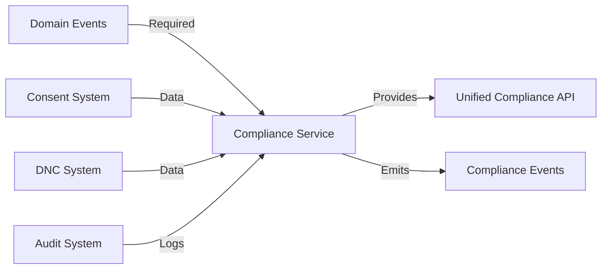
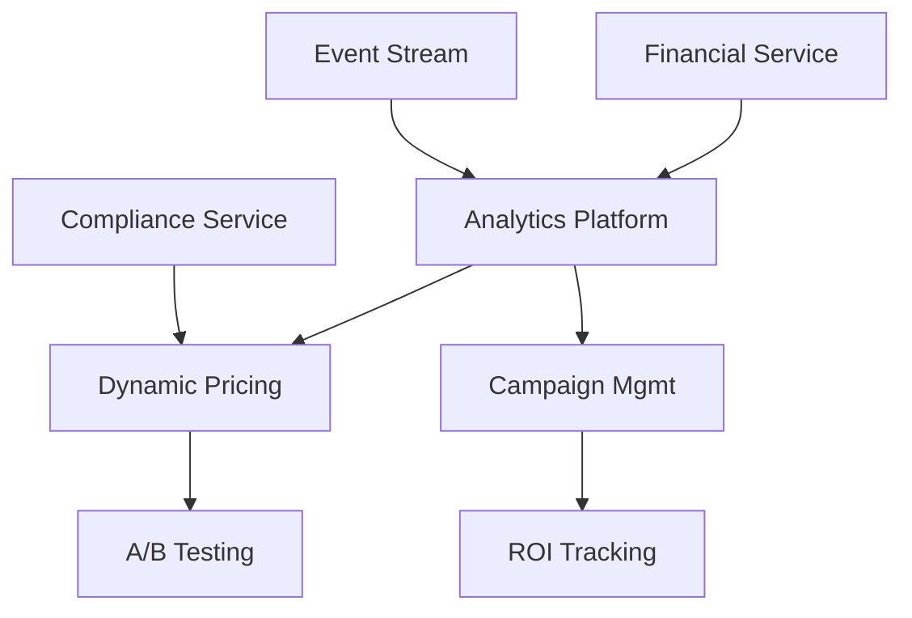

# DCE Implementation Timeline with Dependencies

## Dependency Legend

- 🔴 **Blocker**: Must complete before starting
- 🟡 **Soft Dependency**: Can start but needs for completion
- 🟢 **Independent**: Can proceed in parallel
- ⚡ **Accelerator**: Makes implementation faster if available

## Critical Path Analysis

The critical path through the implementation involves:
1. **Domain Events** → Everything else depends on this
2. **Compliance Foundation** → Consent + DNC + Audit
3. **Compliance Service** → Orchestrates compliance
4. **Financial Service** → Enables revenue features
5. **Analytics Platform** → Powers optimization

## Week-by-Week Implementation Timeline

### Week 1: Emergency Compliance Sprint 🚨

| Day | Feature | Team | Dependencies | Deliverable |
|-----|---------|------|--------------|-------------|
| Mon-Tue | DNC Integration | Engineer A | 🟢 None | DNC cache, Federal API |
| Mon-Wed | Consent Management | Engineer B, C | 🟢 None | Basic consent CRUD |
| Thu-Fri | Audit Logging | Engineer A | 🟢 None | Call/compliance logs |
| Thu-Fri | Test Suite Setup | Engineer B | 🟡 Above features | Compliance tests |

**End of Week 1**: Basic compliance operational, major risks mitigated

### Week 2: Security & Foundation Prep

| Day | Feature | Team | Dependencies | Deliverable |
|-----|---------|------|--------------|-------------|
| Mon-Tue | PII Encryption | Engineer A, B | 🟢 None | Encrypted fields |
| Mon-Fri | Domain Events Design | Architect + Team | 🟢 None | Event schemas, ADRs |
| Wed-Fri | Data Retention | Engineer C | 🟢 None | Deletion jobs |
| Wed-Fri | API Standards | Engineer D | 🟢 None | OpenAPI specs |

**End of Week 2**: Security hardened, event design complete

### Week 3-4: Domain Events Implementation

| Day | Feature | Team | Dependencies | Deliverable |
|-----|---------|------|--------------|-------------|
| W3 Mon-Fri | Event Infrastructure | Engineer A, B | 🔴 Event Design | Event store, bus |
| W3 Mon-Fri | Event Publishers | Engineer C | 🟡 Infrastructure | Domain publishers |
| W4 Mon-Wed | Event Consumers | Engineer A, B | 🔴 Publishers | Basic consumers |
| W4 Thu-Fri | Event Testing | Whole Team | 🔴 All above | Integration tests |

**End of Week 4**: Event architecture operational

### Week 5-6: Compliance Service Layer



| Day | Feature | Team | Dependencies | Deliverable |
|-----|---------|------|--------------|-------------|
| W5 Mon-Wed | Service Architecture | Engineer A, B | 🔴 Events | Service interfaces |
| W5 Thu-Fri | Consent Service | Engineer A | 🔴 Architecture | Full consent mgmt |
| W5 Thu-Fri | DNC Service | Engineer B | 🔴 Architecture | DNC orchestration |
| W6 Mon-Wed | Rule Engine | Engineer C | 🟡 Services | Compliance rules |
| W6 Thu-Fri | API Integration | Engineer D | 🔴 All services | REST endpoints |

**End of Week 6**: Complete compliance platform operational

### Week 7-8: Financial Foundation

| Day | Feature | Team | Dependencies | Deliverable |
|-----|---------|------|--------------|-------------|
| W7 Mon-Wed | Transaction Service | Engineer A, B | 🔴 Events | Transaction mgmt |
| W7 Thu-Fri | Balance Service | Engineer A, B | 🔴 Transactions | Account balances |
| W8 Mon-Wed | Billing Service | Engineer C | 🔴 Balances | Invoice generation |
| W8 Thu-Fri | Payment Integration | Engineer D | 🟡 Billing | Payment processing |

**End of Week 8**: Financial services complete

### Week 9-10: Revenue Optimization



| Day | Feature | Team | Dependencies | Deliverable |
|-----|---------|------|--------------|-------------|
| W9 Mon-Fri | Analytics Foundation | Engineer A, B, C | 🔴 Financial, Events | Data pipeline |
| W10 Mon-Wed | Pricing Model | ML Engineer | 🔴 Analytics | ML model v1 |
| W10 Thu-Fri | Pricing Service | Engineer D | 🔴 Model | Dynamic pricing |

**End of Week 10**: Revenue optimization active

### Week 11-12: Advanced Features

| Day | Feature | Team | Dependencies | Deliverable |
|-----|---------|------|--------------|-------------|
| W11 Mon-Wed | Fraud Detection v2 | ML Engineer | 🔴 Analytics | ML fraud model |
| W11 Thu-Fri | Campaign System | Engineer A, B | 🔴 Analytics | Campaign mgmt |
| W12 Mon-Wed | Webhook Platform | Engineer C | ⚡ Events help | Webhook system |
| W12 Thu-Fri | Integration Testing | Whole Team | 🔴 All above | E2E tests |

**End of Week 12**: Advanced features operational

### Week 13-14: Scale & Performance

| Day | Feature | Team | Dependencies | Deliverable |
|-----|---------|------|--------------|-------------|
| W13 Mon-Fri | Kafka Streaming | Engineer A, B | ⚡ Events migration | Kafka setup |
| W13 Mon-Fri | Compliance Dashboard | Engineer C + Designer | 🔴 Compliance API | UI dashboard |
| W14 Mon-Wed | Performance Suite | Engineer D | 🟢 None | Load tests |
| W14 Thu-Fri | Observability | DevOps | 🟢 None | Enhanced monitoring |

**End of Week 14**: Platform scaled and monitored

### Week 15-16: Excellence & Innovation

| Day | Feature | Team | Dependencies | Deliverable |
|-----|---------|------|--------------|-------------|
| W15 Mon-Wed | Multi-Jurisdiction | Engineer A, B | 🔴 Compliance Service | Global rules |
| W15 Thu-Fri | ML Predictions | ML Engineer | 🔴 Historical data | Predictive model |
| W16 Mon-Wed | Tech Debt Cleanup | Whole Team | 🟢 None | Refactoring |
| W16 Thu-Fri | Documentation | Whole Team | 🔴 All features | Complete docs |

**End of Week 16**: Platform complete with innovation features

## Dependency Management Strategies

### 1. Parallel Work Streams

**Stream A: Compliance** (Weeks 1-6)
- Consent → DNC → Audit → Compliance Service

**Stream B: Platform** (Weeks 3-8)  
- Events → Financial → Analytics

**Stream C: Enhancement** (Weeks 9-16)
- Pricing → Fraud → Campaign → Scale

### 2. Risk Mitigation Tactics

| Risk | Mitigation Strategy |
|------|-------------------|
| Event system delays | Start design in Week 2, prototype early |
| Compliance complexity | Hire consultant Week 1 |
| ML model accuracy | Use simple rules first, enhance later |
| Integration issues | Continuous testing from Week 3 |

### 3. Acceleration Opportunities

- **Hire Senior Architect**: Can parallelize event implementation
- **Use Existing Libraries**: Faster encryption, event sourcing
- **Cloud Services**: Managed Kafka, ML platforms
- **Pair Programming**: Knowledge transfer and quality

## Resource Loading Chart

```
Week    | 1 | 2 | 3 | 4 | 5 | 6 | 7 | 8 | 9 |10 |11 |12 |13 |14 |15 |16 |
--------|---|---|---|---|---|---|---|---|---|---|---|---|---|---|---|---|
Eng A   |DNC|Enc|Evt|Evt|CSv|CSv|Fin|Fin|Ana|Ana|Cmp|Cmp|Kaf|Kaf|Mjr|Dbt|
Eng B   |Con|Enc|Evt|Evt|CSv|CSv|Fin|Fin|Ana|Ana|Cmp|Cmp|Kaf|Kaf|Mjr|Dbt|
Eng C   |Con|Ret|Evt|Evt|Rul|Rul|Bil|Bil|Ana|Ana|Whk|Whk|Dsh|Dsh|   |Doc|
Eng D   |   |API|   |   |API|API|Pay|Pay|Prc|Prc|   |   |Prf|Obs|   |Doc|
ML Eng  |   |   |   |   |   |   |   |   |Mdl|Mdl|Frd|Frd|   |   |Prd|Prd|
DevOps  |   |   |Inf|Inf|   |   |   |   |   |   |   |   |Kaf|Obs|   |   |

Legend: Con=Consent, DNC=DNC, Enc=Encryption, Ret=Retention, Evt=Events,
        CSv=Compliance Service, Rul=Rules, API=APIs, Fin=Financial,
        Bil=Billing, Pay=Payment, Ana=Analytics, Prc=Pricing, Mdl=Model,
        Cmp=Campaign, Frd=Fraud, Whk=Webhook, Kaf=Kafka, Dsh=Dashboard,
        Prf=Performance, Obs=Observability, Mjr=Multi-jurisdiction,
        Prd=Predictions, Dbt=Debt, Doc=Documentation
```

## Critical Success Factors

### Week 2 Checkpoint
- ✅ All emergency compliance features live
- ✅ Zero violations in production
- ✅ Event design approved

### Week 4 Checkpoint  
- ✅ Event system processing 1000 events/sec
- ✅ All domains publishing events
- ✅ Audit trail from events working

### Week 8 Checkpoint
- ✅ Compliance service handling 100% of calls
- ✅ Financial accuracy at 99.99%
- ✅ No revenue leakage

### Week 12 Checkpoint
- ✅ Dynamic pricing showing +10% revenue
- ✅ Fraud detection catching 90% of fraud
- ✅ Platform stable at 10K calls/minute

### Week 16 Checkpoint
- ✅ All features delivered
- ✅ 99.99% platform uptime
- ✅ Ready for 10x growth

## Contingency Planning

### If Domain Events Delayed
- Continue with direct service integration
- Retrofit events in Phase 2
- Use change data capture for audit

### If ML Models Underperform  
- Fall back to rule-based systems
- Iterate on models in production
- Hire ML consultant

### If Compliance Complex
- Focus on US federal rules first
- Add states incrementally
- Defer international

## Conclusion

This timeline provides a realistic 16-week path from compliance crisis to platform excellence. The dependency mapping ensures smooth flow between features while the parallel streams maximize velocity. Regular checkpoints allow for course correction while contingency plans handle common risks.

**Critical Insight**: Weeks 1-2 are make-or-break for compliance. Everything else can be adjusted, but these emergency fixes must succeed.

---
*Last Updated: [Current Date]*
*Next Review: End of Week 2*