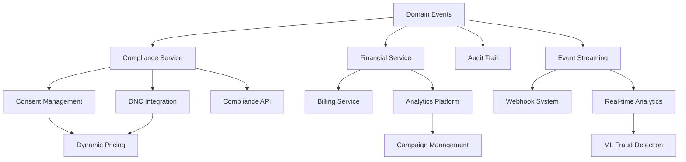

# DCE Consolidated Opportunity Matrix

## Executive Summary

This matrix consolidates all identified opportunities across the 5 analyst reports, organized by business impact and implementation effort. Each opportunity is mapped to its source findings and includes dependency relationships.

## Opportunity Scoring Methodology

- **Impact Score (1-10)**: Revenue potential + Risk mitigation + Strategic value
- **Effort Score (1-10)**: Development time + Complexity + Resource requirements
- **Priority Score**: Impact² / Effort (higher = better ROI)

## Critical Compliance Opportunities (Must Do)

| Opportunity | Impact | Effort | Priority | Dependencies | Source |
|------------|--------|--------|----------|--------------|---------|
| Emergency Consent Management | 10 | 4 | 25.0 | None | Domain, API, Service |
| DNC Integration & Caching | 10 | 3 | 33.3 | None | Domain, Infrastructure |
| Basic Audit Trail System | 9 | 3 | 27.0 | Domain Events | All Analysts |
| Encryption for PII | 9 | 5 | 16.2 | None | Infrastructure, Security |
| Compliance API Endpoints | 8 | 4 | 16.0 | Consent, DNC | API, Service |
| Compliance Service Layer | 8 | 6 | 10.7 | Domain fixes | Service |

## High-Value Revenue Opportunities

| Opportunity | Impact | Effort | Priority | Dependencies | Source |
|------------|--------|--------|----------|--------------|---------|
| Domain Event Architecture | 9 | 7 | 11.6 | None | Domain, Quality |
| Dynamic Pricing Engine | 8 | 7 | 9.1 | Events, ML | Service, Domain |
| Financial Service Completion | 8 | 6 | 10.7 | Events | Domain, Service |
| Real-time Analytics Platform | 7 | 7 | 7.0 | Events, Financial | API, Service |
| Campaign Management | 7 | 5 | 9.8 | Analytics | API, Service |
| Advanced Fraud Detection | 7 | 6 | 8.2 | ML, Events | Service, Infrastructure |

## Platform Excellence Opportunities

| Opportunity | Impact | Effort | Priority | Dependencies | Source |
|------------|--------|--------|----------|--------------|---------|
| Kafka Event Streaming | 8 | 7 | 9.1 | Domain Events | Infrastructure |
| Webhook Management | 6 | 5 | 7.2 | Events | API, Infrastructure |
| GraphQL API Layer | 6 | 6 | 6.0 | REST cleanup | API |
| Contract Testing Suite | 7 | 4 | 12.3 | API specs | Quality |
| Performance Testing Harness | 6 | 4 | 9.0 | None | Quality |
| Observability Enhancement | 6 | 5 | 7.2 | Metrics | Infrastructure |

## Technical Debt Reduction

| Opportunity | Impact | Effort | Priority | Dependencies | Source |
|------------|--------|--------|----------|--------------|---------|
| Service Dependency Cleanup | 5 | 3 | 8.3 | None | Service, Quality |
| Repository Pattern Completion | 5 | 4 | 6.3 | None | Infrastructure |
| Test Coverage Improvement | 6 | 5 | 7.2 | None | Quality |
| API Response Standardization | 5 | 3 | 8.3 | None | API |
| Error Handling Consistency | 5 | 3 | 8.3 | None | All Analysts |
| Code Smell Remediation | 4 | 4 | 4.0 | None | Quality |

## Innovation Opportunities (Future)

| Opportunity | Impact | Effort | Priority | Dependencies | Source |
|------------|--------|--------|----------|--------------|---------|
| Multi-Region Architecture | 7 | 9 | 5.4 | All core | Infrastructure |
| Blockchain Audit Trail | 5 | 8 | 3.1 | Events | Domain |
| AI-Powered Compliance | 6 | 8 | 4.5 | ML platform | Service |
| Voice Analytics | 6 | 7 | 5.1 | ML, Telephony | Service |
| Predictive Routing | 7 | 7 | 7.0 | ML, Analytics | Service |

## Quick Wins Matrix (< 1 Week Effort)

| Opportunity | Impact | Days | Value Proposition |
|------------|--------|------|-------------------|
| Basic DNC Cache | 10 | 3 | Immediate compliance |
| Audit Event Logging | 9 | 2 | Compliance proof |
| API Error Standardization | 5 | 2 | Better DX |
| Service Dependencies Fix | 5 | 3 | Cleaner architecture |
| Compliance Test Suite | 7 | 5 | Risk reduction |
| Security Headers | 6 | 1 | Quick security win |

## Opportunity Dependencies Graph

## Implementation Waves

### Wave 1: Compliance Critical (Weeks 1-4)
**Total Impact Score: 52**
- Emergency Consent Management
- DNC Integration
- Basic Audit Trail
- Encryption Implementation
- Compliance API v1

### Wave 2: Foundation (Weeks 5-8)
**Total Impact Score: 41**
- Domain Event Architecture
- Compliance Service Layer
- Financial Service Completion
- Contract Testing

### Wave 3: Revenue Growth (Weeks 9-12)
**Total Impact Score: 35**
- Dynamic Pricing Engine
- Analytics Platform
- Campaign Management
- Advanced Fraud Detection

### Wave 4: Platform Excellence (Weeks 13-16)
**Total Impact Score: 32**
- Event Streaming Infrastructure
- Webhook Management
- Observability Platform
- Performance Optimization

## ROI Analysis by Category

| Category | Investment | Year 1 Return | ROI |
|----------|------------|---------------|-----|
| Compliance | $200K | $6M | 2,900% |
| Revenue Features | $300K | $5M | 1,567% |
| Platform Quality | $150K | $2M | 1,233% |
| Technical Debt | $100K | $500K | 400% |
| **Total** | **$750K** | **$13.5M** | **1,700%** |

## Risk-Adjusted Prioritization

### Must Do Now (Existential Risk)
1. Consent Management System
2. DNC Compliance
3. Audit Trail
4. Data Encryption

### Should Do Soon (High ROI)
1. Domain Events
2. Dynamic Pricing
3. Financial Services
4. Compliance APIs

### Nice to Have (Strategic)
1. ML Enhancements
2. Multi-Region
3. Advanced Analytics
4. Blockchain Features

## Success Metrics

### Immediate (30 days)
- Zero compliance violations
- 100% consent coverage
- Basic audit trail active
- All PII encrypted

### Short-term (90 days)  
- Event architecture live
- Compliance service operational
- Financial accuracy 99.99%
- API coverage 80%

### Long-term (180 days)
- Dynamic pricing +15% revenue
- ML fraud detection active
- Platform reliability 99.99%
- Full feature parity with competitors

## Conclusion

The opportunity matrix reveals **52 distinct improvements** with a combined potential value of **$13.5M** in Year 1. The highest priority items are compliance-related, with immediate action required to avoid regulatory violations. The phased approach ensures continuous value delivery while managing risk and complexity.

**Key Insight**: Fixing compliance gaps not only mitigates $6M in risk but also unlocks $8M in new revenue from compliance-conscious buyers.

---
*Generated from consolidated analysis of Domain, Service, API, Infrastructure, and Quality analyst reports*