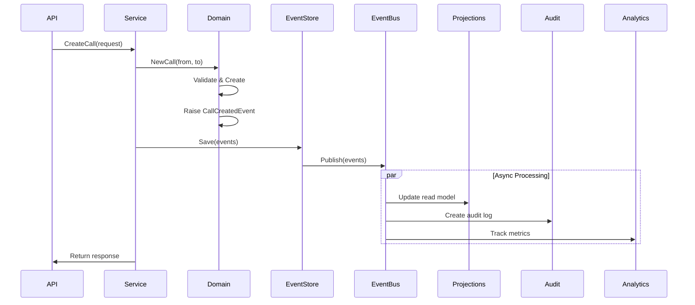

# Domain Events Foundation Specification

## Overview

**Priority:** CRITICAL (Foundation for all compliance features)  
**Timeline:** Week 3-4 (Must complete before Phase 2)  
**Team:** 3 Senior Engineers  
**Revenue Impact:** Enables $5M+ in dependent features  
**Risk Mitigation:** Foundation for audit trail and compliance

## Business Context

### Problem Statement
The platform lacks event-driven architecture, preventing:
- Audit trail implementation (legal requirement)
- Real-time compliance monitoring
- System observability and debugging
- Async processing and scalability
- Integration with external systems

### Success Criteria
- Event sourcing for all critical domain actions
- < 1ms event publishing latency
- 100% event delivery guarantee
- Event replay capability
- Complete audit trail from events
- Support for 100K+ events/second

## Technical Specification

### Core Event Infrastructure

```go
// internal/domain/events/base.go
package events

// DomainEvent is the base interface for all domain events
type DomainEvent interface {
    GetID() uuid.UUID
    GetAggregateID() string
    GetAggregateType() string
    GetEventType() string
    GetTimestamp() time.Time
    GetVersion() int
    GetMetadata() EventMetadata
}

// BaseEvent provides common implementation
type BaseEvent struct {
    ID            uuid.UUID       `json:"id"`
    AggregateID   string         `json:"aggregate_id"`
    AggregateType string         `json:"aggregate_type"`
    EventType     string         `json:"event_type"`
    Timestamp     time.Time      `json:"timestamp"`
    Version       int            `json:"version"`
    Metadata      EventMetadata  `json:"metadata"`
}

type EventMetadata struct {
    UserID       *uuid.UUID             `json:"user_id,omitempty"`
    CorrelationID string                `json:"correlation_id"`
    CausationID   string                `json:"causation_id"`
    IPAddress     string                `json:"ip_address,omitempty"`
    UserAgent     string                `json:"user_agent,omitempty"`
    Custom        map[string]interface{} `json:"custom,omitempty"`
}

// EventStore interface for persistence
type EventStore interface {
    Save(ctx context.Context, events []DomainEvent) error
    Load(ctx context.Context, aggregateID string, fromVersion int) ([]DomainEvent, error)
    LoadStream(ctx context.Context, streamName string, after time.Time) ([]DomainEvent, error)
    Subscribe(ctx context.Context, streamName string, handler EventHandler) error
}

// EventBus for publishing events
type EventBus interface {
    Publish(ctx context.Context, events ...DomainEvent) error
    Subscribe(eventType string, handler EventHandler) error
    SubscribeAsync(eventType string, handler EventHandler) error
}
```

### Domain-Specific Events

```go
// internal/domain/events/compliance_events.go
package events

// ConsentGrantedEvent when consent is given
type ConsentGrantedEvent struct {
    BaseEvent
    PhoneNumber  string              `json:"phone_number_hash"`
    ConsentType  string              `json:"consent_type"`
    Channel      string              `json:"channel"`
    ExpiresAt    *time.Time          `json:"expires_at,omitempty"`
    IPAddress    string              `json:"ip_address"`
    Source       string              `json:"source"`
}

// ConsentRevokedEvent when consent is withdrawn
type ConsentRevokedEvent struct {
    BaseEvent
    PhoneNumber  string              `json:"phone_number_hash"`
    ConsentType  string              `json:"consent_type"`
    Reason       string              `json:"reason"`
    RevokedBy    string              `json:"revoked_by"`
}

// DNCCheckPerformedEvent for audit trail
type DNCCheckPerformedEvent struct {
    BaseEvent
    PhoneNumber  string              `json:"phone_number_hash"`
    IsOnDNC      bool                `json:"is_on_dnc"`
    Lists        []string            `json:"lists"`
    CheckLatency time.Duration       `json:"check_latency"`
    CacheHit     bool                `json:"cache_hit"`
}

// ComplianceViolationDetectedEvent for violations
type ComplianceViolationDetectedEvent struct {
    BaseEvent
    ViolationType string             `json:"violation_type"`
    Severity      string             `json:"severity"`
    CallID        *uuid.UUID         `json:"call_id,omitempty"`
    PhoneNumber   string             `json:"phone_number_hash"`
    Rules         []string           `json:"rules_violated"`
    Details       map[string]interface{} `json:"details"`
}

// CallAttemptedEvent for call lifecycle
type CallAttemptedEvent struct {
    BaseEvent
    CallID       uuid.UUID          `json:"call_id"`
    FromNumber   string             `json:"from_number_hash"`
    ToNumber     string             `json:"to_number_hash"`
    Direction    string             `json:"direction"`
    ComplianceChecks []ComplianceCheck `json:"compliance_checks"`
}

type ComplianceCheck struct {
    Type     string        `json:"type"`
    Passed   bool          `json:"passed"`
    Reason   string        `json:"reason,omitempty"`
    Duration time.Duration `json:"duration"`
}
```

### Event Store Implementation

```go
// internal/infrastructure/eventstore/postgres_store.go
package eventstore

type PostgresEventStore struct {
    db *sql.DB
    serializer EventSerializer
}

func (s *PostgresEventStore) Save(ctx context.Context, events []DomainEvent) error {
    tx, err := s.db.BeginTx(ctx, nil)
    if err != nil {
        return err
    }
    defer tx.Rollback()
    
    for _, event := range events {
        data, err := s.serializer.Serialize(event)
        if err != nil {
            return err
        }
        
        _, err = tx.ExecContext(ctx, `
            INSERT INTO event_store (
                id, aggregate_id, aggregate_type, event_type, 
                event_data, metadata, version, created_at
            ) VALUES ($1, $2, $3, $4, $5, $6, $7, $8)`,
            event.GetID(),
            event.GetAggregateID(),
            event.GetAggregateType(),
            event.GetEventType(),
            data,
            event.GetMetadata(),
            event.GetVersion(),
            event.GetTimestamp(),
        )
        if err != nil {
            return err
        }
    }
    
    return tx.Commit()
}

// Projection builder for read models
type ProjectionBuilder interface {
    Handle(ctx context.Context, event DomainEvent) error
    Rebuild(ctx context.Context, events []DomainEvent) error
}
```

### Event Bus Implementation

```go
// internal/infrastructure/eventbus/memory_bus.go
package eventbus

type InMemoryEventBus struct {
    handlers map[string][]EventHandler
    mu       sync.RWMutex
}

func (b *InMemoryEventBus) Publish(ctx context.Context, events ...DomainEvent) error {
    for _, event := range events {
        b.mu.RLock()
        handlers := b.handlers[event.GetEventType()]
        b.mu.RUnlock()
        
        for _, handler := range handlers {
            if err := handler.Handle(ctx, event); err != nil {
                // Log error but continue
                log.Printf("Handler error: %v", err)
            }
        }
    }
    return nil
}

// Kafka implementation for production
type KafkaEventBus struct {
    producer *kafka.Producer
    consumer *kafka.Consumer
    handlers map[string][]EventHandler
}

func (b *KafkaEventBus) Publish(ctx context.Context, events ...DomainEvent) error {
    for _, event := range events {
        data, err := json.Marshal(event)
        if err != nil {
            return err
        }
        
        msg := &kafka.Message{
            Topic: b.getTopicForEvent(event),
            Key:   []byte(event.GetAggregateID()),
            Value: data,
            Headers: []kafka.Header{
                {Key: "event_type", Value: []byte(event.GetEventType())},
                {Key: "correlation_id", Value: []byte(event.GetMetadata().CorrelationID)},
            },
        }
        
        if err := b.producer.Send(ctx, msg); err != nil {
            return err
        }
    }
    return nil
}
```

### Database Schema

```sql
-- Event store table (append-only)
CREATE TABLE event_store (
    sequence_number BIGSERIAL PRIMARY KEY,
    id UUID NOT NULL,
    aggregate_id VARCHAR(255) NOT NULL,
    aggregate_type VARCHAR(100) NOT NULL,
    event_type VARCHAR(100) NOT NULL,
    event_data JSONB NOT NULL,
    metadata JSONB NOT NULL,
    version INTEGER NOT NULL,
    created_at TIMESTAMPTZ NOT NULL,
    
    UNIQUE(aggregate_id, version)
);

-- Indexes for queries
CREATE INDEX idx_event_store_aggregate ON event_store(aggregate_id, version);
CREATE INDEX idx_event_store_type ON event_store(event_type, created_at);
CREATE INDEX idx_event_store_created ON event_store(created_at);
CREATE INDEX idx_event_metadata_correlation ON event_store((metadata->>'correlation_id'));

-- Event snapshots for performance
CREATE TABLE event_snapshots (
    id UUID PRIMARY KEY,
    aggregate_id VARCHAR(255) NOT NULL,
    aggregate_type VARCHAR(100) NOT NULL,
    version INTEGER NOT NULL,
    snapshot_data JSONB NOT NULL,
    created_at TIMESTAMPTZ NOT NULL DEFAULT NOW(),
    
    UNIQUE(aggregate_id, version)
);

-- Projections for read models
CREATE TABLE compliance_projections (
    id UUID PRIMARY KEY,
    phone_number_hash VARCHAR(64) NOT NULL,
    last_consent_at TIMESTAMPTZ,
    consent_status VARCHAR(20),
    dnc_status BOOLEAN DEFAULT FALSE,
    last_call_at TIMESTAMPTZ,
    call_count_24h INTEGER DEFAULT 0,
    compliance_score FLOAT,
    updated_at TIMESTAMPTZ NOT NULL DEFAULT NOW()
);

CREATE INDEX idx_compliance_phone ON compliance_projections(phone_number_hash);

-- Event subscriptions tracking
CREATE TABLE event_subscriptions (
    id UUID PRIMARY KEY DEFAULT gen_random_uuid(),
    subscriber_name VARCHAR(255) NOT NULL,
    event_type VARCHAR(100) NOT NULL,
    last_processed_sequence BIGINT NOT NULL DEFAULT 0,
    status VARCHAR(20) NOT NULL DEFAULT 'active',
    error_count INTEGER DEFAULT 0,
    last_error TEXT,
    created_at TIMESTAMPTZ NOT NULL DEFAULT NOW(),
    updated_at TIMESTAMPTZ NOT NULL DEFAULT NOW(),
    
    UNIQUE(subscriber_name, event_type)
);
```

### Integration with Existing Domains

```go
// Example: Call domain integration
package call

type Call struct {
    // existing fields...
    events []events.DomainEvent
}

func (c *Call) StartCall(from, to values.PhoneNumber) error {
    // Business logic...
    
    // Raise domain event
    c.events = append(c.events, &events.CallStartedEvent{
        BaseEvent: events.NewBaseEvent(c.ID.String(), "Call"),
        FromNumber: from.Hash(),
        ToNumber: to.Hash(),
        StartedAt: time.Now(),
    })
    
    return nil
}

func (c *Call) GetUncommittedEvents() []events.DomainEvent {
    return c.events
}

func (c *Call) MarkEventsAsCommitted() {
    c.events = []events.DomainEvent{}
}
```

## Implementation Plan

### Week 3: Core Infrastructure

**Days 1-2: Event Framework**
- [ ] Base event interfaces and structs
- [ ] Event store interface
- [ ] PostgreSQL event store
- [ ] Event serialization

**Days 3-4: Event Bus**
- [ ] In-memory event bus
- [ ] Kafka event bus setup
- [ ] Event handler registration
- [ ] Error handling

**Day 5: Domain Integration**
- [ ] Compliance events definition
- [ ] Call events definition
- [ ] Account events definition
- [ ] Financial events definition

### Week 4: Production Features

**Days 1-2: Projections**
- [ ] Projection builder framework
- [ ] Compliance projections
- [ ] Call statistics projections
- [ ] Rebuild capabilities

**Days 3-4: Operations**
- [ ] Event replay tools
- [ ] Monitoring integration
- [ ] Performance optimization
- [ ] Documentation

**Day 5: Testing & Deploy**
- [ ] Integration tests
- [ ] Load testing
- [ ] Migration plan
- [ ] Production deployment

## Event Flow Example



## Performance Requirements

- **Event Creation:** < 1ms
- **Event Storage:** < 5ms (async)
- **Event Publishing:** < 1ms (async)
- **Event Processing:** < 10ms per handler
- **Throughput:** 100K events/second
- **Storage:** 1KB average event size

## Monitoring & Observability

### Key Metrics
- Events per second by type
- Event store write latency
- Event bus publish latency
- Handler processing time
- Event store size growth
- Projection lag

### Dashboards
```yaml
Event Flow Dashboard:
  - Total events/sec
  - Events by type
  - Failed events
  - Handler errors
  - Projection lag

Performance Dashboard:
  - Event store latency
  - Kafka lag
  - Handler duration
  - Queue depths
  - Error rates
```

## Testing Strategy

### Unit Tests
- Event creation and validation
- Serialization/deserialization
- Handler registration
- Error scenarios

### Integration Tests
- End-to-end event flow
- Multiple handler execution
- Event ordering
- Replay functionality

### Load Tests
- 100K events/second sustained
- Event store performance
- Kafka throughput
- Projection updates

### Resilience Tests
- Handler failures
- Kafka unavailability
- Database failures
- Recovery scenarios

## Migration Strategy

### Phase 1: Shadow Mode
1. Deploy event infrastructure
2. Emit events alongside existing code
3. Verify event accuracy
4. Build projections

### Phase 2: Gradual Adoption
1. Audit logging from events
2. Analytics from events
3. Compliance checks from events
4. Financial calculations from events

### Phase 3: Full Migration
1. Remove duplicate code
2. Optimize projections
3. Advanced event sourcing
4. Historical data import

## Success Metrics

### Week 3
- ✅ Event framework deployed
- ✅ Core events defined
- ✅ PostgreSQL store working
- ✅ Basic projections built

### Week 4
- ✅ Kafka integration complete
- ✅ All domains emitting events
- ✅ Audit trail from events
- ✅ < 1ms event latency
- ✅ 100% event delivery

## Risk Mitigation

| Risk | Impact | Mitigation |
|------|--------|------------|
| Event loss | Critical | Transactional outbox, at-least-once delivery |
| Performance impact | High | Async processing, batching |
| Storage growth | Medium | Archival strategy, compression |
| Complexity | Medium | Clear patterns, documentation |

## Long-term Benefits

### Immediate (Month 1)
- Complete audit trail
- Better debugging
- System observability
- Compliance tracking

### Medium-term (Month 3)
- Event-driven integrations
- Real-time analytics
- Advanced projections
- CQRS implementation

### Long-term (Month 6+)
- Event sourcing
- Time travel debugging
- ML training data
- Microservices ready

## Dependencies

- PostgreSQL 13+ (JSONB support)
- Kafka 3.0+ (optional, for scale)
- Existing domain models
- Infrastructure team support

## References

- Event Sourcing Pattern
- Domain-Driven Design (Eric Evans)
- CQRS Pattern
- Kafka Event Streaming

---

*Specification Version: 1.0*  
*Status: APPROVED FOR IMPLEMENTATION*  
*Last Updated: [Current Date]*