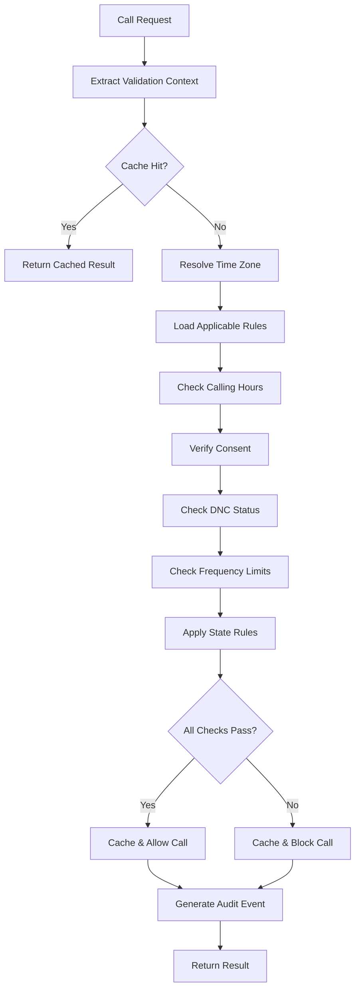

# Real-Time TCPA Validation System - Technical Specification

## Table of Contents
1. [Feature Overview](#feature-overview)
2. [Rule Engine Design](#rule-engine-design)
3. [Validation Service Design](#validation-service-design)
4. [Configuration Management](#configuration-management)
5. [Integration Points](#integration-points)
6. [API Design](#api-design)
7. [Implementation Plan](#implementation-plan)
8. [Performance Requirements](#performance-requirements)
9. [Testing Strategy](#testing-strategy)

## Feature Overview

### TCPA Compliance Requirements

The Telephone Consumer Protection Act (TCPA) imposes strict regulations on automated calls, with violations resulting in statutory damages of $500-$1,500 per call. Our real-time validation system ensures compliance before any call is connected.

#### Core TCPA Requirements:
- **Calling Hours**: 8:00 AM - 9:00 PM in recipient's local time
- **Prior Express Consent**: Written consent for automated/prerecorded calls
- **Do Not Call Registry**: National and state-specific DNC lists
- **Frequency Limits**: Reasonable attempt limits per day/week
- **Identification Requirements**: Caller ID and opt-out mechanisms

### State-Specific Calling Restrictions

Many states have additional requirements beyond federal TCPA:

| State | Additional Restrictions |
|-------|------------------------|
| CA | Written consent for all robocalls |
| FL | 8:00 AM - 8:00 PM calling window |
| PA | No Sunday calls before 1:30 PM |
| IN | State-specific DNC list with 90-day scrub |
| TX | Political calls exempt but must honor DNC |

### Performance Requirements
- **Validation Latency**: < 50ms per validation
- **Throughput**: 100,000 validations/second
- **Cache Hit Rate**: > 95% for rule lookups
- **Availability**: 99.99% uptime

## Rule Engine Design

### TCPARule Domain Model

```go
// internal/domain/compliance/tcpa_rule.go

package compliance

import (
    "time"
    "github.com/davidleathers/dependable-call-exchange-backend/internal/domain/values"
)

// TCPARule represents a TCPA compliance rule
type TCPARule struct {
    ID          RuleID
    Type        RuleType
    Jurisdiction Jurisdiction
    Priority    int
    EffectiveDate time.Time
    ExpiryDate   *time.Time
    Conditions  []RuleCondition
    Actions     []RuleAction
    Metadata    RuleMetadata
}

// RuleType defines the type of TCPA rule
type RuleType string

const (
    RuleTypeCallingHours    RuleType = "CALLING_HOURS"
    RuleTypeConsentRequired RuleType = "CONSENT_REQUIRED"
    RuleTypeFrequencyLimit  RuleType = "FREQUENCY_LIMIT"
    RuleTypeDNCHonor       RuleType = "DNC_HONOR"
    RuleTypeIdentification RuleType = "IDENTIFICATION"
)

// Jurisdiction represents geographic applicability
type Jurisdiction struct {
    Federal bool
    States  []string // Two-letter state codes
    ZipCodes []string // Specific zip codes
}

// RuleCondition defines when a rule applies
type RuleCondition struct {
    Field    string
    Operator ConditionOperator
    Value    interface{}
}

type ConditionOperator string

const (
    OpEquals      ConditionOperator = "EQUALS"
    OpNotEquals   ConditionOperator = "NOT_EQUALS"
    OpContains    ConditionOperator = "CONTAINS"
    OpBetween     ConditionOperator = "BETWEEN"
    OpIn          ConditionOperator = "IN"
)

// RuleAction defines what happens when conditions are met
type RuleAction struct {
    Type     ActionType
    Severity ActionSeverity
    Message  string
    Data     map[string]interface{}
}

type ActionType string

const (
    ActionBlock    ActionType = "BLOCK"
    ActionWarn     ActionType = "WARN"
    ActionRequire  ActionType = "REQUIRE"
    ActionSchedule ActionType = "SCHEDULE"
)

// Evaluate checks if the rule applies to the given context
func (r *TCPARule) Evaluate(ctx ValidationContext) (*RuleResult, error) {
    // Check if rule is currently effective
    if !r.isEffective(ctx.Timestamp) {
        return nil, nil
    }
    
    // Check jurisdiction
    if !r.appliesTo(ctx.RecipientState) {
        return nil, nil
    }
    
    // Evaluate all conditions
    for _, condition := range r.Conditions {
        if !condition.Evaluate(ctx) {
            return nil, nil
        }
    }
    
    // All conditions met, return actions
    return &RuleResult{
        RuleID:   r.ID,
        Matched:  true,
        Actions:  r.Actions,
        Priority: r.Priority,
    }, nil
}
```

### StateComplianceRule Extensions

```go
// internal/domain/compliance/state_rule.go

package compliance

import "time"

// StateComplianceRule extends TCPARule with state-specific logic
type StateComplianceRule struct {
    TCPARule
    StateCode           string
    CallingHourOverride *CallingHours
    ConsentRequirements ConsentType
    DNCGracePeriod     time.Duration
    SpecialRestrictions []SpecialRestriction
}

// CallingHours represents allowed calling window
type CallingHours struct {
    Start    TimeOfDay
    End      TimeOfDay
    Weekdays []time.Weekday
    Holidays []Holiday
}

// TimeOfDay represents time in 24-hour format
type TimeOfDay struct {
    Hour   int
    Minute int
}

// SpecialRestriction for state-specific rules
type SpecialRestriction struct {
    Type        string
    Description string
    Validator   func(ValidationContext) bool
}

// Example: Pennsylvania Sunday restriction
var PennsylvaniaSundayRule = StateComplianceRule{
    TCPARule: TCPARule{
        Type: RuleTypeCallingHours,
        Jurisdiction: Jurisdiction{
            States: []string{"PA"},
        },
    },
    SpecialRestrictions: []SpecialRestriction{
        {
            Type:        "SUNDAY_RESTRICTION",
            Description: "No calls before 1:30 PM on Sundays",
            Validator: func(ctx ValidationContext) bool {
                if ctx.Timestamp.Weekday() == time.Sunday {
                    hour, minute, _ := ctx.Timestamp.Clock()
                    return hour > 13 || (hour == 13 && minute >= 30)
                }
                return true
            },
        },
    },
}
```

### Time Zone Handling

```go
// internal/domain/compliance/timezone.go

package compliance

import (
    "time"
    "github.com/davidleathers/dependable-call-exchange-backend/internal/domain/values"
)

// TimeZoneResolver determines recipient's time zone
type TimeZoneResolver interface {
    ResolveTimeZone(phone values.PhoneNumber) (*time.Location, error)
    ResolveByZipCode(zipCode string) (*time.Location, error)
    ResolveByState(stateCode string) ([]*time.Location, error)
}

// CachedTimeZoneResolver with NPA-NXX database
type CachedTimeZoneResolver struct {
    cache     Cache
    npaNxxDB  NPANXXDatabase
    zipCodeDB ZipCodeDatabase
}

func (r *CachedTimeZoneResolver) ResolveTimeZone(phone values.PhoneNumber) (*time.Location, error) {
    // Extract NPA-NXX (area code + exchange)
    npaNxx := phone.AreaCode() + phone.Exchange()
    
    // Check cache
    if tz, found := r.cache.Get(npaNxx); found {
        return tz.(*time.Location), nil
    }
    
    // Lookup in database
    tzName, err := r.npaNxxDB.GetTimeZone(npaNxx)
    if err != nil {
        return nil, err
    }
    
    location, err := time.LoadLocation(tzName)
    if err != nil {
        return nil, err
    }
    
    // Cache for future lookups
    r.cache.Set(npaNxx, location, 24*time.Hour)
    
    return location, nil
}
```

### Holiday Calendar Integration

```go
// internal/domain/compliance/holiday.go

package compliance

import "time"

// Holiday represents a compliance-relevant holiday
type Holiday struct {
    Name        string
    Date        time.Time
    Federal     bool
    States      []string
    Recurring   bool
    Observance  ObservanceRule
}

// HolidayCalendar manages holiday dates
type HolidayCalendar interface {
    IsHoliday(date time.Time, state string) bool
    GetHolidays(year int, state string) []Holiday
    IsRestrictedDay(date time.Time, state string) bool
}

// ObservanceRule handles weekend holiday shifts
type ObservanceRule struct {
    ShiftSaturday bool // Move to Friday
    ShiftSunday   bool // Move to Monday
}

// Common holidays affecting TCPA compliance
var FederalHolidays = []Holiday{
    {
        Name:      "New Year's Day",
        Federal:   true,
        Recurring: true,
        Observance: ObservanceRule{
            ShiftSaturday: true,
            ShiftSunday:   true,
        },
    },
    {
        Name:      "Independence Day",
        Federal:   true,
        Recurring: true,
        Observance: ObservanceRule{
            ShiftSaturday: true,
            ShiftSunday:   true,
        },
    },
    // ... other federal holidays
}
```

## Validation Service Design

### TCPAValidator Interface

```go
// internal/service/compliance/tcpa_validator.go

package compliance

import (
    "context"
    "time"
    "github.com/davidleathers/dependable-call-exchange-backend/internal/domain/compliance"
    "github.com/davidleathers/dependable-call-exchange-backend/internal/domain/values"
)

// TCPAValidator validates calls for TCPA compliance
type TCPAValidator interface {
    ValidateCall(ctx context.Context, req ValidationRequest) (*ValidationResult, error)
    ValidateBatch(ctx context.Context, requests []ValidationRequest) ([]ValidationResult, error)
    GetApplicableRules(ctx context.Context, state string) ([]compliance.TCPARule, error)
}

// ValidationRequest contains call details to validate
type ValidationRequest struct {
    CallID       string
    FromNumber   values.PhoneNumber
    ToNumber     values.PhoneNumber
    CallType     CallType
    ScheduledTime *time.Time
    BuyerID      string
    SellerID     string
    Metadata     map[string]interface{}
}

// ValidationResult contains compliance decision
type ValidationResult struct {
    RequestID    string
    Compliant    bool
    Violations   []Violation
    Warnings     []Warning
    Requirements []Requirement
    ValidUntil   time.Time
    CacheKey     string
}

// Violation represents a TCPA violation
type Violation struct {
    RuleID      string
    Type        compliance.RuleType
    Severity    Severity
    Description string
    Remediation string
}

// TCPAValidatorService implements the validator
type TCPAValidatorService struct {
    ruleEngine      RuleEngine
    consentService  ConsentService
    dncService      DNCService
    tzResolver      compliance.TimeZoneResolver
    holidayCalendar compliance.HolidayCalendar
    cache           Cache
    metrics         MetricsCollector
}
```

### Pre-call Validation Workflow



### Implementation

```go
func (s *TCPAValidatorService) ValidateCall(ctx context.Context, req ValidationRequest) (*ValidationResult, error) {
    // Start timing for metrics
    start := time.Now()
    defer func() {
        s.metrics.RecordValidation(time.Since(start))
    }()
    
    // Check cache first
    cacheKey := s.generateCacheKey(req)
    if cached, found := s.cache.Get(cacheKey); found {
        s.metrics.IncrementCacheHit()
        return cached.(*ValidationResult), nil
    }
    
    // Build validation context
    validationCtx, err := s.buildValidationContext(ctx, req)
    if err != nil {
        return nil, fmt.Errorf("build context: %w", err)
    }
    
    // Run validation pipeline
    result := &ValidationResult{
        RequestID: req.CallID,
        Compliant: true,
    }
    
    // 1. Check calling hours
    if violation := s.checkCallingHours(validationCtx); violation != nil {
        result.Compliant = false
        result.Violations = append(result.Violations, *violation)
    }
    
    // 2. Verify consent
    if violation := s.verifyConsent(ctx, validationCtx); violation != nil {
        result.Compliant = false
        result.Violations = append(result.Violations, *violation)
    }
    
    // 3. Check DNC status
    if violation := s.checkDNCStatus(ctx, validationCtx); violation != nil {
        result.Compliant = false
        result.Violations = append(result.Violations, *violation)
    }
    
    // 4. Check frequency limits
    if violation := s.checkFrequencyLimits(ctx, validationCtx); violation != nil {
        result.Compliant = false
        result.Violations = append(result.Violations, *violation)
    }
    
    // 5. Apply state-specific rules
    stateViolations := s.applyStateRules(ctx, validationCtx)
    if len(stateViolations) > 0 {
        result.Compliant = false
        result.Violations = append(result.Violations, stateViolations...)
    }
    
    // Cache result
    s.cache.Set(cacheKey, result, s.calculateCacheTTL(result))
    
    // Generate audit event
    s.auditLog.LogValidation(ctx, req, result)
    
    return result, nil
}
```

### Batch Validation Support

```go
func (s *TCPAValidatorService) ValidateBatch(ctx context.Context, requests []ValidationRequest) ([]ValidationResult, error) {
    // Use goroutine pool for parallel validation
    const maxConcurrent = 100
    sem := make(chan struct{}, maxConcurrent)
    
    results := make([]ValidationResult, len(requests))
    errChan := make(chan error, len(requests))
    
    for i, req := range requests {
        sem <- struct{}{} // Acquire semaphore
        go func(idx int, request ValidationRequest) {
            defer func() { <-sem }() // Release semaphore
            
            result, err := s.ValidateCall(ctx, request)
            if err != nil {
                errChan <- err
                return
            }
            results[idx] = *result
        }(i, req)
    }
    
    // Wait for all validations to complete
    for i := 0; i < cap(sem); i++ {
        sem <- struct{}{}
    }
    
    close(errChan)
    
    // Check for errors
    for err := range errChan {
        if err != nil {
            return nil, fmt.Errorf("batch validation failed: %w", err)
        }
    }
    
    return results, nil
}
```

### Rule Caching Strategy

```go
// internal/infrastructure/cache/rule_cache.go

package cache

import (
    "sync"
    "time"
)

// RuleCache implements efficient rule caching
type RuleCache struct {
    mu            sync.RWMutex
    rules         map[string]*CachedRule
    stateIndex    map[string][]string // state -> rule IDs
    typeIndex     map[RuleType][]string // type -> rule IDs
    ttl           time.Duration
}

type CachedRule struct {
    Rule      TCPARule
    LoadedAt  time.Time
    ExpiresAt time.Time
    HitCount  int64
}

func (c *RuleCache) GetRulesForState(state string) ([]TCPARule, bool) {
    c.mu.RLock()
    defer c.mu.RUnlock()
    
    ruleIDs, found := c.stateIndex[state]
    if !found {
        return nil, false
    }
    
    rules := make([]TCPARule, 0, len(ruleIDs))
    for _, id := range ruleIDs {
        if cached, ok := c.rules[id]; ok {
            if time.Now().Before(cached.ExpiresAt) {
                atomic.AddInt64(&cached.HitCount, 1)
                rules = append(rules, cached.Rule)
            }
        }
    }
    
    return rules, len(rules) > 0
}
```

## Configuration Management

### Dynamic Rule Updates

```go
// internal/service/compliance/rule_manager.go

package compliance

import (
    "context"
    "sync"
    "time"
)

// RuleManager handles dynamic rule updates
type RuleManager interface {
    LoadRules(ctx context.Context) error
    UpdateRule(ctx context.Context, rule TCPARule) error
    DeleteRule(ctx context.Context, ruleID string) error
    SubscribeToUpdates(handler RuleUpdateHandler) func()
}

// RuleUpdateHandler processes rule changes
type RuleUpdateHandler func(event RuleUpdateEvent)

type RuleUpdateEvent struct {
    Type      UpdateType
    RuleID    string
    Rule      *TCPARule
    Timestamp time.Time
    Source    string
}

type UpdateType string

const (
    UpdateTypeCreate UpdateType = "CREATE"
    UpdateTypeUpdate UpdateType = "UPDATE"
    UpdateTypeDelete UpdateType = "DELETE"
    UpdateTypeReload UpdateType = "RELOAD"
)

// DynamicRuleManager implementation
type DynamicRuleManager struct {
    mu          sync.RWMutex
    rules       map[string]TCPARule
    repository  RuleRepository
    cache       RuleCache
    subscribers []RuleUpdateHandler
    updateChan  chan RuleUpdateEvent
}

func (m *DynamicRuleManager) StartWatching(ctx context.Context) {
    // Watch for database changes
    go m.watchDatabaseChanges(ctx)
    
    // Watch for configuration file changes
    go m.watchConfigChanges(ctx)
    
    // Process update events
    go m.processUpdates(ctx)
}

func (m *DynamicRuleManager) processUpdates(ctx context.Context) {
    for {
        select {
        case event := <-m.updateChan:
            m.handleUpdate(event)
        case <-ctx.Done():
            return
        }
    }
}
```

### State Law Change Tracking

```go
// internal/domain/compliance/law_tracker.go

package compliance

import (
    "time"
)

// LawChangeEvent represents a compliance law change
type LawChangeEvent struct {
    ID           string
    State        string
    ChangeType   string
    EffectiveDate time.Time
    Description  string
    OldRule      *TCPARule
    NewRule      *TCPARule
    Source       string
    ReviewedBy   string
}

// LawChangeTracker monitors compliance law changes
type LawChangeTracker interface {
    TrackChange(event LawChangeEvent) error
    GetUpcomingChanges(days int) ([]LawChangeEvent, error)
    GetChangeHistory(state string, since time.Time) ([]LawChangeEvent, error)
    SubscribeToAlerts(handler AlertHandler) func()
}

// Implementation with automated alerts
type ComplianceLawTracker struct {
    repository   LawChangeRepository
    alertService AlertService
    subscribers  []AlertHandler
}

func (t *ComplianceLawTracker) ProcessUpcomingChanges() error {
    // Check for changes effective in next 30 days
    upcoming, err := t.GetUpcomingChanges(30)
    if err != nil {
        return err
    }
    
    for _, change := range upcoming {
        daysUntil := int(time.Until(change.EffectiveDate).Hours() / 24)
        
        // Alert at 30, 14, 7, and 1 day marks
        if daysUntil == 30 || daysUntil == 14 || daysUntil == 7 || daysUntil == 1 {
            alert := ComplianceAlert{
                Type:        "LAW_CHANGE_UPCOMING",
                Severity:    "HIGH",
                State:       change.State,
                DaysUntil:   daysUntil,
                Description: change.Description,
            }
            
            t.alertService.SendAlert(alert)
        }
    }
    
    return nil
}
```

### A/B Testing Compliance Rules

```go
// internal/service/compliance/ab_testing.go

package compliance

import (
    "context"
    "math/rand"
)

// ABTestConfig for compliance rule testing
type ABTestConfig struct {
    TestID      string
    Name        string
    Description string
    StartDate   time.Time
    EndDate     time.Time
    TrafficSplit float64 // Percentage for variant B
    ControlRule  TCPARule
    VariantRule  TCPARule
    Metrics     []string
}

// ABTestingService manages compliance rule experiments
type ABTestingService struct {
    tests      map[string]ABTestConfig
    metrics    MetricsCollector
    repository ABTestRepository
}

func (s *ABTestingService) GetRule(ctx context.Context, testID string, userID string) (*TCPARule, string) {
    test, exists := s.tests[testID]
    if !exists || !s.isTestActive(test) {
        return nil, ""
    }
    
    // Deterministic assignment based on user ID
    hash := hashUserID(userID)
    threshold := uint32(float64(^uint32(0)) * test.TrafficSplit)
    
    if hash < threshold {
        s.metrics.RecordVariant(testID, "B")
        return &test.VariantRule, "B"
    }
    
    s.metrics.RecordVariant(testID, "A")
    return &test.ControlRule, "A"
}

// Example: Testing stricter calling hours
var CallingHoursABTest = ABTestConfig{
    TestID:       "calling-hours-v2",
    Name:         "Stricter Calling Hours Test",
    Description:  "Test 8AM-8PM vs 8AM-9PM calling window",
    TrafficSplit: 0.1, // 10% get stricter hours
    ControlRule: TCPARule{
        Type: RuleTypeCallingHours,
        Actions: []RuleAction{{
            Type: ActionBlock,
            Data: map[string]interface{}{
                "start": "08:00",
                "end":   "21:00",
            },
        }},
    },
    VariantRule: TCPARule{
        Type: RuleTypeCallingHours,
        Actions: []RuleAction{{
            Type: ActionBlock,
            Data: map[string]interface{}{
                "start": "08:00",
                "end":   "20:00", // One hour earlier
            },
        }},
    },
}
```

### Override Mechanisms

```go
// internal/domain/compliance/override.go

package compliance

import (
    "time"
)

// ComplianceOverride allows temporary rule exemptions
type ComplianceOverride struct {
    ID          string
    RuleID      string
    Type        OverrideType
    Reason      string
    ApprovedBy  string
    ValidFrom   time.Time
    ValidUntil  time.Time
    Conditions  []OverrideCondition
    AuditTrail  []AuditEntry
}

type OverrideType string

const (
    OverrideTypeEmergency   OverrideType = "EMERGENCY"
    OverrideTypeException   OverrideType = "EXCEPTION"
    OverrideTypeTesting     OverrideType = "TESTING"
    OverrideTypeMaintenance OverrideType = "MAINTENANCE"
)

// OverrideService manages compliance overrides
type OverrideService struct {
    repository OverrideRepository
    approvers  ApproverService
    audit      AuditService
}

func (s *OverrideService) CreateOverride(ctx context.Context, req OverrideRequest) (*ComplianceOverride, error) {
    // Validate approver permissions
    if !s.approvers.CanApproveOverride(ctx, req.ApproverID, req.Type) {
        return nil, ErrUnauthorizedApprover
    }
    
    // Create override with audit trail
    override := &ComplianceOverride{
        ID:         GenerateID(),
        RuleID:     req.RuleID,
        Type:       req.Type,
        Reason:     req.Reason,
        ApprovedBy: req.ApproverID,
        ValidFrom:  req.ValidFrom,
        ValidUntil: req.ValidUntil,
        Conditions: req.Conditions,
        AuditTrail: []AuditEntry{{
            Action:    "CREATED",
            Timestamp: time.Now(),
            UserID:    req.ApproverID,
            Details:   req.Reason,
        }},
    }
    
    // Persist and notify
    if err := s.repository.Create(ctx, override); err != nil {
        return nil, err
    }
    
    s.audit.LogOverrideCreated(ctx, override)
    
    return override, nil
}
```

## Integration Points

### Call Routing Integration

```go
// internal/service/callrouting/tcpa_integration.go

package callrouting

import (
    "context"
    "github.com/davidleathers/dependable-call-exchange-backend/internal/service/compliance"
)

// TCPARoutingDecorator adds TCPA validation to routing
type TCPARoutingDecorator struct {
    router    CallRouter
    validator compliance.TCPAValidator
    metrics   MetricsCollector
}

func (d *TCPARoutingDecorator) RouteCall(ctx context.Context, call *Call) (*RoutingDecision, error) {
    // Pre-routing TCPA validation
    validationReq := compliance.ValidationRequest{
        CallID:     call.ID,
        FromNumber: call.FromNumber,
        ToNumber:   call.ToNumber,
        CallType:   d.mapCallType(call.Type),
        BuyerID:    call.BuyerID,
        SellerID:   call.SellerID,
    }
    
    result, err := d.validator.ValidateCall(ctx, validationReq)
    if err != nil {
        d.metrics.IncrementValidationError()
        return nil, fmt.Errorf("TCPA validation failed: %w", err)
    }
    
    if !result.Compliant {
        d.metrics.IncrementBlockedCalls()
        return &RoutingDecision{
            Action:     ActionBlock,
            Reason:     "TCPA_VIOLATION",
            Violations: result.Violations,
        }, nil
    }
    
    // Proceed with routing if compliant
    decision, err := d.router.RouteCall(ctx, call)
    if err != nil {
        return nil, err
    }
    
    // Attach compliance info to decision
    decision.ComplianceResult = result
    
    return decision, nil
}
```

### Consent Verification Hooks

```go
// internal/service/compliance/consent_hooks.go

package compliance

import (
    "context"
    "time"
)

// ConsentHook for real-time consent verification
type ConsentHook interface {
    PreCallVerification(ctx context.Context, req ConsentRequest) (*ConsentStatus, error)
    PostCallUpdate(ctx context.Context, callID string, outcome CallOutcome) error
}

// ConsentRequest for verification
type ConsentRequest struct {
    ConsumerPhone   string
    BusinessID      string
    ConsentType     ConsentType
    CampaignID      string
    RequestTime     time.Time
}

// ConsentStatus response
type ConsentStatus struct {
    HasConsent      bool
    ConsentType     ConsentType
    ConsentDate     time.Time
    ExpiryDate      *time.Time
    Revocable       bool
    VerificationID  string
}

// ConsentVerificationService implements hooks
type ConsentVerificationService struct {
    repository ConsentRepository
    cache      Cache
    audit      AuditService
}

func (s *ConsentVerificationService) PreCallVerification(ctx context.Context, req ConsentRequest) (*ConsentStatus, error) {
    // Check cache first
    cacheKey := fmt.Sprintf("consent:%s:%s", req.ConsumerPhone, req.BusinessID)
    if cached, found := s.cache.Get(cacheKey); found {
        return cached.(*ConsentStatus), nil
    }
    
    // Query consent database
    consent, err := s.repository.GetConsent(ctx, req.ConsumerPhone, req.BusinessID)
    if err != nil {
        return nil, err
    }
    
    if consent == nil {
        return &ConsentStatus{HasConsent: false}, nil
    }
    
    // Verify consent is valid
    status := &ConsentStatus{
        HasConsent:     consent.IsValid(),
        ConsentType:    consent.Type,
        ConsentDate:    consent.GrantedAt,
        ExpiryDate:     consent.ExpiresAt,
        Revocable:      consent.Revocable,
        VerificationID: GenerateVerificationID(),
    }
    
    // Cache valid consent
    if status.HasConsent {
        ttl := time.Until(*consent.ExpiresAt)
        if ttl > 0 {
            s.cache.Set(cacheKey, status, ttl)
        }
    }
    
    // Audit the verification
    s.audit.LogConsentVerification(ctx, req, status)
    
    return status, nil
}
```

### DNC List Checking

```go
// internal/service/compliance/dnc_integration.go

package compliance

import (
    "context"
    "sync"
    "time"
)

// DNCChecker integrates multiple DNC sources
type DNCChecker struct {
    federalDNC  DNCProvider
    stateDNC    map[string]DNCProvider
    internalDNC InternalDNCList
    cache       Cache
    mu          sync.RWMutex
}

// DNCProvider interface for different DNC sources
type DNCProvider interface {
    CheckNumber(ctx context.Context, phone string) (*DNCStatus, error)
    LastUpdated() time.Time
    ProviderName() string
}

// CheckAllDNCLists performs comprehensive DNC checking
func (c *DNCChecker) CheckAllDNCLists(ctx context.Context, phone string, state string) (*DNCCheckResult, error) {
    result := &DNCCheckResult{
        Phone:     phone,
        CheckedAt: time.Now(),
        Lists:     make([]DNCListResult, 0),
    }
    
    // Parallel checking with timeout
    ctx, cancel := context.WithTimeout(ctx, 2*time.Second)
    defer cancel()
    
    var wg sync.WaitGroup
    resultChan := make(chan DNCListResult, 3)
    
    // Check federal DNC
    wg.Add(1)
    go func() {
        defer wg.Done()
        status, err := c.federalDNC.CheckNumber(ctx, phone)
        resultChan <- DNCListResult{
            ListType: "FEDERAL",
            OnList:   status != nil && status.OnList,
            Error:    err,
        }
    }()
    
    // Check state DNC if applicable
    if provider, exists := c.stateDNC[state]; exists {
        wg.Add(1)
        go func() {
            defer wg.Done()
            status, err := provider.CheckNumber(ctx, phone)
            resultChan <- DNCListResult{
                ListType: "STATE_" + state,
                OnList:   status != nil && status.OnList,
                Error:    err,
            }
        }()
    }
    
    // Check internal DNC
    wg.Add(1)
    go func() {
        defer wg.Done()
        onList := c.internalDNC.Contains(phone)
        resultChan <- DNCListResult{
            ListType: "INTERNAL",
            OnList:   onList,
        }
    }()
    
    // Wait for all checks
    go func() {
        wg.Wait()
        close(resultChan)
    }()
    
    // Collect results
    for listResult := range resultChan {
        result.Lists = append(result.Lists, listResult)
        if listResult.OnList {
            result.OnAnyList = true
        }
    }
    
    // Cache negative results for performance
    if !result.OnAnyList {
        c.cache.Set("dnc:"+phone, result, 24*time.Hour)
    }
    
    return result, nil
}
```

### Audit Event Generation

```go
// internal/service/compliance/audit_events.go

package compliance

import (
    "context"
    "time"
)

// ComplianceAuditEvent for tracking all compliance decisions
type ComplianceAuditEvent struct {
    ID           string
    Timestamp    time.Time
    EventType    AuditEventType
    CallID       string
    FromNumber   string
    ToNumber     string
    Decision     ComplianceDecision
    RulesApplied []string
    Violations   []Violation
    UserID       string
    SystemID     string
    Metadata     map[string]interface{}
}

type AuditEventType string

const (
    AuditValidationPerformed AuditEventType = "VALIDATION_PERFORMED"
    AuditCallBlocked        AuditEventType = "CALL_BLOCKED"
    AuditCallAllowed        AuditEventType = "CALL_ALLOWED"
    AuditConsentChecked     AuditEventType = "CONSENT_CHECKED"
    AuditDNCChecked         AuditEventType = "DNC_CHECKED"
    AuditOverrideApplied    AuditEventType = "OVERRIDE_APPLIED"
)

// AuditService for compliance tracking
type AuditService struct {
    repository AuditRepository
    stream     EventStream
    encryptor  Encryptor
}

func (s *AuditService) LogValidation(ctx context.Context, req ValidationRequest, result *ValidationResult) error {
    event := ComplianceAuditEvent{
        ID:           GenerateAuditID(),
        Timestamp:    time.Now(),
        EventType:    AuditValidationPerformed,
        CallID:       req.CallID,
        FromNumber:   s.encryptor.Encrypt(req.FromNumber.String()),
        ToNumber:     s.encryptor.Encrypt(req.ToNumber.String()),
        Decision:     s.mapDecision(result.Compliant),
        RulesApplied: s.extractRuleIDs(result),
        Violations:   result.Violations,
        UserID:       GetUserID(ctx),
        SystemID:     GetSystemID(),
        Metadata: map[string]interface{}{
            "buyer_id":      req.BuyerID,
            "seller_id":     req.SellerID,
            "call_type":     req.CallType,
            "cache_hit":     result.CacheKey != "",
            "response_time": time.Since(req.Timestamp).Milliseconds(),
        },
    }
    
    // Persist to audit log
    if err := s.repository.Store(ctx, event); err != nil {
        return fmt.Errorf("store audit event: %w", err)
    }
    
    // Stream for real-time monitoring
    s.stream.Publish("compliance.audit", event)
    
    return nil
}
```

## API Design

### Validation Endpoint

```yaml
# OpenAPI specification for TCPA validation

/api/v1/compliance/tcpa/validate:
  post:
    summary: Validate call for TCPA compliance
    operationId: validateTCPA
    tags:
      - Compliance
    requestBody:
      required: true
      content:
        application/json:
          schema:
            $ref: '#/components/schemas/TCPAValidationRequest'
    responses:
      '200':
        description: Validation result
        content:
          application/json:
            schema:
              $ref: '#/components/schemas/TCPAValidationResponse'
      '400':
        $ref: '#/components/responses/BadRequest'
      '500':
        $ref: '#/components/responses/InternalError'

components:
  schemas:
    TCPAValidationRequest:
      type: object
      required:
        - from_number
        - to_number
        - call_type
      properties:
        from_number:
          type: string
          pattern: '^\+1[0-9]{10}$'
          example: "+14155551234"
        to_number:
          type: string
          pattern: '^\+1[0-9]{10}$'
          example: "+14085555678"
        call_type:
          type: string
          enum: [MANUAL, AUTOMATED, PRERECORDED, PREDICTIVE]
        scheduled_time:
          type: string
          format: date-time
        buyer_id:
          type: string
          format: uuid
        metadata:
          type: object
          additionalProperties: true

    TCPAValidationResponse:
      type: object
      properties:
        compliant:
          type: boolean
        violations:
          type: array
          items:
            $ref: '#/components/schemas/TCPAViolation'
        warnings:
          type: array
          items:
            $ref: '#/components/schemas/ComplianceWarning'
        valid_until:
          type: string
          format: date-time
        cache_key:
          type: string

    TCPAViolation:
      type: object
      properties:
        rule_id:
          type: string
        type:
          type: string
          enum: [CALLING_HOURS, CONSENT_REQUIRED, DNC_VIOLATION, FREQUENCY_LIMIT]
        severity:
          type: string
          enum: [LOW, MEDIUM, HIGH, CRITICAL]
        description:
          type: string
        remediation:
          type: string
```

### Rule Management API

```go
// internal/api/rest/compliance_rules.go

package rest

import (
    "encoding/json"
    "net/http"
)

// HandleCreateRule creates a new TCPA rule
func (h *Handler) HandleCreateRule(w http.ResponseWriter, r *http.Request) {
    var req CreateRuleRequest
    if err := json.NewDecoder(r.Body).Decode(&req); err != nil {
        h.writeError(w, http.StatusBadRequest, "INVALID_REQUEST", err.Error())
        return
    }
    
    // Validate rule structure
    if err := h.validateRule(req); err != nil {
        h.writeError(w, http.StatusBadRequest, "INVALID_RULE", err.Error())
        return
    }
    
    // Check permissions
    if !h.canManageRules(r.Context()) {
        h.writeError(w, http.StatusForbidden, "FORBIDDEN", "Insufficient permissions")
        return
    }
    
    // Create rule
    rule, err := h.ruleService.CreateRule(r.Context(), req.ToRule())
    if err != nil {
        h.writeError(w, http.StatusInternalServerError, "CREATE_FAILED", err.Error())
        return
    }
    
    h.writeJSON(w, http.StatusCreated, rule)
}

// HandleUpdateRule updates an existing rule
func (h *Handler) HandleUpdateRule(w http.ResponseWriter, r *http.Request) {
    ruleID := r.PathValue("id")
    
    var req UpdateRuleRequest
    if err := json.NewDecoder(r.Body).Decode(&req); err != nil {
        h.writeError(w, http.StatusBadRequest, "INVALID_REQUEST", err.Error())
        return
    }
    
    // Update with version check for optimistic locking
    rule, err := h.ruleService.UpdateRule(r.Context(), ruleID, req.Version, req.Updates)
    if err != nil {
        if errors.Is(err, ErrVersionMismatch) {
            h.writeError(w, http.StatusConflict, "VERSION_MISMATCH", "Rule has been modified")
            return
        }
        h.writeError(w, http.StatusInternalServerError, "UPDATE_FAILED", err.Error())
        return
    }
    
    h.writeJSON(w, http.StatusOK, rule)
}

// HandleTestRule tests a rule against sample data
func (h *Handler) HandleTestRule(w http.ResponseWriter, r *http.Request) {
    var req TestRuleRequest
    if err := json.NewDecoder(r.Body).Decode(&req); err != nil {
        h.writeError(w, http.StatusBadRequest, "INVALID_REQUEST", err.Error())
        return
    }
    
    // Run rule evaluation
    results, err := h.ruleService.TestRule(r.Context(), req.Rule, req.TestCases)
    if err != nil {
        h.writeError(w, http.StatusInternalServerError, "TEST_FAILED", err.Error())
        return
    }
    
    h.writeJSON(w, http.StatusOK, results)
}
```

### Compliance Report Endpoints

```go
// internal/api/rest/compliance_reports.go

package rest

// HandleComplianceReport generates compliance reports
func (h *Handler) HandleComplianceReport(w http.ResponseWriter, r *http.Request) {
    // Parse query parameters
    params := ComplianceReportParams{
        StartDate: r.URL.Query().Get("start_date"),
        EndDate:   r.URL.Query().Get("end_date"),
        State:     r.URL.Query().Get("state"),
        BuyerID:   r.URL.Query().Get("buyer_id"),
        Format:    r.URL.Query().Get("format"), // json, csv, pdf
    }
    
    // Generate report
    report, err := h.reportService.GenerateComplianceReport(r.Context(), params)
    if err != nil {
        h.writeError(w, http.StatusInternalServerError, "REPORT_FAILED", err.Error())
        return
    }
    
    // Set appropriate content type
    switch params.Format {
    case "csv":
        w.Header().Set("Content-Type", "text/csv")
        w.Header().Set("Content-Disposition", "attachment; filename=compliance-report.csv")
    case "pdf":
        w.Header().Set("Content-Type", "application/pdf")
        w.Header().Set("Content-Disposition", "attachment; filename=compliance-report.pdf")
    default:
        w.Header().Set("Content-Type", "application/json")
    }
    
    w.Write(report.Data)
}

// HandleViolationSummary provides violation statistics
func (h *Handler) HandleViolationSummary(w http.ResponseWriter, r *http.Request) {
    period := r.URL.Query().Get("period") // day, week, month
    
    summary, err := h.reportService.GetViolationSummary(r.Context(), period)
    if err != nil {
        h.writeError(w, http.StatusInternalServerError, "SUMMARY_FAILED", err.Error())
        return
    }
    
    h.writeJSON(w, http.StatusOK, summary)
}
```

### Bulk Validation

```go
// internal/api/rest/bulk_validation.go

package rest

import (
    "encoding/csv"
    "net/http"
)

// HandleBulkValidation processes CSV upload for bulk validation
func (h *Handler) HandleBulkValidation(w http.ResponseWriter, r *http.Request) {
    // Parse multipart form
    err := r.ParseMultipartForm(10 << 20) // 10MB limit
    if err != nil {
        h.writeError(w, http.StatusBadRequest, "PARSE_ERROR", err.Error())
        return
    }
    
    file, _, err := r.FormFile("file")
    if err != nil {
        h.writeError(w, http.StatusBadRequest, "FILE_ERROR", err.Error())
        return
    }
    defer file.Close()
    
    // Parse CSV
    reader := csv.NewReader(file)
    requests, err := h.parseValidationCSV(reader)
    if err != nil {
        h.writeError(w, http.StatusBadRequest, "CSV_ERROR", err.Error())
        return
    }
    
    // Process in background
    jobID := GenerateJobID()
    go h.processBulkValidation(r.Context(), jobID, requests)
    
    // Return job ID for status checking
    h.writeJSON(w, http.StatusAccepted, map[string]string{
        "job_id": jobID,
        "status": "processing",
        "check_url": fmt.Sprintf("/api/v1/compliance/jobs/%s", jobID),
    })
}

// HandleBulkValidationStatus checks job status
func (h *Handler) HandleBulkValidationStatus(w http.ResponseWriter, r *http.Request) {
    jobID := r.PathValue("jobId")
    
    status, err := h.jobService.GetJobStatus(r.Context(), jobID)
    if err != nil {
        if errors.Is(err, ErrJobNotFound) {
            h.writeError(w, http.StatusNotFound, "JOB_NOT_FOUND", "Job not found")
            return
        }
        h.writeError(w, http.StatusInternalServerError, "STATUS_ERROR", err.Error())
        return
    }
    
    response := BulkValidationStatus{
        JobID:      jobID,
        Status:     status.State,
        Progress:   status.Progress,
        Total:      status.Total,
        Completed:  status.Completed,
        Failed:     status.Failed,
        ResultURL:  fmt.Sprintf("/api/v1/compliance/jobs/%s/results", jobID),
    }
    
    h.writeJSON(w, http.StatusOK, response)
}
```

## Implementation Plan

### Week 1: Rule Engine Core (Days 1-5)

**Day 1-2: Domain Models**
- [ ] Implement TCPARule entity and value objects
- [ ] Create RuleCondition evaluation logic
- [ ] Build RuleAction execution framework
- [ ] Write comprehensive unit tests

**Day 3-4: Rule Repository**
- [ ] Design database schema for rules
- [ ] Implement PostgreSQL repository
- [ ] Add rule versioning support
- [ ] Create migration scripts

**Day 5: Rule Engine**
- [ ] Build rule evaluation engine
- [ ] Implement rule priority handling
- [ ] Add performance optimizations
- [ ] Load test with 1000+ rules

### Week 2: State-Specific Rules (Days 6-10)

**Day 6-7: State Rule Implementation**
- [ ] Create StateComplianceRule extensions
- [ ] Implement all 50 state variations
- [ ] Add special restrictions (PA Sunday, etc.)
- [ ] Build state rule registry

**Day 8-9: Time Zone & Holiday Support**
- [ ] Integrate NPA-NXX database
- [ ] Build TimeZoneResolver with caching
- [ ] Create HolidayCalendar service
- [ ] Add observance rule handling

**Day 10: Testing State Rules**
- [ ] Test each state's specific rules
- [ ] Verify time zone calculations
- [ ] Validate holiday handling
- [ ] Performance test geo-lookups

### Week 3: Service Integration (Days 11-15)

**Day 11-12: Validation Service**
- [ ] Implement TCPAValidatorService
- [ ] Add caching layer
- [ ] Build validation pipeline
- [ ] Create batch validation support

**Day 13: External Integrations**
- [ ] Integrate consent service
- [ ] Connect DNC providers
- [ ] Add frequency tracking
- [ ] Implement audit logging

**Day 14-15: Call Routing Integration**
- [ ] Create routing decorator
- [ ] Add pre-call validation
- [ ] Implement fallback logic
- [ ] Performance optimization

### Week 4: Testing All States (Days 16-20)

**Day 16-17: Comprehensive Testing**
- [ ] Test all 50 states + DC
- [ ] Verify federal rules
- [ ] Test edge cases (DST, holidays)
- [ ] Load test at scale

**Day 18: API Implementation**
- [ ] Build validation endpoints
- [ ] Create rule management API
- [ ] Add bulk validation
- [ ] Generate OpenAPI docs

**Day 19: Monitoring & Alerts**
- [ ] Add Prometheus metrics
- [ ] Create Grafana dashboards
- [ ] Set up compliance alerts
- [ ] Build violation reports

**Day 20: Documentation & Deployment**
- [ ] Complete API documentation
- [ ] Create operation runbooks
- [ ] Deploy to staging
- [ ] Final performance validation

## Performance Requirements

### Latency Targets
- Single validation: < 50ms p99
- Batch validation: < 100ms per 100 numbers
- Rule loading: < 10ms from cache
- Time zone lookup: < 5ms

### Throughput Targets
- 100,000 validations/second
- 10,000 rule updates/minute
- 1,000 concurrent API requests

### Resource Usage
- Memory: < 2GB for rule cache
- CPU: < 50% at peak load
- Database connections: < 100
- Cache hit rate: > 95%

## Testing Strategy

### Unit Testing
```go
func TestCallingHoursValidation(t *testing.T) {
    tests := []struct {
        name      string
        state     string
        callTime  time.Time
        expected  bool
    }{
        {
            name:     "valid weekday call",
            state:    "CA",
            callTime: time.Date(2025, 1, 15, 14, 0, 0, 0, time.UTC),
            expected: true,
        },
        {
            name:     "too early morning",
            state:    "NY",
            callTime: time.Date(2025, 1, 15, 7, 30, 0, 0, time.UTC),
            expected: false,
        },
        {
            name:     "PA Sunday restriction",
            state:    "PA",
            callTime: time.Date(2025, 1, 19, 13, 0, 0, 0, time.UTC), // Sunday 1PM
            expected: false,
        },
    }
    
    for _, tt := range tests {
        t.Run(tt.name, func(t *testing.T) {
            result := validator.CheckCallingHours(tt.state, tt.callTime)
            assert.Equal(t, tt.expected, result.Compliant)
        })
    }
}
```

### Integration Testing
- Test with real DNC providers
- Verify state law compliance
- Test holiday calendar integration
- Validate time zone accuracy

### Performance Testing
```go
func BenchmarkTCPAValidation(b *testing.B) {
    validator := setupValidator()
    req := generateValidationRequest()
    
    b.ResetTimer()
    for i := 0; i < b.N; i++ {
        _, _ = validator.ValidateCall(context.Background(), req)
    }
}
```

### Compliance Testing
- Verify all 50 states + federal rules
- Test with compliance consultants
- Regular law update verification
- A/B test result analysis

This comprehensive specification provides a complete blueprint for implementing the Real-Time TCPA Validation system with all necessary components for production deployment.