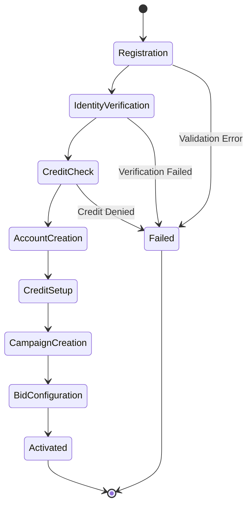
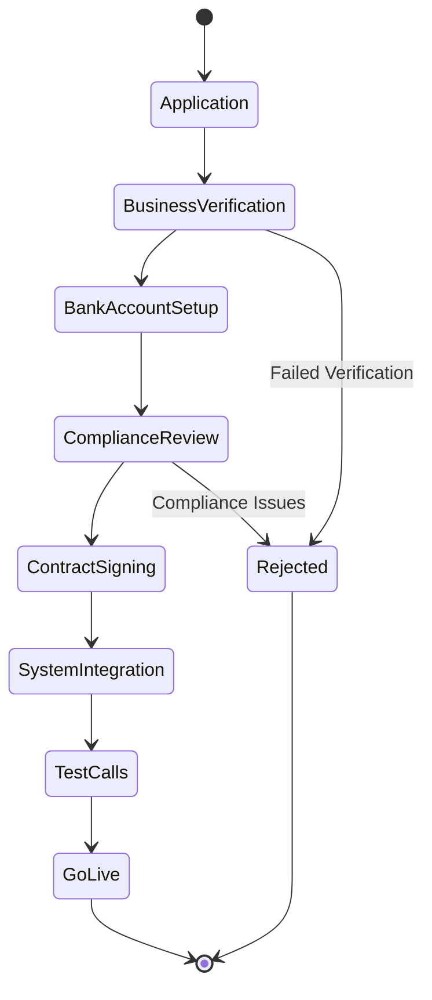
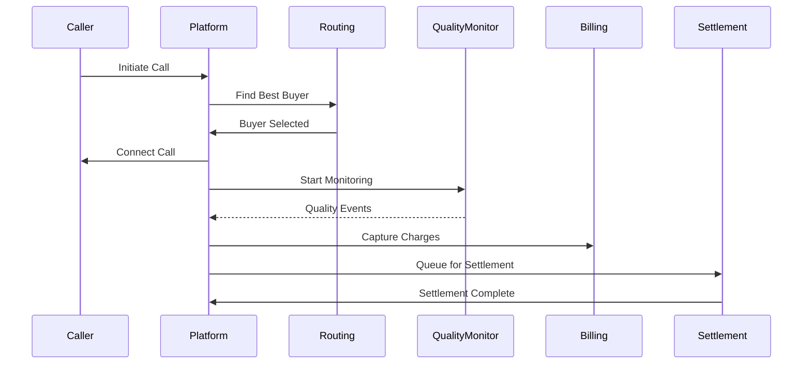
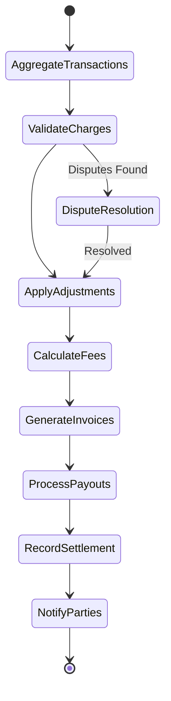
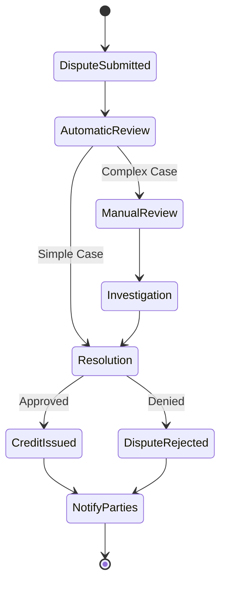

# Marketplace Orchestration Specification

## Executive Summary

### Problem Statement
The DCE platform currently consists of isolated services (authentication, call routing, bidding, quality monitoring, etc.) that lack end-to-end orchestration. This results in:
- Fragmented user experiences
- Manual coordination between services
- Inconsistent error handling across workflows
- Difficulty tracking end-to-end transactions
- No unified business process visibility

### Business Impact
- **User Experience**: Disjointed interactions requiring manual steps
- **Operational Efficiency**: Support teams lack visibility into workflow states
- **Revenue Risk**: Failed transactions due to uncoordinated service failures
- **Compliance**: Difficulty proving end-to-end audit trails
- **Scalability**: Adding new workflows requires extensive integration work

### Solution Overview
Implement a comprehensive Marketplace Orchestration layer that:
- Coordinates multi-service workflows using saga patterns
- Provides state management across service boundaries
- Implements compensation logic for failed transactions
- Offers workflow visualization and monitoring
- Enables declarative workflow definitions

## Core Workflows

### 1. Buyer Onboarding Flow
Complete journey from registration to first successful call purchase.



**Steps:**
1. User registration with basic info
2. Identity verification (KYC)
3. Credit check and risk assessment
4. Account creation in billing system
5. Initial credit limit setup
6. First campaign creation
7. Bid criteria configuration
8. Account activation

### 2. Seller Onboarding Flow
Journey from application to receiving first payout.



**Steps:**
1. Seller application submission
2. Business verification and documentation
3. Bank account and tax setup
4. Compliance review (TCPA, licenses)
5. Contract generation and e-signing
6. Technical integration setup
7. Test call validation
8. Production activation

### 3. Call Lifecycle Orchestration
End-to-end call flow from initiation to settlement.



**Steps:**
1. Call initiation and validation
2. Real-time bid matching
3. Buyer selection and routing
4. Call connection and monitoring
5. Quality scoring during call
6. Duration tracking
7. Charge calculation
8. Settlement processing

### 4. Settlement Workflow
Daily settlement process for all parties.



**Steps:**
1. Aggregate day's transactions
2. Validate all charges
3. Apply credits/adjustments
4. Calculate platform fees
5. Generate invoices for buyers
6. Process payouts to sellers
7. Record settlement details
8. Send notifications

### 5. Dispute Resolution Flow
Handling quality and billing disputes.



**Steps:**
1. Dispute submission with evidence
2. Automatic review based on rules
3. Manual review escalation if needed
4. Investigation with call recordings
5. Resolution decision
6. Credit/adjustment processing
7. Party notification
8. Audit trail recording

## Orchestration Patterns

### 1. Saga Pattern Implementation
Long-running transactions with compensation logic.

```go
type Saga struct {
    ID          uuid.UUID
    Name        string
    Steps       []SagaStep
    State       SagaState
    Context     map[string]interface{}
    StartedAt   time.Time
    CompletedAt *time.Time
}

type SagaStep struct {
    Name            string
    Execute         func(ctx context.Context, data interface{}) error
    Compensate      func(ctx context.Context, data interface{}) error
    RetryPolicy     RetryPolicy
    Timeout         time.Duration
}

type SagaCoordinator struct {
    repository SagaRepository
    executor   StepExecutor
    monitor    SagaMonitor
}

func (c *SagaCoordinator) Execute(ctx context.Context, saga *Saga) error {
    for i, step := range saga.Steps {
        if err := c.executeStep(ctx, saga, step); err != nil {
            // Compensate in reverse order
            return c.compensate(ctx, saga, i-1)
        }
        saga.State.CompletedSteps = append(saga.State.CompletedSteps, step.Name)
    }
    return nil
}
```

### 2. State Machine Management
Workflow state transitions with validation.

```go
type WorkflowStateMachine struct {
    States      map[string]State
    Transitions map[string][]Transition
    Current     string
}

type State struct {
    Name        string
    Type        StateType // Start, End, Task, Choice, Parallel
    OnEnter     func(ctx context.Context) error
    OnExit      func(ctx context.Context) error
    Timeout     time.Duration
}

type Transition struct {
    From      string
    To        string
    Condition func(ctx context.Context) bool
    Action    func(ctx context.Context) error
}

type WorkflowEngine struct {
    definitions  map[string]WorkflowDefinition
    instances    map[uuid.UUID]*WorkflowInstance
    stateMgr     StateManager
    eventBus     EventBus
}
```

### 3. Compensation Handlers
Rollback logic for failed transactions.

```go
type CompensationHandler struct {
    handlers map[string]CompensationFunc
    logger   Logger
}

type CompensationFunc func(ctx context.Context, failure error, data interface{}) error

func (h *CompensationHandler) Register(service string, fn CompensationFunc) {
    h.handlers[service] = fn
}

// Example compensations
var compensations = map[string]CompensationFunc{
    "billing": func(ctx context.Context, failure error, data interface{}) error {
        // Reverse charges
        return billingService.ReverseCharge(ctx, data.(ChargeData))
    },
    "inventory": func(ctx context.Context, failure error, data interface{}) error {
        // Release reserved inventory
        return inventoryService.ReleaseReservation(ctx, data.(ReservationData))
    },
}
```

### 4. Workflow Versioning
Support for evolving workflows without breaking existing instances.

```go
type WorkflowVersion struct {
    Version      string
    Definition   WorkflowDefinition
    ValidFrom    time.Time
    ValidUntil   *time.Time
    Migrations   []Migration
}

type WorkflowVersionManager struct {
    versions map[string][]WorkflowVersion
}

func (m *WorkflowVersionManager) GetDefinition(name string, startedAt time.Time) WorkflowDefinition {
    versions := m.versions[name]
    for _, v := range versions {
        if startedAt.After(v.ValidFrom) && (v.ValidUntil == nil || startedAt.Before(*v.ValidUntil)) {
            return v.Definition
        }
    }
    return versions[len(versions)-1].Definition // Latest version
}
```

## Service Coordination

### 1. Marketplace Orchestrator
Central coordinator for all marketplace workflows.

```go
type MarketplaceOrchestrator struct {
    workflowEngine   *WorkflowEngine
    serviceRegistry  ServiceRegistry
    eventBus         EventBus
    stateManager     StateManager
    sagaCoordinator  *SagaCoordinator
    monitor          *WorkflowMonitor
}

func (o *MarketplaceOrchestrator) StartWorkflow(ctx context.Context, workflowType string, input interface{}) (*WorkflowInstance, error) {
    definition := o.workflowEngine.GetDefinition(workflowType)
    instance := &WorkflowInstance{
        ID:         uuid.New(),
        Type:       workflowType,
        State:      definition.InitialState,
        Input:      input,
        StartedAt:  time.Now(),
    }
    
    if err := o.stateManager.SaveInstance(ctx, instance); err != nil {
        return nil, err
    }
    
    go o.executeWorkflow(context.Background(), instance)
    return instance, nil
}

func (o *MarketplaceOrchestrator) executeWorkflow(ctx context.Context, instance *WorkflowInstance) {
    defer o.monitor.RecordCompletion(instance)
    
    for !instance.IsTerminal() {
        state := o.workflowEngine.GetState(instance.Type, instance.State)
        
        if err := o.executeState(ctx, instance, state); err != nil {
            o.handleError(ctx, instance, err)
            return
        }
        
        next := o.determineNextState(ctx, instance, state)
        instance.State = next
        o.stateManager.UpdateState(ctx, instance)
    }
}
```

### 2. Workflow Engine
Core workflow execution engine.

```go
type WorkflowEngine struct {
    definitions  map[string]WorkflowDefinition
    executor     TaskExecutor
    transitions  TransitionEvaluator
    persistence  WorkflowPersistence
}

type WorkflowDefinition struct {
    Name         string
    Version      string
    States       []State
    Transitions  []Transition
    InputSchema  json.RawMessage
    OutputSchema json.RawMessage
    Timeouts     WorkflowTimeouts
}

type WorkflowInstance struct {
    ID           uuid.UUID
    Type         string
    State        string
    Input        interface{}
    Context      map[string]interface{}
    History      []StateTransition
    StartedAt    time.Time
    CompletedAt  *time.Time
    Error        *WorkflowError
}

func (e *WorkflowEngine) ExecuteTask(ctx context.Context, task Task) (interface{}, error) {
    // Service invocation with retry and timeout
    ctx, cancel := context.WithTimeout(ctx, task.Timeout)
    defer cancel()
    
    return retry.Do(ctx, task.RetryPolicy, func() (interface{}, error) {
        service := e.serviceRegistry.Get(task.Service)
        return service.Execute(ctx, task.Method, task.Input)
    })
}
```

### 3. State Manager
Persistent state management across services.

```go
type StateManager struct {
    store        StateStore
    cache        Cache
    eventStream  EventStream
    serializer   StateSerializer
}

type WorkflowState struct {
    InstanceID   uuid.UUID
    CurrentState string
    Context      map[string]interface{}
    History      []StateTransition
    Checkpoints  []Checkpoint
    LastUpdated  time.Time
}

func (m *StateManager) SaveCheckpoint(ctx context.Context, instanceID uuid.UUID, checkpoint Checkpoint) error {
    state, err := m.GetState(ctx, instanceID)
    if err != nil {
        return err
    }
    
    state.Checkpoints = append(state.Checkpoints, checkpoint)
    state.LastUpdated = time.Now()
    
    if err := m.store.Save(ctx, state); err != nil {
        return err
    }
    
    m.eventStream.Publish(ctx, StateUpdatedEvent{
        InstanceID: instanceID,
        State:      state.CurrentState,
        Timestamp:  time.Now(),
    })
    
    return nil
}

func (m *StateManager) Recover(ctx context.Context, instanceID uuid.UUID) (*WorkflowState, error) {
    state, err := m.store.Get(ctx, instanceID)
    if err != nil {
        return nil, err
    }
    
    // Find last successful checkpoint
    lastCheckpoint := state.Checkpoints[len(state.Checkpoints)-1]
    state.CurrentState = lastCheckpoint.State
    state.Context = lastCheckpoint.Context
    
    return state, nil
}
```

### 4. Compensation Handler
Manages rollback and compensation logic.

```go
type CompensationHandler struct {
    registry     CompensationRegistry
    executor     CompensationExecutor
    logger       Logger
}

type CompensationStrategy struct {
    Type         CompensationType // Retry, Compensate, Ignore
    MaxAttempts  int
    BackoffPolicy BackoffPolicy
}

func (h *CompensationHandler) Compensate(ctx context.Context, saga *Saga, failedStep int) error {
    // Execute compensations in reverse order
    for i := failedStep; i >= 0; i-- {
        step := saga.Steps[i]
        if step.Compensate == nil {
            continue
        }
        
        if err := h.executeCompensation(ctx, step, saga.Context); err != nil {
            h.logger.Error("Compensation failed", 
                "saga", saga.ID,
                "step", step.Name,
                "error", err)
            // Continue with other compensations
        }
    }
    
    return h.markSagaFailed(ctx, saga)
}
```

## End-to-End Flows

### 1. Call Initiation → Routing → Billing Flow

```go
func (o *MarketplaceOrchestrator) ProcessCall(ctx context.Context, callReq CallRequest) error {
    workflow := &CallWorkflow{
        ID:      uuid.New(),
        Request: callReq,
    }
    
    saga := &Saga{
        Name: "call-processing",
        Steps: []SagaStep{
            {
                Name: "validate-caller",
                Execute: func(ctx context.Context, data interface{}) error {
                    return o.validateCaller(ctx, callReq.FromNumber)
                },
            },
            {
                Name: "find-buyer",
                Execute: func(ctx context.Context, data interface{}) error {
                    buyer, err := o.routingService.FindBestBuyer(ctx, callReq)
                    if err != nil {
                        return err
                    }
                    workflow.Buyer = buyer
                    return nil
                },
                Compensate: func(ctx context.Context, data interface{}) error {
                    return o.routingService.ReleaseReservation(ctx, workflow.Buyer.ID)
                },
            },
            {
                Name: "connect-call",
                Execute: func(ctx context.Context, data interface{}) error {
                    conn, err := o.telephonyService.Connect(ctx, callReq, workflow.Buyer)
                    workflow.Connection = conn
                    return err
                },
                Compensate: func(ctx context.Context, data interface{}) error {
                    return o.telephonyService.Disconnect(ctx, workflow.Connection.ID)
                },
            },
            {
                Name: "start-billing",
                Execute: func(ctx context.Context, data interface{}) error {
                    return o.billingService.StartMeter(ctx, workflow.Connection.ID, workflow.Buyer.Rate)
                },
                Compensate: func(ctx context.Context, data interface{}) error {
                    return o.billingService.CancelMeter(ctx, workflow.Connection.ID)
                },
            },
        },
    }
    
    return o.sagaCoordinator.Execute(ctx, saga)
}
```

### 2. Buyer Registration → Verification → Activation

```go
func (o *MarketplaceOrchestrator) OnboardBuyer(ctx context.Context, registration BuyerRegistration) error {
    instance, err := o.StartWorkflow(ctx, "buyer-onboarding", registration)
    if err != nil {
        return err
    }
    
    // Workflow definition handles:
    // 1. Identity verification
    // 2. Credit check
    // 3. Account setup
    // 4. Initial campaign creation
    // 5. Activation
    
    return o.waitForCompletion(ctx, instance.ID, 24*time.Hour)
}
```

### 3. Quality Monitoring → Scoring → Action

```go
type QualityWorkflow struct {
    orchestrator *MarketplaceOrchestrator
}

func (w *QualityWorkflow) MonitorAndAct(ctx context.Context, callID uuid.UUID) error {
    return w.orchestrator.StartWorkflow(ctx, "quality-monitoring", map[string]interface{}{
        "callID": callID,
        "rules": []QualityRule{
            {Metric: "silence_duration", Threshold: 5, Action: "alert"},
            {Metric: "conversion_rate", Threshold: 0.1, Action: "review"},
            {Metric: "complaint_rate", Threshold: 0.02, Action: "suspend"},
        },
    })
}
```

### 4. Payout Request → Validation → Processing

```go
func (o *MarketplaceOrchestrator) ProcessPayout(ctx context.Context, request PayoutRequest) error {
    saga := &Saga{
        Name: "payout-processing",
        Steps: []SagaStep{
            {
                Name: "validate-balance",
                Execute: func(ctx context.Context, data interface{}) error {
                    balance, err := o.financialService.GetBalance(ctx, request.SellerID)
                    if err != nil {
                        return err
                    }
                    if balance.Amount.LessThan(request.Amount) {
                        return ErrInsufficientBalance
                    }
                    return nil
                },
            },
            {
                Name: "reserve-funds",
                Execute: func(ctx context.Context, data interface{}) error {
                    return o.financialService.ReserveFunds(ctx, request.SellerID, request.Amount)
                },
                Compensate: func(ctx context.Context, data interface{}) error {
                    return o.financialService.ReleaseFunds(ctx, request.SellerID, request.Amount)
                },
            },
            {
                Name: "initiate-transfer",
                Execute: func(ctx context.Context, data interface{}) error {
                    return o.paymentService.InitiateACH(ctx, request)
                },
                Compensate: func(ctx context.Context, data interface{}) error {
                    return o.paymentService.CancelTransfer(ctx, request.ID)
                },
            },
            {
                Name: "update-ledger",
                Execute: func(ctx context.Context, data interface{}) error {
                    return o.financialService.RecordPayout(ctx, request)
                },
            },
        },
    }
    
    return o.sagaCoordinator.Execute(ctx, saga)
}
```

## Error Handling

### 1. Retry Strategies

```go
type RetryPolicy struct {
    MaxAttempts     int
    InitialDelay    time.Duration
    MaxDelay        time.Duration
    BackoffFactor   float64
    RetryableErrors []error
}

func (p *RetryPolicy) ShouldRetry(err error, attempt int) bool {
    if attempt >= p.MaxAttempts {
        return false
    }
    
    for _, retryable := range p.RetryableErrors {
        if errors.Is(err, retryable) {
            return true
        }
    }
    
    return false
}

func (p *RetryPolicy) NextDelay(attempt int) time.Duration {
    delay := p.InitialDelay * time.Duration(math.Pow(p.BackoffFactor, float64(attempt)))
    if delay > p.MaxDelay {
        return p.MaxDelay
    }
    return delay
}
```

### 2. Circuit Breakers

```go
type CircuitBreaker struct {
    name            string
    failureThreshold int
    recoveryTimeout  time.Duration
    state           CircuitState
    failures        int
    lastFailureTime time.Time
    mu              sync.RWMutex
}

func (cb *CircuitBreaker) Call(ctx context.Context, fn func() error) error {
    if !cb.canProceed() {
        return ErrCircuitOpen
    }
    
    err := fn()
    cb.recordResult(err)
    return err
}

func (cb *CircuitBreaker) canProceed() bool {
    cb.mu.RLock()
    defer cb.mu.RUnlock()
    
    switch cb.state {
    case StateOpen:
        return time.Since(cb.lastFailureTime) > cb.recoveryTimeout
    case StateHalfOpen:
        return true
    default:
        return true
    }
}
```

### 3. Fallback Mechanisms

```go
type FallbackHandler struct {
    primary   ServiceClient
    fallbacks []ServiceClient
    strategy  FallbackStrategy
}

func (h *FallbackHandler) Execute(ctx context.Context, request interface{}) (interface{}, error) {
    result, err := h.primary.Execute(ctx, request)
    if err == nil {
        return result, nil
    }
    
    if !h.shouldFallback(err) {
        return nil, err
    }
    
    for _, fallback := range h.fallbacks {
        result, err = fallback.Execute(ctx, request)
        if err == nil {
            return result, nil
        }
    }
    
    return nil, ErrAllFallbacksFailed
}
```

### 4. Manual Intervention

```go
type ManualInterventionQueue struct {
    store    InterventionStore
    notifier NotificationService
}

type Intervention struct {
    ID          uuid.UUID
    WorkflowID  uuid.UUID
    Type        string
    Reason      string
    Context     map[string]interface{}
    Priority    Priority
    AssignedTo  *string
    CreatedAt   time.Time
    ResolvedAt  *time.Time
    Resolution  *Resolution
}

func (q *ManualInterventionQueue) RequireIntervention(ctx context.Context, workflow *WorkflowInstance, reason string) error {
    intervention := &Intervention{
        ID:         uuid.New(),
        WorkflowID: workflow.ID,
        Type:       workflow.Type,
        Reason:     reason,
        Context:    workflow.Context,
        Priority:   q.calculatePriority(workflow),
        CreatedAt:  time.Now(),
    }
    
    if err := q.store.Save(ctx, intervention); err != nil {
        return err
    }
    
    return q.notifier.NotifyOncall(ctx, intervention)
}
```

## Monitoring

### 1. Workflow Visualization

```go
type WorkflowVisualizer struct {
    renderer GraphRenderer
    store    WorkflowStore
}

func (v *WorkflowVisualizer) GenerateFlowDiagram(ctx context.Context, instanceID uuid.UUID) ([]byte, error) {
    instance, err := v.store.GetInstance(ctx, instanceID)
    if err != nil {
        return nil, err
    }
    
    graph := &FlowGraph{
        Nodes: v.createNodes(instance),
        Edges: v.createEdges(instance),
        Current: instance.State,
    }
    
    return v.renderer.Render(graph)
}

// Real-time dashboard data
type WorkflowMetrics struct {
    Active      int
    Completed   int
    Failed      int
    AvgDuration time.Duration
    SLAMet      float64
    Bottlenecks []Bottleneck
}
```

### 2. SLA Tracking

```go
type SLAMonitor struct {
    definitions map[string]SLADefinition
    tracker     MetricsTracker
}

type SLADefinition struct {
    WorkflowType string
    Targets      []SLATarget
}

type SLATarget struct {
    Metric    string
    Threshold float64
    Window    time.Duration
}

func (m *SLAMonitor) CheckSLA(ctx context.Context, workflow string) (*SLAReport, error) {
    definition := m.definitions[workflow]
    report := &SLAReport{
        WorkflowType: workflow,
        Period:       time.Now().Add(-24 * time.Hour),
        Results:      make([]SLAResult, 0),
    }
    
    for _, target := range definition.Targets {
        actual := m.tracker.GetMetric(workflow, target.Metric, target.Window)
        report.Results = append(report.Results, SLAResult{
            Metric:    target.Metric,
            Target:    target.Threshold,
            Actual:    actual,
            Met:       actual <= target.Threshold,
        })
    }
    
    return report, nil
}
```

### 3. Bottleneck Detection

```go
type BottleneckDetector struct {
    analyzer StepAnalyzer
    store    MetricsStore
}

func (d *BottleneckDetector) FindBottlenecks(ctx context.Context, workflowType string) ([]Bottleneck, error) {
    metrics, err := d.store.GetStepMetrics(ctx, workflowType, time.Now().Add(-7*24*time.Hour))
    if err != nil {
        return nil, err
    }
    
    bottlenecks := []Bottleneck{}
    
    for step, stepMetrics := range metrics {
        if stepMetrics.AvgDuration > stepMetrics.P50Duration*2 {
            bottlenecks = append(bottlenecks, Bottleneck{
                Step:        step,
                Impact:      "High variance in execution time",
                AvgDuration: stepMetrics.AvgDuration,
                P99Duration: stepMetrics.P99Duration,
            })
        }
        
        if stepMetrics.ErrorRate > 0.05 {
            bottlenecks = append(bottlenecks, Bottleneck{
                Step:      step,
                Impact:    fmt.Sprintf("High error rate: %.2f%%", stepMetrics.ErrorRate*100),
                ErrorRate: stepMetrics.ErrorRate,
            })
        }
    }
    
    return bottlenecks, nil
}
```

### 4. Success Metrics

```go
type SuccessMetrics struct {
    CompletionRate   float64
    AvgCompletionTime time.Duration
    SLACompliance    float64
    ErrorRate        float64
    CompensationRate float64
    UserSatisfaction float64
}

func (m *WorkflowMonitor) CalculateSuccess(ctx context.Context, period time.Duration) (*SuccessMetrics, error) {
    instances, err := m.store.GetInstancesInPeriod(ctx, time.Now().Add(-period), time.Now())
    if err != nil {
        return nil, err
    }
    
    metrics := &SuccessMetrics{}
    completed := 0
    totalDuration := time.Duration(0)
    compensated := 0
    
    for _, instance := range instances {
        if instance.CompletedAt != nil {
            completed++
            totalDuration += instance.CompletedAt.Sub(instance.StartedAt)
        }
        
        if instance.HadCompensation {
            compensated++
        }
    }
    
    metrics.CompletionRate = float64(completed) / float64(len(instances))
    metrics.AvgCompletionTime = totalDuration / time.Duration(completed)
    metrics.CompensationRate = float64(compensated) / float64(len(instances))
    
    return metrics, nil
}
```

## Implementation Phases

### Phase 1: Core Infrastructure (2 days)
- Workflow engine implementation
- State management system
- Basic saga coordinator
- Event bus integration

### Phase 2: Primary Workflows (2 days)
- Call lifecycle orchestration
- Buyer onboarding flow
- Basic error handling
- Compensation framework

### Phase 3: Advanced Workflows (2 days)
- Settlement orchestration
- Dispute resolution flow
- Quality monitoring integration
- Seller onboarding

### Phase 4: Monitoring & Operations (1 day)
- Workflow visualization
- SLA tracking
- Bottleneck detection
- Manual intervention queue

## Testing Strategy

### Unit Tests
```go
func TestSagaCompensation(t *testing.T) {
    coordinator := NewSagaCoordinator()
    failingStep := 2
    
    saga := &Saga{
        Steps: []SagaStep{
            {Execute: mockSuccess, Compensate: mockCompensate},
            {Execute: mockSuccess, Compensate: mockCompensate},
            {Execute: mockFailure, Compensate: mockCompensate},
        },
    }
    
    err := coordinator.Execute(context.Background(), saga)
    assert.Error(t, err)
    assert.Equal(t, 2, compensationsCalled)
}
```

### Integration Tests
- Full workflow execution
- Service coordination
- State persistence
- Error recovery

### Performance Tests
- Workflow throughput
- State management latency
- Concurrent execution
- Recovery time

## Effort Estimate

**Total: 6-7 Developer Days**

- **Core Infrastructure**: 2 days
- **Primary Workflows**: 2 days  
- **Advanced Features**: 2 days
- **Testing & Documentation**: 1 day

## Success Criteria

1. **Functional**
   - All core workflows automated
   - < 5% manual intervention rate
   - Successful compensation for all failures

2. **Performance**
   - Workflow initiation < 100ms
   - State transitions < 50ms
   - 1000+ concurrent workflows

3. **Reliability**
   - 99.9% workflow completion rate
   - Zero data loss on failures
   - < 5 minute recovery time

4. **Observability**
   - Real-time workflow visualization
   - Complete audit trail
   - Proactive bottleneck detection