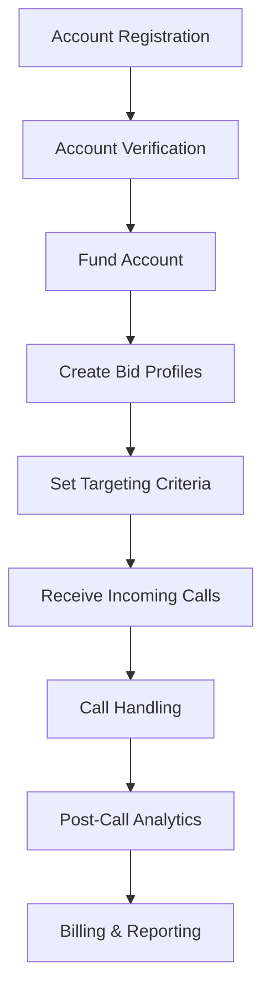
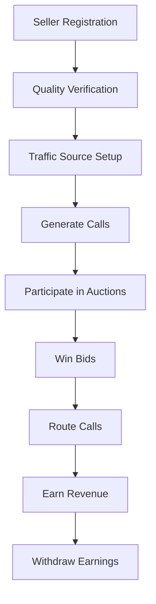

# Dependable Call Exchange Backend - Comprehensive Analysis Report

## Executive Summary

The Dependable Call Exchange Backend is a sophisticated pay-per-call marketplace platform built in Go, designed to connect call buyers and sellers through real-time auctions, intelligent routing, and comprehensive compliance management. The system implements a modular monolith architecture with clear domain boundaries, event-driven processing, and enterprise-grade scalability features.

## 1. Business Logic Overview

### 1.1 Core Business Model

The platform operates as a real-time marketplace where:
- **Buyers** (typically businesses) pay for incoming calls from potential customers
- **Sellers** (lead generators, affiliates) route calls to buyers through competitive bidding
- **The Exchange** facilitates real-time auctions, ensures compliance, and handles financial transactions

### 1.2 Key Business Processes

#### Call Auction Process
1. **Call Initiation**: Incoming call triggers real-time auction
2. **Bid Matching**: System matches call characteristics with active bid profiles
3. **Auction Execution**: Millisecond-level auction determines winning bid
4. **Call Routing**: Call is routed to winning buyer
5. **Quality Tracking**: Real-time monitoring of call quality and duration
6. **Financial Settlement**: Automatic billing based on call outcome

#### Compliance Management
- **TCPA Compliance**: Time-based calling restrictions
- **DNC List Management**: Real-time Do-Not-Call list checking
- **GDPR Compliance**: Data protection and consent management
- **Geographic Restrictions**: State/country-specific regulations

#### Fraud Prevention
- **ML-based Scoring**: Real-time fraud detection using behavioral patterns
- **Velocity Checks**: Rate limiting and unusual activity detection
- **Quality Metrics**: Historical performance tracking
- **Account Verification**: Multi-level verification process

## 2. User Journeys

### 2.1 Buyer Journey



**Detailed Steps:**
1. **Registration & Onboarding**
   - Create buyer account with business details
   - Pass KYC/AML verification
   - Configure account settings and preferences

2. **Financial Setup**
   - Add payment methods
   - Fund account balance
   - Set spending limits and alerts

3. **Campaign Configuration**
   - Define bid profiles with targeting criteria:
     - Geographic targeting (countries, states, cities)
     - Time windows for receiving calls
     - Call types (sales, support, inquiries)
     - Quality requirements
   - Set bid amounts and budgets
   - Configure routing preferences

4. **Real-time Operations**
   - Participate in automated auctions
   - Receive routed calls
   - Track call quality and conversions
   - Adjust bids based on performance

5. **Analytics & Optimization**
   - Review call recordings and transcripts
   - Analyze conversion metrics
   - Optimize bid strategies
   - Generate compliance reports

### 2.2 Seller Journey



**Detailed Steps:**
1. **Onboarding**
   - Register as traffic source/publisher
   - Verify traffic quality and sources
   - Configure technical integration

2. **Campaign Setup**
   - Define traffic characteristics
   - Set minimum acceptable rates
   - Configure call handling rules

3. **Call Generation**
   - Drive traffic through approved channels
   - Ensure compliance with regulations
   - Maintain quality standards

4. **Revenue Generation**
   - Calls automatically enter auctions
   - Win bids based on quality and price
   - Track earnings in real-time
   - Receive payments per agreed schedule

### 2.3 System Administrator Journey

1. **Platform Management**
   - Monitor system health and performance
   - Manage user accounts and permissions
   - Configure global compliance rules

2. **Fraud Management**
   - Review flagged accounts and calls
   - Adjust fraud detection parameters
   - Investigate suspicious patterns

3. **Financial Operations**
   - Manage payment processing
   - Handle disputes and chargebacks
   - Generate financial reports

## 3. Domain Model Analysis

### 3.1 Core Entities

#### Account Domain
```go
Account {
    ID: UUID
    Email: string
    Type: enum(buyer, seller, admin)
    Status: enum(active, suspended, closed)
    Balance: decimal
    QualityScore: integer (0-100)
    Settings: JSONB
}
```

#### Call Domain
```go
Call {
    ID: UUID
    FromNumber: string
    ToNumber: string
    Direction: enum(inbound, outbound)
    Status: enum(pending, ringing, in_progress, completed, failed)
    StartTime: timestamp
    Duration: integer (seconds)
    Cost: decimal
    BuyerID: UUID
    SellerID: UUID
}
```

#### Bid Domain
```go
Bid {
    ID: UUID
    CallID: UUID
    BuyerID: UUID
    Amount: decimal
    Status: enum(active, won, lost, expired)
    Criteria: {
        Geography: {Countries, States, Cities}
        TimeWindow: {StartHour, EndHour, Timezone}
        CallTypes: []string
        QualityRequirements: {MinDuration, MinQualityScore}
    }
}
```

#### Compliance Domain
```go
ComplianceRule {
    ID: UUID
    Name: string
    Type: enum(tcpa, gdpr, dnc, geographic)
    Conditions: []Condition
    Actions: []Action
    GeographicScope: {Countries, States}
}

ConsentRecord {
    PhoneNumber: string
    ConsentType: enum(call, sms, marketing)
    Status: enum(granted, revoked, expired)
}
```

### 3.2 Value Objects

- **PhoneNumber**: E.164 formatted with validation
- **Email**: RFC-compliant email validation
- **Money**: Currency-aware decimal handling
- **Location**: Geographic data with validation

## 4. Service Layer Architecture

### 4.1 Core Services

#### Call Routing Service
**Responsibilities:**
- Process incoming calls
- Execute routing algorithms
- Manage call state transitions
- Track routing decisions

**Key Algorithms:**
- **Cost-based Routing**: Lowest cost wins
- **Quality-based Routing**: Highest quality score wins
- **Hybrid Routing**: Weighted combination of factors
- **Geographic Routing**: Location-based preferences

#### Bidding Service
**Responsibilities:**
- Manage bid profiles
- Execute real-time auctions
- Handle bid validation
- Track auction results

**Auction Types:**
- **First-Price Auction**: Highest bid wins, pays bid amount
- **Second-Price Auction**: Highest bid wins, pays second-highest + increment
- **Quality-Adjusted Auction**: Bids adjusted by quality scores

#### Fraud Detection Service
**Responsibilities:**
- Real-time fraud scoring
- Pattern detection
- Velocity checking
- Account verification

**Detection Methods:**
- ML-based anomaly detection
- Rule-based filtering
- Behavioral analysis
- Network graph analysis

#### Telephony Service
**Responsibilities:**
- SIP/WebRTC integration
- Call state management
- Recording management
- DTMF handling

#### Analytics Service
**Responsibilities:**
- Real-time metrics collection
- Aggregated reporting
- Performance tracking
- Custom dashboards

### 4.2 Infrastructure Services

#### Database Layer
- **PostgreSQL**: Primary data store with TimescaleDB for time-series
- **Redis**: Caching and real-time data
- **Connection Pooling**: PgBouncer for connection management

#### Messaging Layer
- **Event Bus**: For asynchronous processing
- **WebSocket**: Real-time client updates
- **gRPC**: Inter-service communication

#### Observability
- **OpenTelemetry**: Distributed tracing
- **Prometheus**: Metrics collection
- **ELK Stack**: Centralized logging

## 5. API Endpoints

### 5.1 REST API

#### Account Management
- `POST /api/v1/accounts` - Create account
- `GET /api/v1/accounts/{id}` - Get account details
- `PUT /api/v1/accounts/{id}` - Update account
- `GET /api/v1/accounts/{id}/balance` - Get balance
- `POST /api/v1/accounts/{id}/fund` - Add funds

#### Call Management
- `POST /api/v1/calls` - Initiate call
- `GET /api/v1/calls/{id}` - Get call details
- `PUT /api/v1/calls/{id}/status` - Update call status
- `GET /api/v1/calls/{id}/recording` - Get recording

#### Bidding
- `POST /api/v1/bids` - Place bid
- `GET /api/v1/bids/{id}` - Get bid details
- `GET /api/v1/auctions/{id}` - Get auction status
- `POST /api/v1/bid-profiles` - Create bid profile

#### Analytics
- `GET /api/v1/analytics/calls` - Call metrics
- `GET /api/v1/analytics/revenue` - Revenue reports
- `GET /api/v1/analytics/quality` - Quality metrics

### 5.2 WebSocket Events

- `call.initiated` - New call started
- `auction.started` - Auction begun
- `bid.placed` - New bid received
- `auction.completed` - Winner selected
- `call.status.changed` - Call state update
- `balance.updated` - Account balance change

### 5.3 gRPC Services

```protobuf
service CallRouting {
    rpc RouteCall(RouteCallRequest) returns (RouteCallResponse);
    rpc GetActiveRoutes(GetActiveRoutesRequest) returns (stream ActiveRoute);
}

service Bidding {
    rpc PlaceBid(PlaceBidRequest) returns (Bid);
    rpc StreamAuctions(StreamAuctionsRequest) returns (stream AuctionUpdate);
}
```

## 6. Database Schema

### 6.1 Core Tables

#### accounts
- Stores user accounts with partitioning by type
- Indexes on email, type, status
- Soft delete support

#### calls (TimescaleDB Hypertable)
- Time-series optimized with weekly chunks
- Automatic compression after 30 days
- Partitioned by start_time

#### bids
- High-performance auction data
- Indexes for active bid lookups
- Expiration-based cleanup

#### transactions
- Financial ledger with double-entry bookkeeping
- Immutable audit trail
- Running balance tracking

### 6.2 Performance Optimizations

- **Connection Pooling**: 25 connections max
- **Read Replicas**: For analytics queries
- **Materialized Views**: For dashboards
- **Table Partitioning**: For large datasets
- **Index Strategy**: Covering indexes for hot paths

## 7. Security & Compliance

### 7.1 Security Features

- **Authentication**: JWT-based with refresh tokens
- **Authorization**: Role-based access control (RBAC)
- **Encryption**: TLS 1.3 for transport, AES-256 for data at rest
- **Rate Limiting**: Per-user and global limits
- **Input Validation**: Comprehensive validation at all layers

### 7.2 Compliance Implementation

- **TCPA**: Time-based calling restrictions
- **DNC**: Real-time list checking
- **GDPR**: Data retention policies, right to erasure
- **PCI**: Tokenized payment processing
- **SOC2**: Audit logging and access controls

## 8. Scalability & Performance

### 8.1 Performance Targets

- **Call Routing**: < 1ms decision time
- **Bid Processing**: 100K bids/second
- **API Response**: < 50ms p99
- **Database Queries**: < 10ms for hot paths
- **WebSocket Events**: < 5ms delivery

### 8.2 Scaling Strategy

- **Horizontal Scaling**: Stateless services
- **Database Sharding**: By account/geographic region
- **Caching Strategy**: Multi-level caching
- **Event Streaming**: Kafka for high throughput
- **CDN Integration**: For static assets

## 9. Development & Deployment

### 9.1 Development Workflow

```bash
# Local development
make dev-watch

# Run tests
make test
make test-integration
make test-e2e

# Code quality
make lint
make fmt
make vet
```

### 9.2 Deployment Strategy

- **Blue-Green Deployment**: Zero-downtime updates
- **Canary Releases**: Gradual rollout
- **Feature Flags**: Progressive feature enablement
- **Rollback Strategy**: Automated rollback on failure

## 10. Monitoring & Observability

### 10.1 Key Metrics

- **Business Metrics**: Calls/minute, Revenue/hour, Conversion rates
- **System Metrics**: CPU, Memory, Disk I/O, Network
- **Application Metrics**: Request rates, Error rates, Latencies
- **Database Metrics**: Query performance, Connection pool usage

### 10.2 Alerting Rules

- Call routing failures > 1%
- Auction completion time > 100ms
- Database connection pool > 80%
- Error rate > 0.1%
- Revenue drop > 20%

## 11. Future Enhancements

### 11.1 Planned Features

1. **AI-Powered Routing**: ML models for optimal routing
2. **Smart Bidding**: Automated bid optimization
3. **Voice Analytics**: Call transcription and sentiment analysis
4. **Blockchain Integration**: Transparent auction records
5. **International Expansion**: Multi-currency and language support

### 11.2 Technical Improvements

1. **Microservices Migration**: Extract high-load services
2. **GraphQL API**: Flexible client queries
3. **Event Sourcing**: Complete audit trail
4. **Kubernetes Native**: Full K8s integration
5. **Edge Computing**: Regional call processing

## Conclusion

The Dependable Call Exchange Backend represents a well-architected, production-ready system for managing a pay-per-call marketplace. The modular design, comprehensive testing, and focus on compliance and security make it suitable for enterprise deployment. The clear separation of concerns and use of modern Go patterns ensure maintainability and extensibility as the platform grows.
