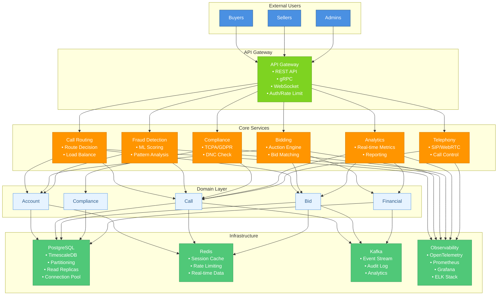

# System Architecture Diagram

## Overview
This diagram illustrates the complete system architecture of the Dependable Call Exchange Backend, showing how different components interact to provide a scalable pay-per-call marketplace.

## Architecture Diagram

## Component Descriptions

### External Users
- **Buyers**: Businesses that pay for incoming calls
- **Sellers**: Lead generators and affiliates who route calls
- **Admins**: System administrators managing the platform

### API Gateway Layer
Single entry point for all external requests:
- **REST API**: Standard HTTP/JSON endpoints
- **gRPC**: High-performance RPC for internal services
- **WebSocket**: Real-time bidirectional communication
- **Auth/Rate Limit**: Security and traffic management

### Core Services

#### Call Routing Service
- Makes intelligent routing decisions in < 1ms
- Implements multiple routing algorithms
- Handles load balancing across buyers

#### Bidding Service
- Executes real-time auctions
- Matches calls with bid profiles
- Processes 100K+ bids per second

#### Fraud Detection Service
- ML-powered fraud scoring
- Real-time pattern analysis
- Behavioral anomaly detection

#### Telephony Service
- SIP/WebRTC protocol handling
- Call state management
- Media streaming control

#### Analytics Service
- Real-time metrics collection
- Business intelligence reporting
- Performance monitoring

#### Compliance Service
- TCPA time-based restrictions
- GDPR data protection
- DNC list checking

### Domain Layer
Core business entities:
- **Account**: User accounts (buyers, sellers, admins)
- **Call**: Call records and state
- **Bid**: Auction bids and profiles
- **Compliance**: Rules and violations
- **Financial**: Transactions and billing

### Infrastructure Layer

#### PostgreSQL
- Primary data store
- TimescaleDB for time-series data
- Table partitioning for scale
- Read replicas for analytics
- Connection pooling with PgBouncer

#### Redis
- Session caching
- Rate limiting counters
- Real-time data storage
- Pub/sub for events

#### Kafka
- Event streaming platform
- Audit log persistence
- Analytics data pipeline
- Asynchronous processing

#### Observability Stack
- **OpenTelemetry**: Distributed tracing
- **Prometheus**: Metrics collection
- **Grafana**: Visualization dashboards
- **ELK Stack**: Log aggregation and search

## Data Flow

1. **Request Flow**: Users → API Gateway → Services
2. **Business Logic**: Services → Domain Layer
3. **Persistence**: Domain → Infrastructure
4. **Events**: All layers → Kafka → Analytics/Audit
5. **Monitoring**: All components → Observability Stack

## Scalability Features

- Stateless services for horizontal scaling
- Database sharding by account/region
- Multi-level caching strategy
- Event-driven architecture for decoupling
- Read replicas for analytics workloads
