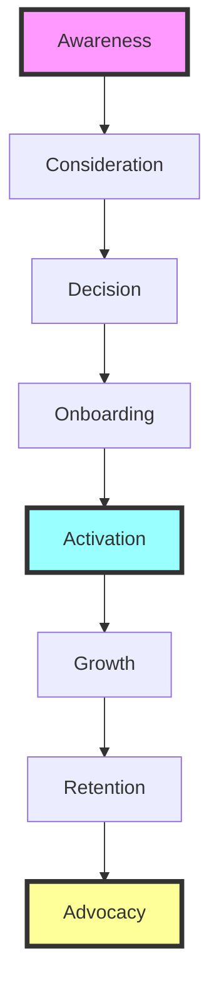

# Pay-Per-Call Marketplace Buyer Journey 2025

## Journey Overview

---

## Stage 1: AWARENESS
*Goal: Build brand recognition and educate market about pay-per-call solutions*

### Key Activities
1. **Content Marketing & SEO**
   - Educational blog series: "Ultimate Guide to Pay-Per-Call Marketing"
   - Industry benchmark reports with original research
   - ROI calculator tools (ungated)
   - Video content: "How Pay-Per-Call Works" series

2. **Thought Leadership**
   - Executive bylines in industry publications
   - Speaking at marketing conferences
   - Podcast sponsorships and guest appearances
   - LinkedIn thought leadership content

3. **Paid Acquisition**
   - Google Ads targeting "call tracking software," "pay per call marketing"
   - LinkedIn ABM campaigns for target accounts
   - Retargeting campaigns with educational content
   - Industry publication sponsorships

### Success Metrics
- Organic traffic growth (target: 15-20% QoQ)
- Brand search volume increase
- Content engagement rates
- MQL generation from content

---

## Stage 2: CONSIDERATION
*Goal: Help buyers evaluate solution fit and build trust*

### Key Activities
1. **Self-Service Discovery**
   - Interactive product tour (no signup required)
   - Live marketplace dashboard showing real-time metrics
   - Transparent pricing calculator
   - Competitor comparison tool
   - Customer success stories by industry

2. **Free Value Delivery**
   - "Marketplace Readiness Assessment" tool
   - Free industry benchmark report (personalized)
   - 14-day free trial with $100 call credits
   - Weekly webinar: "Maximizing Pay-Per-Call ROI"

3. **Trust Building**
   - Security & compliance certifications display
   - Real-time fraud prevention statistics
   - Customer testimonial videos
   - G2/Capterra review widgets

### Success Metrics
- Trial signup rate (target: 8-10% of visitors)
- Content download to trial conversion
- Time spent on pricing/demo pages
- Review site traffic

---

## Stage 3: DECISION
*Goal: Remove friction and enable confident purchase decision*

### Key Activities
1. **Streamlined Registration**
   - Single-page signup (email + password only)
   - Social login options (Google, LinkedIn)
   - Progressive profiling post-signup
   - Risk-based KYC (delayed for low-risk accounts)

2. **Buyer Enablement Toolkit**
   - ROI projection template (customizable)
   - Business case presentation deck
   - Security & compliance documentation
   - Integration technical requirements
   - Champion enablement guide

3. **Sales Support (High-Value)**
   - Dedicated sales engineer for POC
   - Custom demo with buyer's use cases
   - Trial success planning session
   - Executive alignment meetings

### Success Metrics
- Trial to paid conversion (target: 20-25%)
- Registration completion rate (>85%)
- Sales cycle length reduction
- Deal size growth

---

## Stage 4: ONBOARDING
*Goal: Achieve first value realization within 24 hours*

### Key Activities
1. **Instant Quick Start**
   - Pre-configured campaign templates by industry
   - One-click campaign launch
   - $50 bonus credits for first campaign
   - AI-powered bid recommendations

2. **Guided Setup Path**
   - Interactive onboarding checklist
   - Video walkthrough for each step
   - Live chat support during business hours
   - Dedicated CSM for accounts >$5K/month

3. **Progressive Feature Adoption**
   - Week 1: Basic geographic targeting
   - Week 2: Advanced bid strategies
   - Week 3: Custom routing rules
   - Week 4: API integration setup

### Success Metrics
- Time to first call: <24 hours
- Onboarding completion rate: >80%
- Feature adoption velocity
- Support ticket volume (lower is better)

---

## Stage 5: ACTIVATION
*Goal: Establish consistent usage patterns and prove ROI*

### Key Activities
1. **Success Milestones**
   - First successful call celebration
   - 10 calls processed badge
   - First profitable campaign alert
   - ROI achievement notification

2. **Optimization Support**
   - Weekly performance reports
   - AI-powered optimization suggestions
   - Peer benchmark comparisons
   - Monthly optimization webinars

3. **Expansion Opportunities**
   - New vertical recommendations
   - Geographic expansion suggestions
   - Advanced feature trials
   - Volume discount opportunities

### Success Metrics
- 30-day activation rate: >60%
- Average calls/week growth
- Campaign ROI improvement
- Feature utilization depth

---

## Stage 6: GROWTH
*Goal: Expand account value through increased usage and features*

### Key Activities
1. **Proactive Account Management**
   - Quarterly Business Reviews (QBRs)
   - Performance optimization workshops
   - New feature beta access
   - Custom integration development

2. **Upsell/Cross-sell Programs**
   - Advanced analytics package
   - Premium routing algorithms
   - Dedicated phone numbers
   - White-label opportunities

3. **Strategic Partnership Development**
   - Co-marketing opportunities
   - Case study development
   - Industry event speaking slots
   - Product advisory board invitation

### Success Metrics
- Net Revenue Retention: >120%
- Upsell conversion rate: >30%
- Account expansion velocity
- Product stickiness score

---

## Stage 7: RETENTION
*Goal: Maintain high satisfaction and prevent churn*

### Key Activities
1. **Predictive Health Monitoring**
   - AI-powered churn risk scoring
   - Usage pattern anomaly detection
   - Proactive intervention triggers
   - Success metric dashboards

2. **Continuous Value Delivery**
   - New feature announcements
   - Industry trend reports
   - Exclusive training content
   - Priority support access

3. **Community Building**
   - Private LinkedIn group for buyers
   - Monthly virtual roundtables
   - Annual user conference
   - Peer mentorship program

### Success Metrics
- Gross churn rate: <5% monthly
- NPS score: >50
- Support satisfaction: >95%
- Community engagement rate

---

## Stage 8: ADVOCACY
*Goal: Transform satisfied customers into active promoters*

### Key Activities
1. **Formal Advocacy Program**
   - Referral rewards (25% revenue share for 12 months)
   - Case study co-creation
   - Speaking opportunities
   - Product roadmap influence

2. **Social Proof Generation**
   - Automated review requests
   - Video testimonial program
   - Success story amplification
   - LinkedIn advocacy toolkit

3. **Exclusive Benefits**
   - Advocate-only features
   - Priority access to new markets
   - Executive networking events
   - Industry award nominations

### Success Metrics
- Referral program participation: >40%
- Advocate-generated pipeline: >30%
- Review generation rate
- Social mention sentiment

---

## Technology Stack Requirements

### Marketing & Sales
- **CRM**: Salesforce or HubSpot
- **Marketing Automation**: Marketo or Pardot
- **Analytics**: Google Analytics 4 + Mixpanel
- **ABM Platform**: 6sense or Demandbase
- **Content Management**: Contentful or WordPress

### Product & Operations
- **Onboarding**: Pendo or Appcues
- **Customer Success**: Gainsight or ChurnZero
- **Support**: Intercom or Zendesk
- **Analytics**: Amplitude or Heap
- **Community**: Circle or Discourse

### Compliance & Security
- **KYC/AML**: Jumio or Trulioo
- **Fraud Detection**: Sift or Kount
- **Data Security**: Auth0 + AWS Security
- **Compliance Management**: OneTrust

---

## Implementation Roadmap

### Phase 1: Foundation (Months 1-3)
- Implement streamlined registration
- Launch content marketing program
- Deploy basic onboarding flows
- Set up analytics infrastructure

### Phase 2: Optimization (Months 4-6)
- Launch free trial program
- Implement predictive health scoring
- Build community platform
- Enhance fraud detection

### Phase 3: Scale (Months 7-12)
- Full advocacy program rollout
- Advanced personalization
- AI-powered optimization
- International expansion

---

## Key Performance Indicators

### North Star Metrics
- **Customer Lifetime Value (CLV)**: Target 3:1 CLV/CAC ratio
- **Net Revenue Retention**: >120% annually
- **Time to Value**: <24 hours to first successful call

### Stage-Specific Targets
| Stage | Primary KPI | Target |
|-------|------------|--------|
| Awareness | Organic Traffic Growth | 20% QoQ |
| Consideration | Trial Signup Rate | 10% |
| Decision | Trial-to-Paid Conversion | 25% |
| Onboarding | 24-Hour Activation | 80% |
| Activation | 30-Day Retention | 85% |
| Growth | Expansion Revenue | 30% |
| Retention | Monthly Churn | <5% |
| Advocacy | Referral Revenue | 25% |

---

## Competitive Advantages

### 1. **Speed to Value**
- Industry-leading 24-hour activation
- Pre-configured templates
- AI-powered optimization

### 2. **Trust & Security**
- Real-time fraud prevention
- Transparent compliance
- Industry certifications

### 3. **Community & Support**
- Peer learning network
- 24/7 expert support
- Success guarantee program

### 4. **Technology Innovation**
- AI bid optimization
- Predictive analytics
- API-first platform

---

*This enhanced buyer journey represents a modern, customer-centric approach that addresses the unique needs of pay-per-call marketplace buyers while incorporating 2025's best practices in B2B marketing and customer success.*