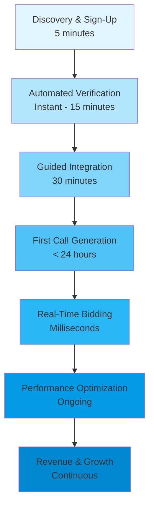

# Pay-Per-Call Seller Journey 2025

## Journey Overview



## Stage 1: Discovery & Sign-Up (5 minutes)

### Objectives
- Capture seller interest with clear value proposition
- Reduce friction with progressive profiling
- Enable instant account creation

### Enhanced Features
1. **AI-Powered Value Calculator**
   - Input: Current call volume and average quality
   - Output: Projected monthly earnings
   - Shows top performer benchmarks

2. **Smart Registration Flow**
   - OAuth integration (Google, LinkedIn, Microsoft)
   - Only 3 required fields initially:
     - Email
     - Company name
     - Estimated monthly call volume
   - Progressive data collection post-activation

3. **Instant Approval Path**
   - Pre-qualified sellers get immediate access
   - Risk scoring happens in background
   - Conditional approval with limits for new sellers

### Success Metrics
- Sign-up completion rate: >85%
- Time to complete: <5 minutes
- Drop-off rate: <15%

---

## Stage 2: Automated Verification (Instant - 15 minutes)

### Objectives
- Ensure seller legitimacy while minimizing friction
- Implement risk-based verification levels
- Maintain TCPA compliance from day one

### Enhanced Features
1. **Tiered Verification System**
   ```
   Tier 1 (Instant): Basic email/phone verification
   Tier 2 (5 mins): Business verification via APIs
   Tier 3 (15 mins): Enhanced KYB for high-volume sellers
   ```

2. **Automated Compliance Checks**
   - Business registration validation
   - TCPA compliance history scan
   - Domain reputation analysis
   - Traffic source verification

3. **Smart Document Processing**
   - AI-powered document parsing
   - Auto-extraction of business details
   - Real-time verification against databases

### Success Metrics
- Verification completion rate: >95%
- False positive rate: <5%
- Average verification time: <5 minutes

---

## Stage 3: Guided Integration (30 minutes)

### Objectives
- Enable technical integration without developer resources
- Provide immediate value through first successful call
- Build seller confidence with guided setup

### Enhanced Features
1. **No-Code Integration Wizard**
   - Pre-built integrations for major platforms
   - Copy-paste JavaScript snippets
   - API key generation with clear documentation
   - Webhook configuration with testing tools

2. **Interactive Onboarding Checklist**
   ```
   ✓ Account verified
   ✓ Integration method selected
   ✓ Test call completed
   ✓ First campaign configured
   ✓ Compliance training completed (5 mins)
   ```

3. **AI Configuration Assistant**
   - Recommends optimal settings based on:
     - Industry vertical
     - Traffic sources
     - Geographic targets
   - Auto-configures bid strategies

4. **Compliance Onboarding Module**
   - 5-minute interactive TCPA training
   - Auto-generated compliance certificates
   - Pre-configured DNC list integration
   - Consent management templates

### Success Metrics
- Integration completion rate: >80%
- Time to first test call: <20 minutes
- Support ticket rate: <10%

---

## Stage 4: First Call Generation (< 24 hours)

### Objectives
- Accelerate time to first revenue
- Build momentum with early wins
- Establish quality baselines

### Enhanced Features
1. **Quick Start Campaigns**
   - Pre-approved traffic sources
   - Guaranteed bid wins for first 10 calls
   - Protected learner status (no penalties)

2. **Real-Time Quality Coaching**
   - Live quality score display
   - Instant feedback on call attributes
   - Suggestions for improvement
   - Peer benchmarking

3. **Smart Traffic Optimization**
   - AI-powered routing suggestions
   - Best time-of-day recommendations
   - Geographic heat maps
   - Compliance alerts

### Success Metrics
- Time to first call: <24 hours
- First call quality score: >70
- Day-1 retention: >90%

---

## Stage 5: Real-Time Bidding Participation

### Objectives
- Maximize auction win rates
- Optimize pricing strategies
- Provide full transparency

### Enhanced Features
1. **Auction Intelligence Dashboard**
   ```
   Live Metrics:
   - Current win rate: 45%
   - Average winning bid: $12.50
   - Your quality multiplier: 1.2x
   - Competitor activity level: Medium
   ```

2. **AI Bid Optimization**
   - Machine learning price recommendations
   - Dynamic bidding based on:
     - Call characteristics
     - Historical performance
     - Current competition
     - ROI targets

3. **Transparency Features**
   - Real-time auction replay
   - Win/loss analysis with reasons
   - Competitor anonymized benchmarks
   - Price discovery tools

### Success Metrics
- Average win rate: >40%
- Bid optimization adoption: >70%
- Revenue per call improvement: >20%

---

## Stage 6: Performance Optimization (Ongoing)

### Objectives
- Continuously improve quality scores
- Maximize earnings per call
- Reduce compliance risks

### Enhanced Features
1. **Predictive Analytics Suite**
   - 30-day revenue forecasts
   - Quality score predictions
   - Risk alerting system
   - Opportunity identification

2. **Automated Optimization**
   - Self-adjusting bid strategies
   - Traffic source recommendations
   - Time-of-day optimization
   - Geographic expansion suggestions

3. **Performance Coaching**
   - Weekly AI-generated insights
   - Peer comparison reports
   - Custom improvement plans
   - Success milestone rewards

4. **Compliance Monitoring**
   - Real-time TCPA violation detection
   - Automated consent verification
   - DNC list cross-checking
   - Compliance score tracking

### Success Metrics
- Month-over-month quality improvement: >5%
- Compliance violation rate: <0.1%
- Seller NPS score: >50

---

## Stage 7: Revenue & Growth (Continuous)

### Objectives
- Maximize seller lifetime value
- Enable sustainable growth
- Build long-term partnerships

### Enhanced Features
1. **Financial Management Suite**
   - **Instant Payments**
     - Daily automatic payouts
     - Multiple payment methods
     - Cryptocurrency options
   - **Financial Analytics**
     - Revenue trending
     - Tax document generation
     - Profit margin analysis
     - Commission calculator

2. **Growth Acceleration Program**
   - Volume-based tier upgrades:
     ```
     Bronze: Standard rates
     Silver: 5% bonus (>1000 calls/month)
     Gold: 10% bonus (>5000 calls/month)
     Platinum: 15% bonus + dedicated support
     ```
   - Exclusive bid opportunities
   - Beta feature access
   - Co-marketing opportunities

3. **Partner Success Resources**
   - Dedicated success manager (Gold+)
   - Monthly business reviews
   - Custom API development
   - Strategic planning sessions

### Success Metrics
- 90-day retention rate: >80%
- Average seller lifetime: >18 months
- Monthly active seller rate: >70%
- Referral rate: >30%

---

## Technology Enablement Stack

### Core Platform Features
1. **AI/ML Capabilities**
   - Fraud detection and prevention
   - Quality prediction models
   - Bid optimization algorithms
   - Compliance risk scoring

2. **Integration Ecosystem**
   - REST API with comprehensive documentation
   - Webhook support for real-time events
   - Pre-built integrations for 20+ platforms
   - Zapier/Make.com connectivity

3. **Analytics & Reporting**
   - Real-time performance dashboards
   - Custom report builder
   - API access to all metrics
   - Mobile app for on-the-go monitoring

4. **Compliance Infrastructure**
   - Automated TCPA compliance engine
   - Built-in DNC list management
   - Consent verification system
   - Audit trail for all calls

---

## Implementation Success Factors

### 1. Seller Activation Metrics
- **Target**: 40% activation rate within 7 days
- **Method**: Activation velocity tracking
- **Optimization**: A/B test onboarding flows

### 2. Quality Assurance
- **Target**: Average quality score >80
- **Method**: ML-based quality prediction
- **Optimization**: Proactive seller coaching

### 3. Revenue Performance
- **Target**: Average EPC >$2.00
- **Method**: Dynamic pricing optimization
- **Optimization**: Continuous algorithm refinement

### 4. Compliance Excellence
- **Target**: <0.1% violation rate
- **Method**: Automated compliance monitoring
- **Optimization**: Regular training updates

---

## Continuous Improvement Framework

### Monthly Optimization Cycle
1. **Week 1**: Analyze seller cohort performance
2. **Week 2**: Identify optimization opportunities
3. **Week 3**: Implement A/B tests
4. **Week 4**: Roll out winning variations

### Quarterly Business Reviews
- Seller satisfaction surveys
- Feature request prioritization
- Market trend analysis
- Competitive benchmarking

### Annual Strategic Planning
- Technology roadmap updates
- Partnership opportunities
- Market expansion planning
- Regulatory compliance updates

---

## Expected Outcomes

### Year 1 Targets
- **Seller Acquisition**: 1,000+ active sellers
- **Activation Rate**: 45% within 7 days
- **Retention Rate**: 85% at 90 days
- **Average Revenue per Seller**: $5,000/month
- **Platform NPS**: >60

### Competitive Advantages
1. **Fastest Time-to-Revenue**: <24 hours vs industry average of 3-5 days
2. **Highest Transparency**: Full auction visibility and analytics
3. **Best-in-Class Compliance**: Automated TCPA protection
4. **Superior Seller Support**: AI + human hybrid model

This enhanced journey transforms the seller experience from a complex, multi-day process into a streamlined, intelligent system that drives rapid activation, sustained engagement, and long-term success in the pay-per-call marketplace.